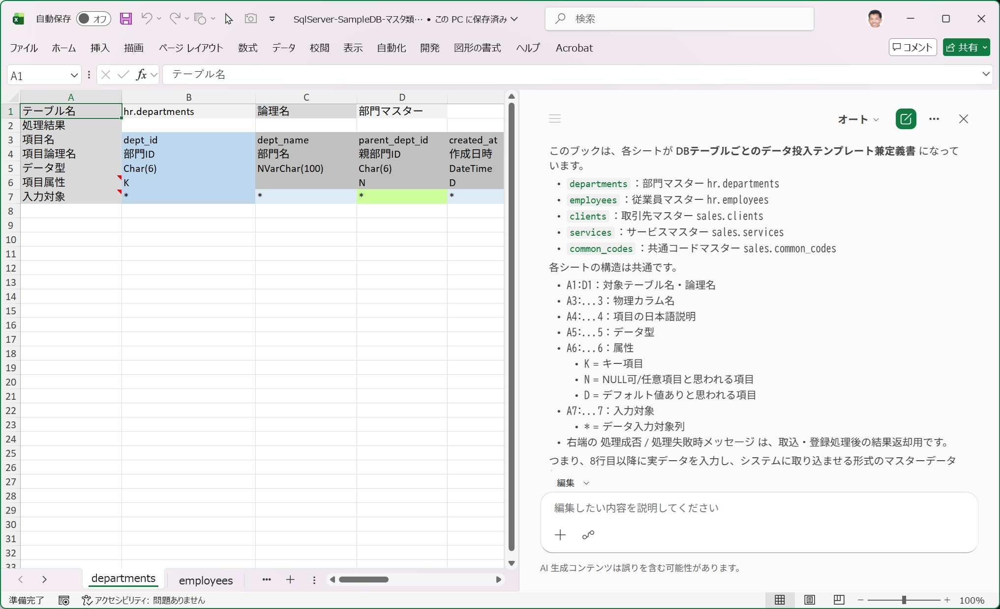
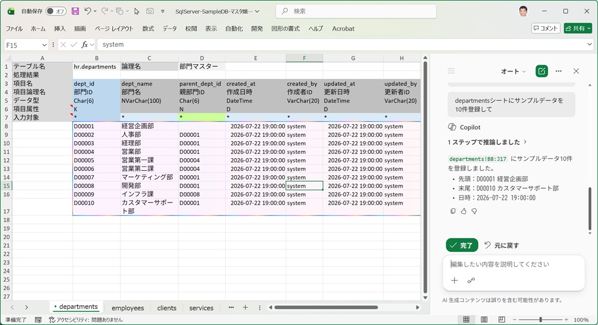
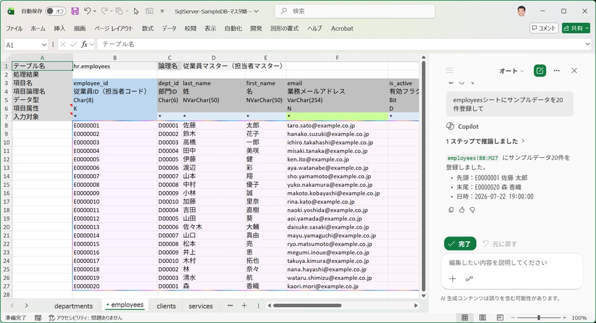
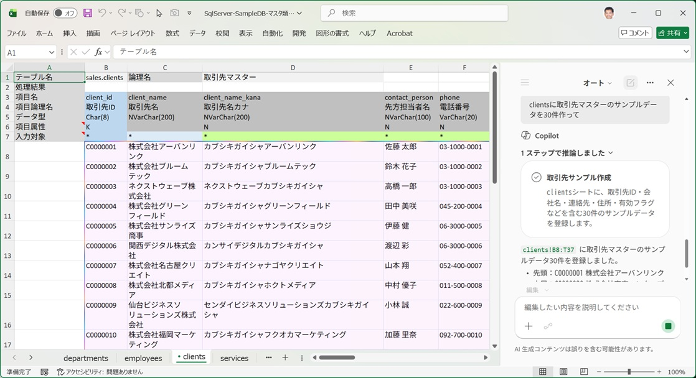
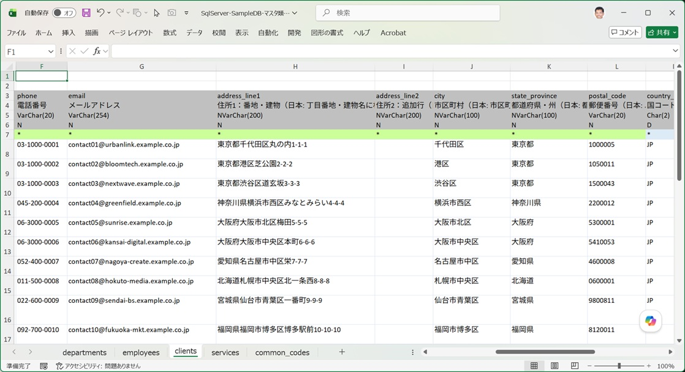
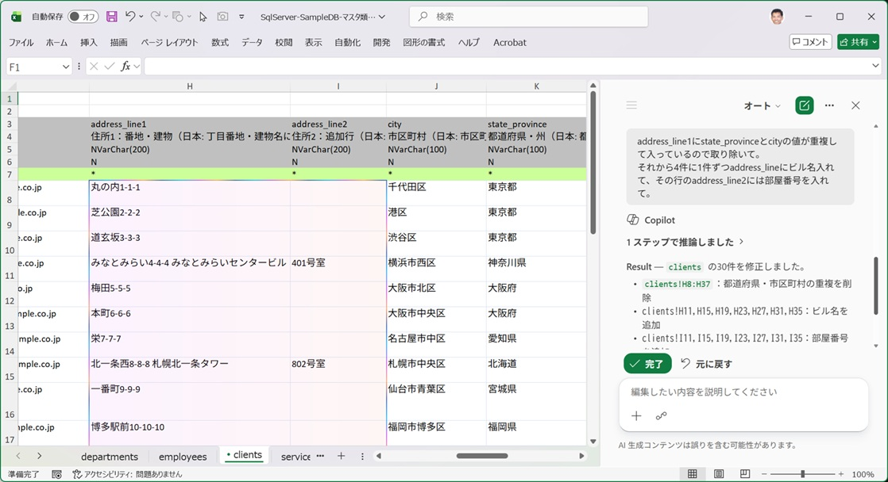
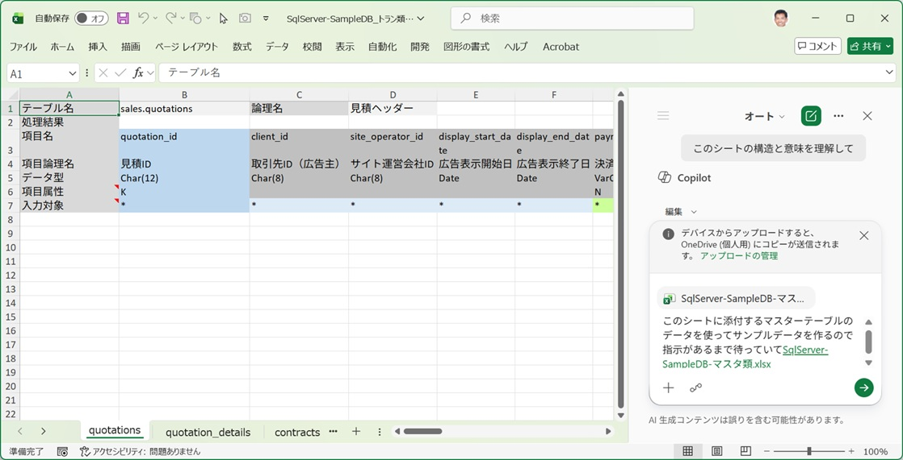
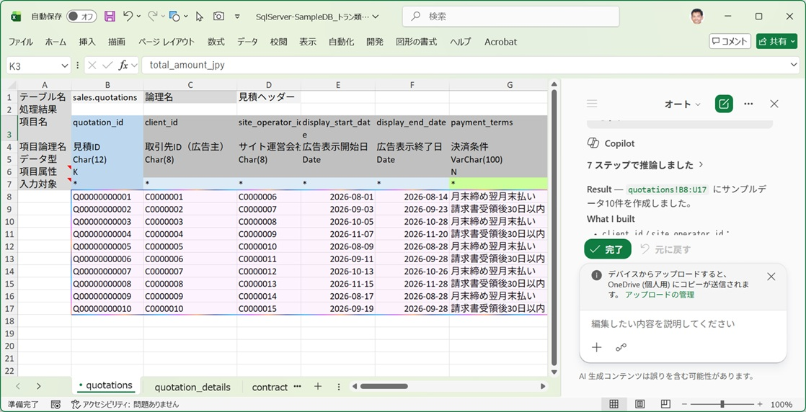

**入力シートへのデータ投入において、最もお薦めする方法です。**

## なぜお薦めなのか

Microsoft 365 Copilot（Excel 上で使える Copilot 機能）は、通常の Microsoft 365 利用に比べて追加コストがかかりますが、それに見合う価値があります。企業ユーザーでの導入例も多く、**この用途に使うためだけでも契約する価値がある**と考えるほどです。

- 架空の氏名・住所・メールアドレス・電話番号など「それらしい」データを作るのが非常に得意
- 外部キー参照がある一連のテーブルのデータを作る場合に、参照整合性を保ったまま一括生成できる（[関数・マクロ](/ja/docs/data-entry/formulas/) では複雑になりがちな作業）

## 使い方

### 1. 入力シートの構造を理解させる

SQExcel の入力シートは、シート自体にテーブル名・項目名・データ型・主キー等の情報を持っています。そのため、Copilot に対して細かい説明をする必要はなく、次のように指示するだけで構造を理解させられます。

> 「このシートの構造と意味を理解して」

   

### 2. 作業条件を事前に伝える

サンプルデータの内容を指示する前に、Copilot に触ってほしくない範囲や前提条件をまとめて伝えておきます。

> 「作業の前提として、入力エリアのセルの書式設定は変更しないでください。項目ヘッダより上の行にも触れないでください。」

### 3. 生成してほしいデータの内容を指示する

項目名が分かりやすいものであれば、あとは欲しいデータの量・傾向を伝えるだけで済みます。

> 「部門マスタのデータとして、全部で20件のサンプルデータを作ってください。営業・経理・人事・開発の4部門に分散させてください。」

### 4. キー項目の採番ルールを伝える

マスタテーブルの主キーとなる ID を生成させる場合は、採番ルールを事前に伝えておきます。

> 「dept_id は 'D' + 4桁の連番（例：D0001）で採番してください。」

### 5. 項目ごとの制約を個別に伝える

その他、項目ごとにデータの制約がある場合は、会話形式で個別に伝えます。

> 「email 列は既存データと重複しないユニークな値にしてください。」 
> 「hire_date は 2015-01-01 以降の平日の日付にしてください。」

---

以上の手順だけで、入力シートの書式を壊すことなく、まとまった量の「それらしい」サンプルデータを短時間で作成できます。

## 実際のCopilotでのデータ作成例

以下の例では、マスターテーブル類の入力シートのワークブックに部門マスター(departments)・従業員マスター(employees)・取引先マスター(clients)が、トランザクションテーブル類の入力シートにquotations(見積ヘッダー)が含まれていることを前提とします。テーブルの構造は、表示されている入力シートの項目から読み取ってください。

### 1. 自己参照を含むマスターデータを作成する

例として部門マスター(departments)の入力シートで、Copilotに「このシートの構造と意味を理解して」を指示した後、「departmentsシートにサンプルデータを10件登録して」を指示します。

   

- 指示に対して、サンプルデータが10件作成されます。
- 部門名は何も指示しなくても、実際に存在しそうな架空の部門名を割り当てています。
- parent_dept_id(親部門ID)がdept_id(部門ID)を参照していることを読み取り、参照する側のデータを参照される側より後方に作成しています。

### 2. 別シートのデータを参照するマスターデータを作成する

例として従業員マスター(employees)の入力シートで、Copilotに「このシートの構造と意味を理解して」を指示した後、「employeesシートにサンプルデータを20件登録して」を指示します。

   

- 指示に対して、従業員マスターのサンプルデータが20件作成されます。
- 姓名やメールアドレスには架空の値がセットされますが、どれも存在しそうな値がセットされます。
- 特に指示はないのにdept_id(部門ID)はdepartmentsに作成したサンプルデータを参照しています。

### 3. 名前、カナ名、住所、メールアドレスなどを持つ大きなマスターデータを作成する

例として取引先マスター(clients)の入力シートを開き、Copilotに「このシートの構造と意味を理解して」を指示した後、「clientsに取引先マスターのサンプルデータを30件作って」を指示します。

   

- 指示に対して、取引先マスターのサンプルデータが30件作成されます。
- 取引先名、取引先カナ名、先方担当者名や電話番号に架空の値がセットされますが、どれも存在しそうな値がセットされます。

ここで取引先マスターに作成されたサンプルデータの住所関連の列を見てみましょう。

   

- **驚くのは、住所項目や郵便番号、国コードなどの項目名を読み取って、これも実在しそうな架空の値を自動的にセットしてくれる**ことです。氏名・住所・電話番号・メールアドレスなど、この手の架空データを自動生成してくれる点は非常に便利です。

### 4. 住所項目のデータを調整する

住所項目に少し直したい値が入っているので、次のプロンプトを入力します。

> 「address_line1にstate_provinceとcityの値が重複して入っているので取り除いて。それから4件に1件ずつaddress_lineにビル名を入れて、その行のaddress_line2には部屋番号を入れて」

すると、結果がすぐに反映されます。

   

※このように、作成するデータの項目や特性を細かく指示することもできます。

### 5. 別の入力シートを参照するサンプルデータを作成する

サンプルデータが登録されたマスターテーブル用の入力シートを参照して、トランザクションデータを作成する例を見てみましょう。まず、トランザクションテーブル用の入力シートでquotations(見積ヘッダー)を開き、Copilotに「このシートの構造と意味を理解して」を指示します。続けて **「このシートに添付するマスターテーブルのデータを使ってサンプルデータを作るので指示があるまで待っていて」** とプロンプトを入力し、マスターテーブル用の入力シートを添付します。

   

### 6. マスターデータで参照する項目を細かく指定する

プロンプトで、次のように参照する項目を指定してからデータ作成を指示します。

> 「quotationsにサンプルデータを次のように作成して。
> client_idとsite_operator_idにはマスターテーブルclientsのclient_idをセット。
> employee_idにはマスターテーブルemployeesのemployee_idをセット。
> マスターテーブルのcommon_codesのcategory_nameに名前のある項目は、category_codeの値を適当に選択してセット」

このように細かくデータの内容を指示すると、作成されるデータの精度が上がります。

   

---

:::caution
外部キー参照のあるテーブル群を扱う場合は、続けて必ず [外部キー参照のあるテーブルへのデータ挿入及び削除手順（重要）](/ja/docs/data-entry/foreign-key-order/) を確認してください。Copilot に的確な指示を出すためにも、この原則の理解が欠かせません。
:::
