複数のテーブルにまたがって、外部キー制約のあるデータを作成する場合、[入力シートへのデータ投入方法](/ja/docs/data-entry/) のどの方式（直接入力・関数/マクロ・Copilot）を使うにしても共通して守るべき原則があります。この原則を誤ると、データ取り込み時に外部キー制約違反でエラーになります。

## ルール

### 1. マスター参照がある場合は、参照元の情報を明示する

トランザクションテーブルの項目に、マスターテーブルの ID を参照する外部キーがある場合、そのマスター ID がどのワークブック・どのシートに存在するかを明確にしておきます。

- [直接入力](/ja/docs/data-entry/manual-entry/) や [関数・マクロ](/ja/docs/data-entry/formulas/) の場合：`XLOOKUP` などで参照する際に、参照先シート名・セル範囲を正確に指定します。
- [Copilot](/ja/docs/data-entry/copilot/) の場合：指示を出す際に「取引先IDは `顧客マスター.xlsx` の `clients` シートの `client_id` 列から選んでください」のように、参照元のワークブックとシート名を明示的に伝えます。

### 2. 自己参照テーブルは「参照される側」を前方に作成する

部門マスターのように、自分自身のテーブルを参照する項目（例：課の親部門として本部の department_id を参照する）を持つテーブルでは、**参照されるデータ（親）を、参照するデータ（子）より前の行に作成**します。

### 3. データ取り込み実行時：参照される側を先に処理する

複数テーブルをテーブルグループとしてまとめてデータ取り込み（INSERT）を行う場合、[テーブルグループ](/ja/docs/features/io-operations/) 内のテーブル処理順序も、**参照されるテーブルを先、参照するテーブルを後**に並べます。

例：マスター（部門・従業員・取引先）→ トランザクションヘッダ（見積・契約）→ トランザクション明細、の順。

### 4. データ削除時：逆順オプションを使う

INSERT 用に作られた順序（参照されるテーブル→参照するテーブル）のまま DELETE を実行すると、外部キー制約により**参照されている側から先に消せず削除が失敗**します。

これに対応するため、[データ取り込みダイアログ](/ja/docs/features/io-operations/data-import-dialog/) には「**DELETE時にテーブル順・行順を逆順にする**」オプションがあります。これを ON にすると、テーブルの処理順序とテーブル内の行の処理順序の両方が反転し、参照する側（子）から先に削除されます。

## 実行例

:::note[サンプルDBを例にして説明します]
ここでは、外部キー参照や自己参照キーを持つデータを登録・削除する際の事例を示しながら説明します。入出力操作の対象となるデータベースの内容については[サンプルDB](/ja/docs/sample-db/)を参照してください。
:::

### 1. 自己参照テーブルとマスター参照があるテーブルへのデータ投入でエラーとなる場合

1. データ取り込みを行う対象テーブルとして、departments(部門マスター)とemployees(従業員マスター)を、この順番で選択済みテーブルリストに配置します。
    - departments(部門マスター)は自己参照キーを、employees(従業員マスター)はdepartmentsへの外部参照キーを持ちます。
    - 選択済みテーブルリスト内では、ドラッグ＆ドロップでテーブルの並び順を変更できます。

   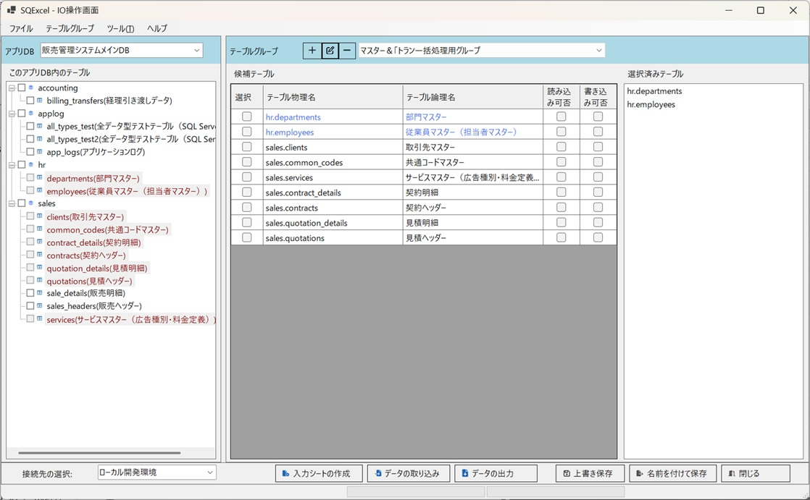

2. SC0005の親部門IDであるDB003は、SC0005より後の行で登録されるため、この行の登録時点ではまだ存在しません。そのため、このデータは自己参照キーエラーとなります。

   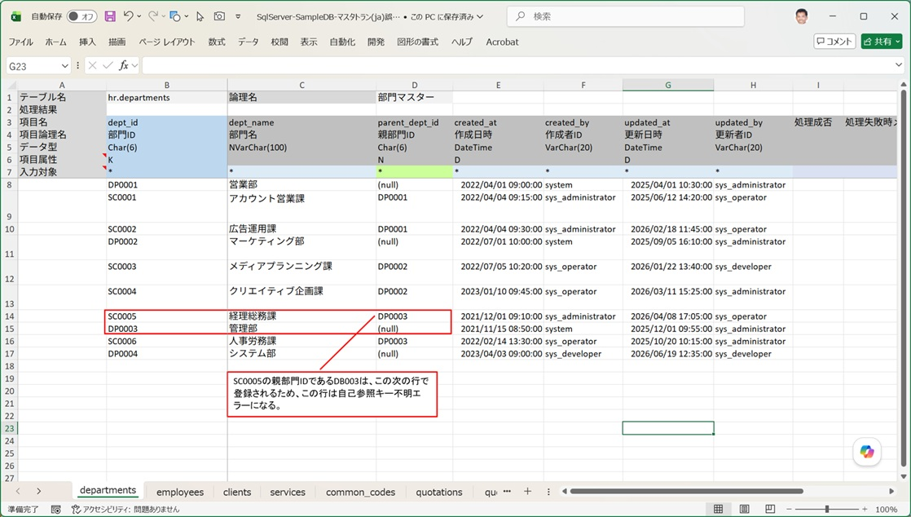

3. 部門ID:SC0005はdepartmentsシートのデータ取り込みでエラーになるため、存在しない部門IDのままになります。その結果、従業員ID:18000015は部門IDの外部参照キーエラーとなり、登録に失敗します。

   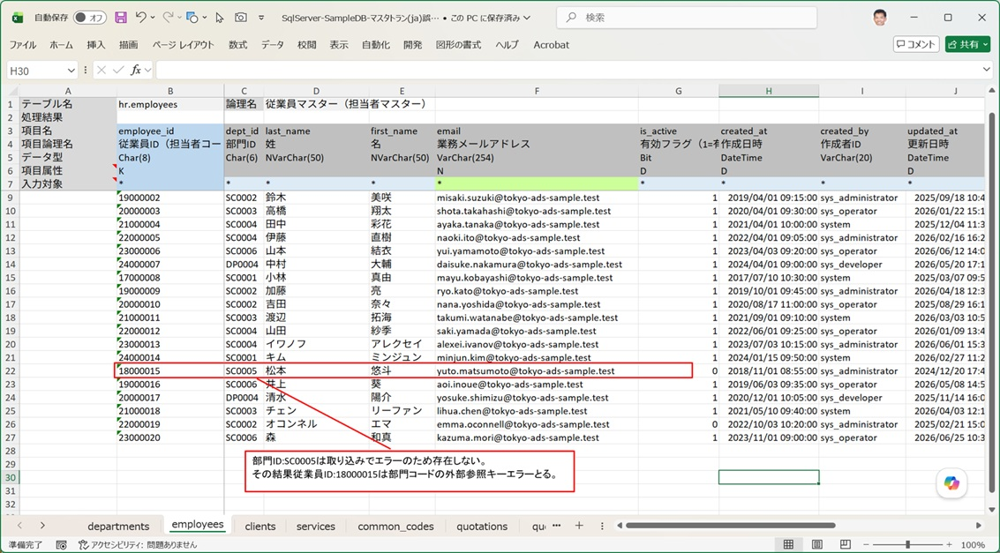

4. このエラーデータを含む入力シートに対してデータ取り込みで[INSERT]を指定して実行すると、次のように処理結果でエラーが発生したことが通知されます。

   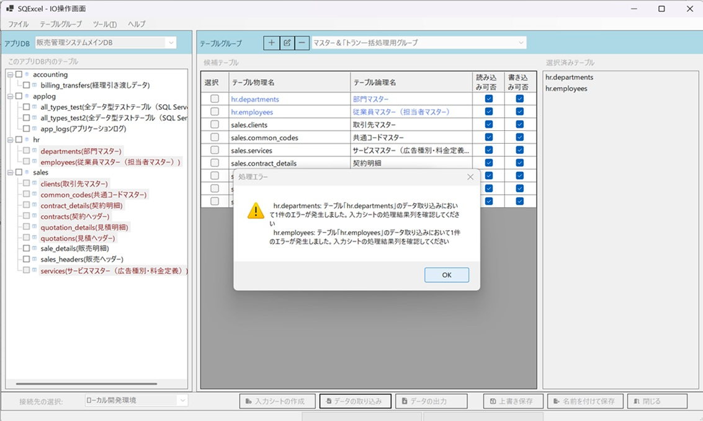

5. 入力シートを開いて処理結果を確認します。部門マスターのSC0005は自己参照キーエラーとなり、処理成否=FALSE、処理失敗メッセージにはエラー内容と実行されたSQL文が表示されます。

   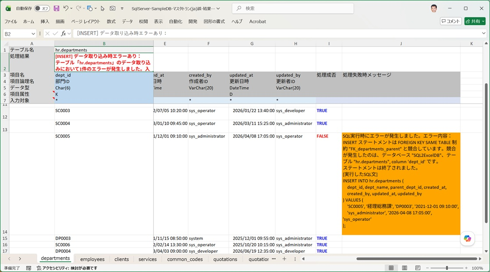

6. 従業員マスターの18000015は外部参照キーエラーとなり、処理成否=FALSE、処理失敗メッセージにはエラー内容と実行されたSQL文が表示されます。

   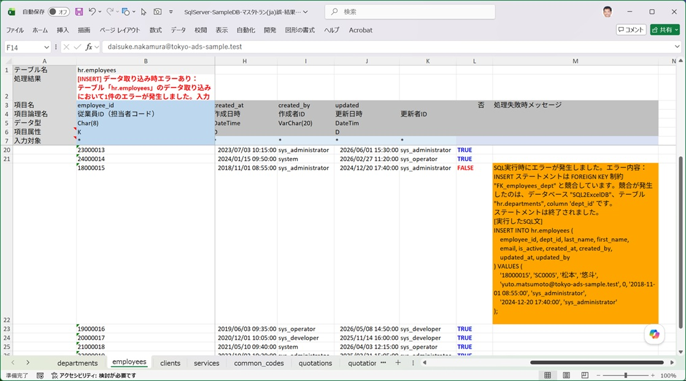

### 2. データ削除時：逆順オプションを使わない場合(承前)

1. エラーが出たので、いったん登録されたデータをすべて削除し、入力シートを直してデータ取り込みをやり直します。ここでは、まず試験的に正しくない手順で削除を実行してみます。データ取り込みダイアログで実行するSQLの種類に「Delete」を選択し、「INSERT実行時の逆順にDELETEを実行する」チェックボックスをOFFにします（既定ではON）。

   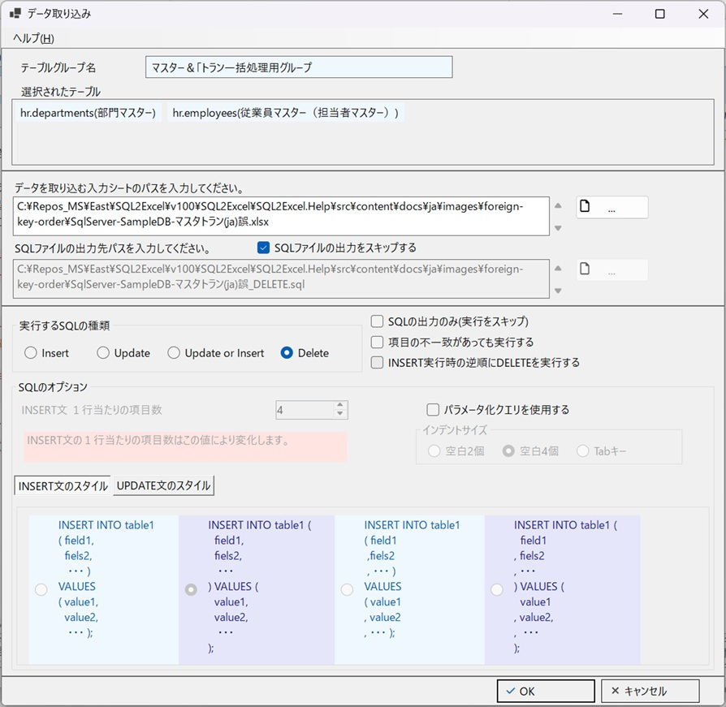

2. この状態でデータ取り込みを実行すると、次のように処理結果でエラーが発生したことが通知されます。

   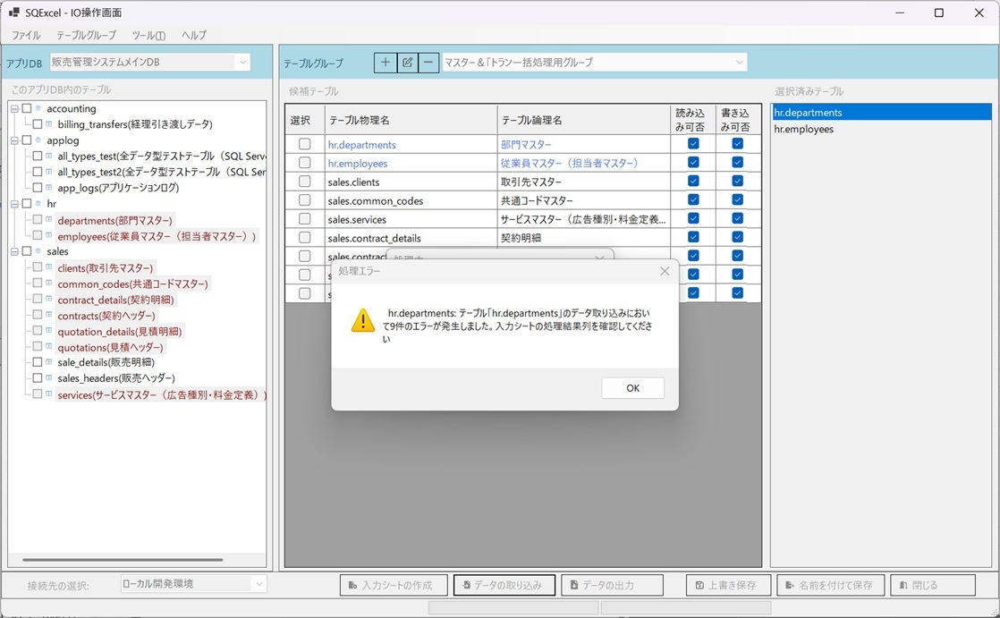

3. 入力シートを開いて、departmentsシートのエラー内容を確認します。部門マスターのデータは、外部キー参照している従業員マスターのデータが存在する限り削除できません。つまり、先に従業員マスターを削除し、その後で部門マスターを削除する必要があります。
    - 最初のデータ取り込みでエラーになったSC0005はデータが存在しないため、DELETE SQLはエラーになりません。

   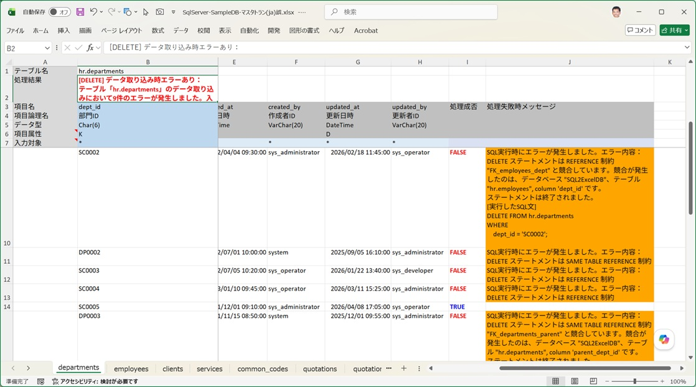

### 3. データ削除時：逆順オプションを使う場合(承前)

1. 今度は、参照エラーのない正しい順序でデータが記載された入力シートを使い、INSERTでデータ取り込みを実行してから、正しい手順でデータを削除します。データ取り込みダイアログで実行するSQLの種類に「Delete」を選択し、「INSERT実行時の逆順にDELETEを実行する」チェックボックスは既定値のONのままにします。

   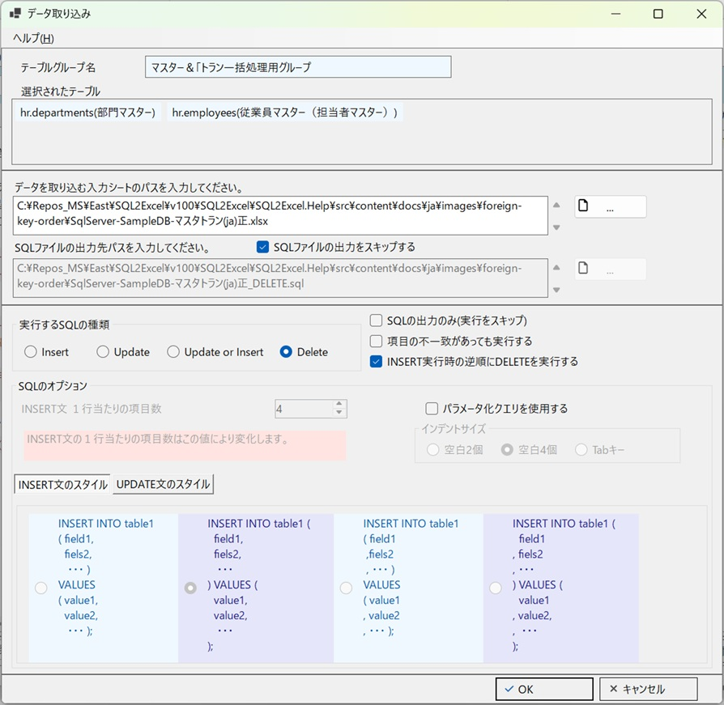

2. 選択済みテーブルの並び順ではemployees(従業員マスター)はdepartments(部門マスター)より後ですが、「INSERT実行時の逆順にDELETEを実行する」がチェックされているため、employees(従業員マスター)が先に処理されます。さらに、入力データも下から上へ逆順に処理されます。

   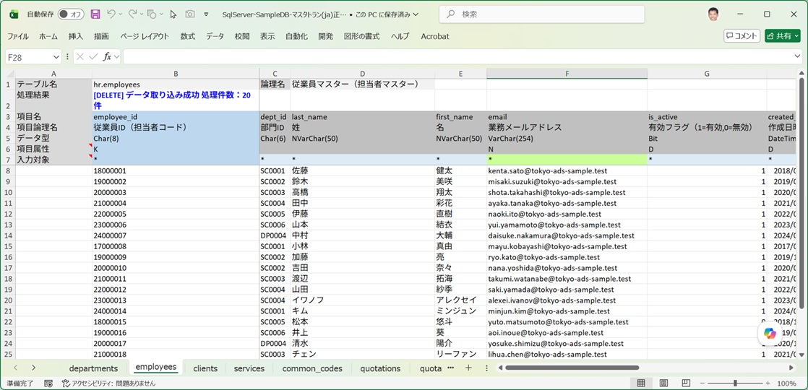

3. 自己参照キーを持つdepartments(部門マスター)も、正しく削除されています。入力データを下から上へ逆順に処理するため、参照するデータを先に削除し、参照されるデータを後から削除する形になります。これにより、INSERT用に[参照されるデータ→参照するデータ]の順でセットした入力シートを、そのまま削除にも使えます。

   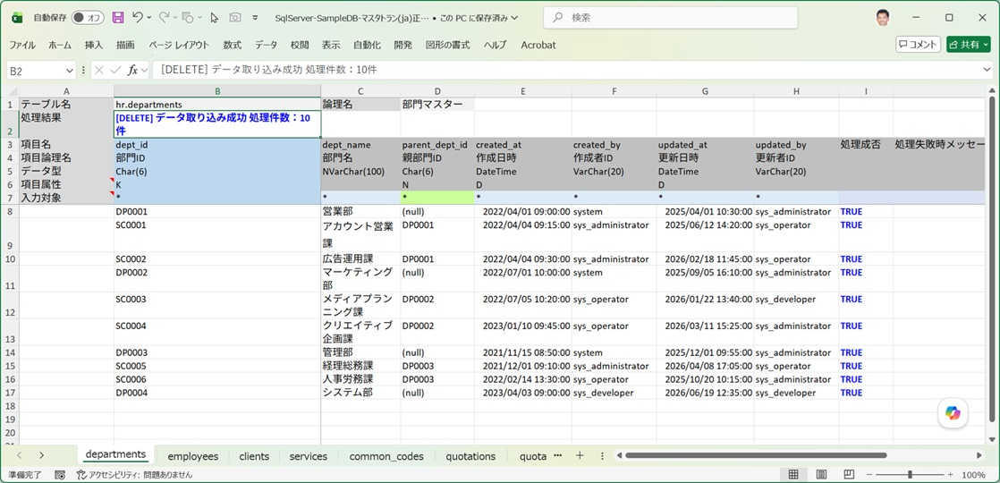

---

:::tip[まとめ]
INSERT のときに考えた「親が先、子が後」という並び順は、そのまま DELETE のときには「子が先、親が後」に反転させる必要があります。この逆転をテーブルグループの並び替えという手作業で行う代わりに、オプション1つで自動化できるのがこの機能です。
:::
