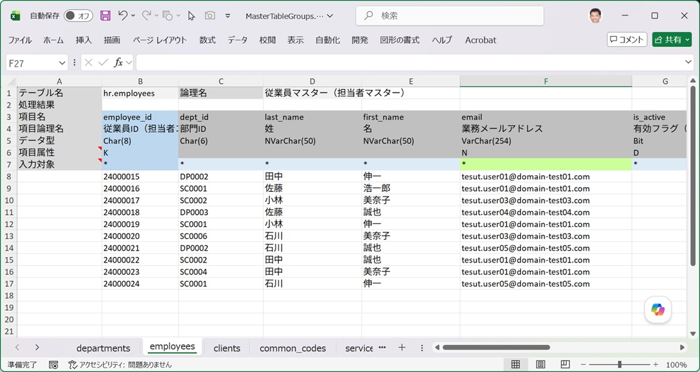
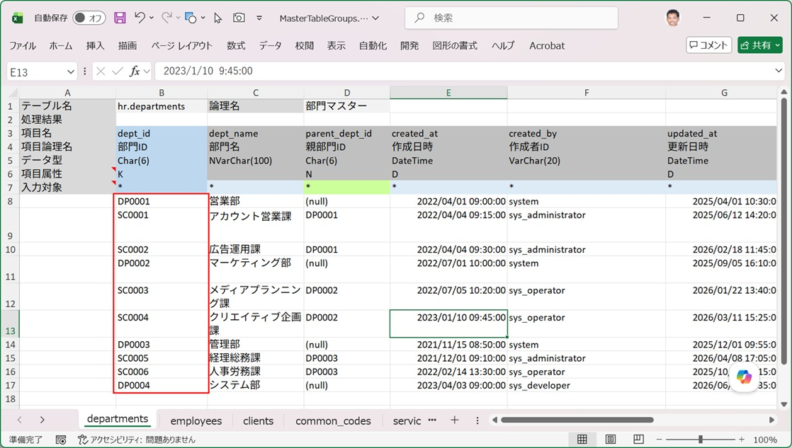
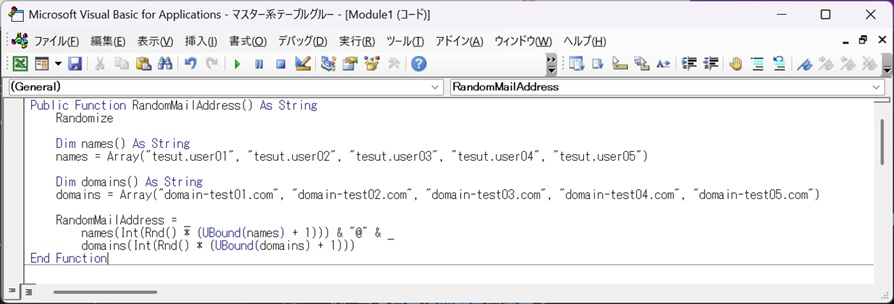

Excel Copilot を使わない場合、これが最も一般的で古くから使われてきた方法です。関数やマクロに慣れているユーザーであれば、大量のサンプルデータを効率よく作成できます。

## 基本的な考え方

入力エリアの1行目だけ手作業や関数で「型」を作り、残りの行はコピーまたはオートフィルで増やしていく、という使い方が基本になります。

## LOOKUP系関数による参照先データの取得

外部キー参照のある項目には、`VLOOKUP` / `XLOOKUP` 関数を使って、参照先テーブルの入力シートからキー値を取得すると効率的です。

```
=XLOOKUP(ROW()-<開始行>, 参照先シート!$B$8:$B$107, 参照先シート!$B$8:$B$107)
```

## RANDBETWEEN・RAND関数によるランダム値の生成

数値のばらつきが欲しい場合は `RANDBETWEEN`、比率で分岐させたい場合は `RAND` と `IF` の組み合わせが定番です。

```
=RANDBETWEEN(1000, 9999)
=IF(RAND() < 0.3, "法人", "個人")
```

:::caution[再計算による値の変化に注意]
`RANDBETWEEN` や `RAND` は再計算のたびに値が変わります。データ取り込みを実行する前に「値の貼り付け」で数式を確定値に変換しておかないと、確認のたびに値が変わってしまい、処理結果の突き合わせができなくなります。
:::

## マクロ内に関数を定義する

数式が複雑になりすぎる場合は、VBA マクロ内にユーザー定義関数（Function プロシージャ）を作成し、ワークシート上の数式として呼び出すこともできます。氏名・住所などのランダム生成ロジックをマクロ側に持たせることで、ワークシートの数式をシンプルに保てます。

```vb
Public Function RandomMailAddress() As String
    Randomize

    Dim names() As String
    names = Array("tesut.user01", "tesut.user02", "tesut.user03", "tesut.user04", "tesut.user05")

    Dim domains() As String
    domains = Array("domain-test01.com", "domain-test02.com", "domain-test03.com", "domain-test04.com", "domain-test05.com")

    RandomMailAddress = _
        names(Int(Rnd() * (UBound(names) + 1))) & "@" & _
        domains(Int(Rnd() * (UBound(domains) + 1)))
End Function
```

### ワークシート関数やマクロ関数を使用した入力シートの例

   

このワークシートには次のような関数が埋め込まれています。
| 列 | 埋め込まれている関数 |
|------|------|
| C列(dept_id/部門ID) | INDEX(dept_id_source,RANDBETWEEN(1,ROWS(dept_id_source))) |
| D列(last_name/姓) | LET(v,RAND(),IF(v<0.2,"鈴木",IF(v<0.4,"田中",IF(v<0.6,"佐藤",IF(v<0.8,"小林","石川"))))) |
| E列(first_name/名) | LET(v,RAND(),IF(v<0.2,"誠也",IF(v<0.4,"美奈子",IF(v<0.6,"浩一郎",IF(v<0.8,"伸一","裕子"))))) |
| F列(email/メールアドレス) | RandomMailAddress() |

- C列の関数内にある**dept_id_source**は、departments(部門マスター)シート上でサンプルデータが定義されているB8:B17の範囲を指します。

   

- D列とE列では、LET関数を使ってRAND()関数の出力結果を一時変数vに代入しています。
- F列に定義したRandomMailAddressは、マクロエディタでは次のように定義されています。

   

### ワンポイント
このようにワークシート関数やマクロ関数を使用する場合、その行全体をコピーして後方の行に数式コピーすることにより、100件から数1000件単位でサンプルデータを作成することが出来ます。項目値の設定に制限や規則がある場合に、大量のサンプルデータを投入する際には非常に有利な方法です。<br/>
※複雑な関数を埋め込んだ行が多くなりすぎると、エクセルのパフォーマンスに影響を与えるので注意が必要です。

## この方法の限界

外部キー参照がある一連のテーブル（例：受注ヘッダ→受注明細→商品マスタ）のデータを作る場合、`LOOKUP` 系関数が何重にもネストしたり、行の対応関係を手動で管理する必要が生じたりして、数式が複雑になりすぎることがよくあります。このようなケースでは、無理に関数で解決しようとせず、[Microsoft 365 Copilotを利用する](/ja/docs/data-entry/copilot/) 方法への切り替えを検討してください。

外部キーが絡む入力の原則は [外部キー参照のあるテーブルへのデータ挿入及び削除手順（重要）](/ja/docs/data-entry/foreign-key-order/) を参照してください。
