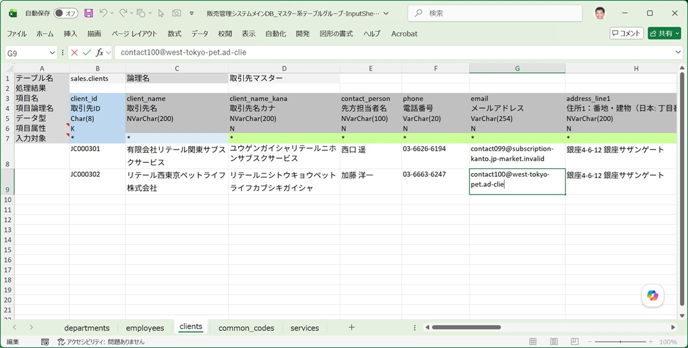

もっとも単純で、迷うことのない方法です。入力シート作成で生成された入力シートの入力エリアに、Excel の通常のセル入力操作でデータを書き込んでいきます。

## 基本手順

1. [入力シート作成ダイアログ](/ja/docs/features/io-operations/input-sheet-builder-dialog/) で対象テーブルの入力シートを作成します。

2. 生成された Excel を開くと、項目ヘッダの下に「入力対象」行があります。データを入力したい列に `*` がセットされていることを確認します（既定では主キーを含む全項目が対象になっています）。

3. 項目ヘッダの3行目（データ型）を参考にしながら、1行につき1レコード分のデータをセルに入力していきます。

   

4. 主キーが自動採番（IDENTITY／SEQUENCE等）される項目は、入力対象を外す（`*` を消す）か空欄のままにしておくと、その項目を除いた INSERT 文が生成されます。

5. 入力が終わったら保存し、[データ取り込みダイアログ](/ja/docs/features/io-operations/data-import-dialog/) から DB へ反映します。

## 空白のシートから始めない方が効率的

新規テーブルに0件からデータを作る場合でも、**空白の入力シートにいきなり入力していくのは非効率**です。次の手順の方が速く、かつ実在のデータ形式に近いサンプルができます。

1. 先に [データ出力ダイアログ](/ja/docs/features/io-operations/data-export-dialog/)（または簡易出力）で、少数件（既存データがあれば数件、なければ後述の方法で作成した仮データでも可）を取り込んでおきます。

2. 取り込まれたデータの内容を見ながら、行をコピー＆ペーストして必要件数まで増やし、値だけを書き換えます。

こうすることで、日付や数値の書式崩れが起きにくく、既存データとの整合性も保ちやすくなります。詳しいやり方は[取り敢えず使ってみよう](/ja/docs/quick-start/)の「一番簡単な入力シートによるデータ操作」を参照してください。

## 外部キー参照があるテーブルの場合

複数のテーブルにまたがってデータを作る場合は、必ず [外部キー参照のあるテーブルへのデータ挿入及び削除手順（重要）](/ja/docs/data-entry/foreign-key-order/) を確認してください。特に直接入力の場合、参照先テーブルのキー値をどこかに表示しておき、それを見ながら入力する必要があります。
