ホーム画面は、[データモデル階層](/ja/docs/operation-flow/#データモデル階層のカージナリティ)（プロジェクト＞アプリDB＞接続）を作成・編集する画面です。ウィンドウタイトルには「SQExcel - [対象アプリケーション名]」が表示されます。

## 画面構成

   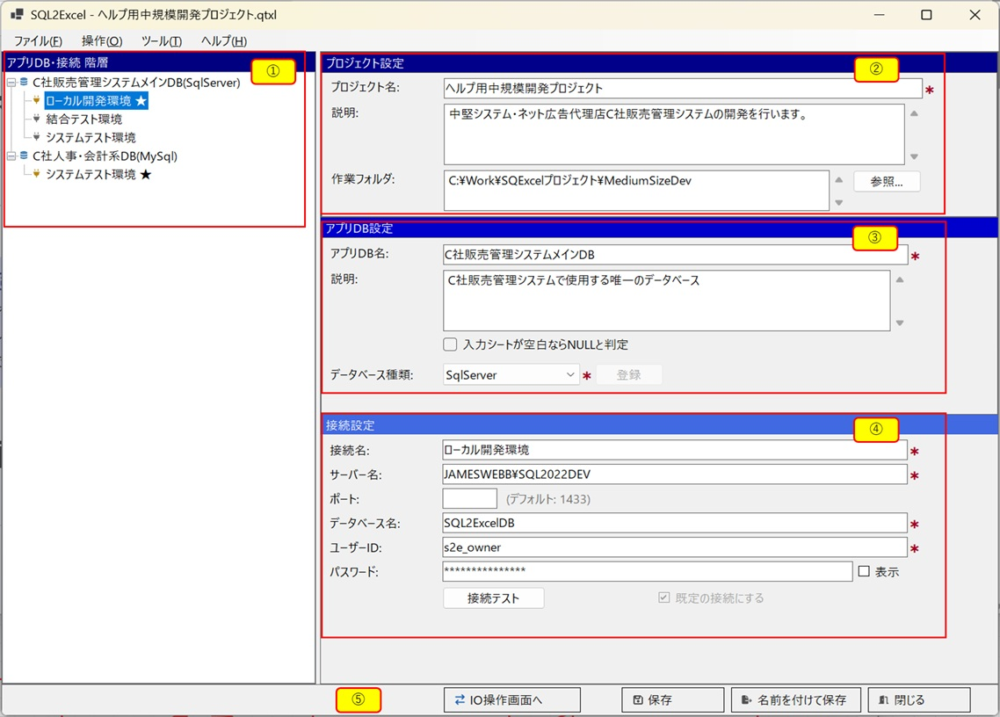

| No. | エリア | 内容 |
|---|---|---|
| ① | アプリDB・接続ツリー(階層ツリー) | プロジェクト内のアプリDBとその配下の接続を階層的に表示します。ノードを選択すると、対応する内容が下記の各パネルに表示されます。 |
| ② | プロジェクト設定パネル | プロジェクト（対象アプリケーション）の名前・説明・作業フォルダを編集します |
| ③ | アプリDB設定パネル | 選択中のアプリDBの名前・説明・DB種類を編集します |
| ④ | 接続設定パネル | 選択中の接続のサーバー名・ポート・データベース名・ユーザーID・パスワード等を編集します |
| ⑤ | 画面フッタ | 「IO操作画面へ」「保存」「名前を付けて保存」「閉じる」の各ボタン |

## ホーム画面における各種操作

このセクションで示す「プロジェクト」、「アプリDB」、「接続」という用語がSQExcelの中でどのような意味を有するかを知りたい場合は、先ず[操作の流れとデータモデル階層](/ja/docs/operation-flow/)をご参照ください。

### プロジェクトの保存

新規プロジェクトを作成する場合、最初に行うのはプロジェクトの作成です。以下に作業手順を示します。

1. 新規プロジェクトを作成後、プロジェクト設定パネルで必要情報を入力し、保存をクリックします。

   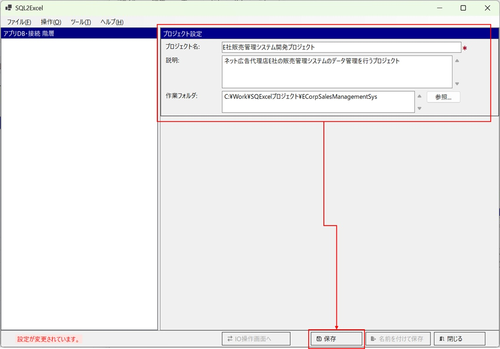

2. 名前を付けて保存ダイアログで、任意のフォルダを選んでファイル名を指定して `.qtxl`（SQExcelプロジェクト）ファイルを保存します。

   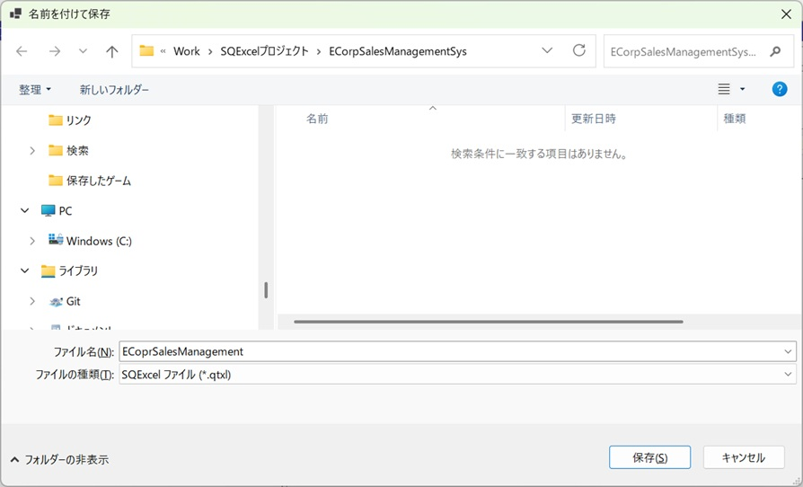

3. プロジェクトの保存が完了すると、アプリDB設定パネルが表示され、アプリDB情報の入力が可能になります。

   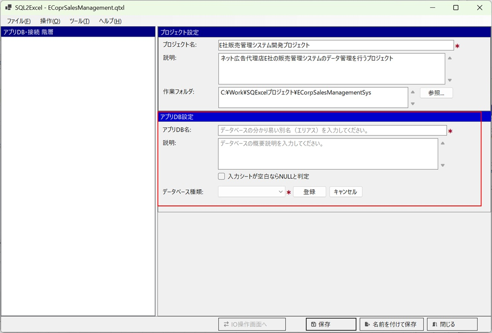

### アプリDBの追加

1. アプリDB設定パネルで必要な情報を入力します。データベース種類は登録後に変更すると、その下に関連付けられた接続情報やテーブルグループ情報を全てクリアする必要が生じるため、間違えないように登録してください。

   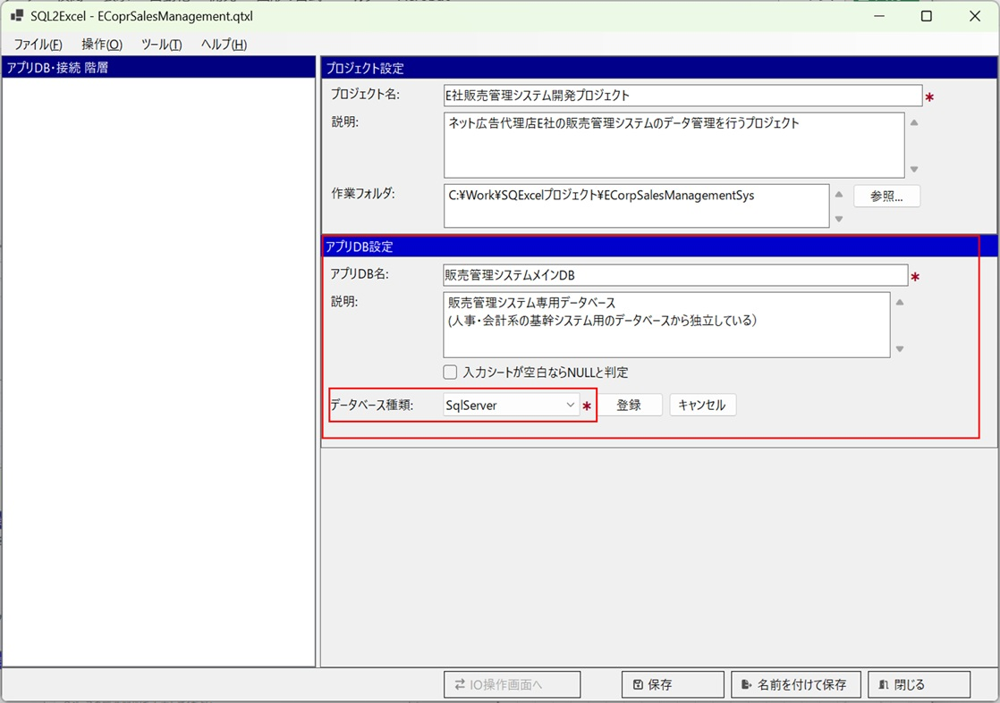

2. アプリDB情報を入力して登録をクリックすると、アプリDB・接続ツリー上に登録したアプリDBのノードが表示されます。ノードの接尾辞には、データベース種類が（）内に表示されます。同時に、このアプリDBに関連付けられる最初の接続用の設定パネルが開きます。

   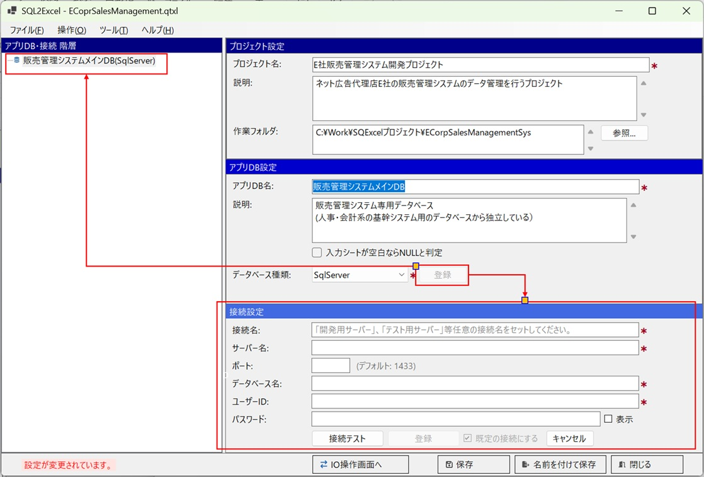

3. プロジェクト内でアプリDBを追加・削除するには、アプリDB・接続ツリー内のコンテキストメニューから実行します。コンテキストメニューの「アプリDBの追加」をクリックすると、アプリDB設定パネルが初期化され、新しいアプリDB情報を設定できます。

   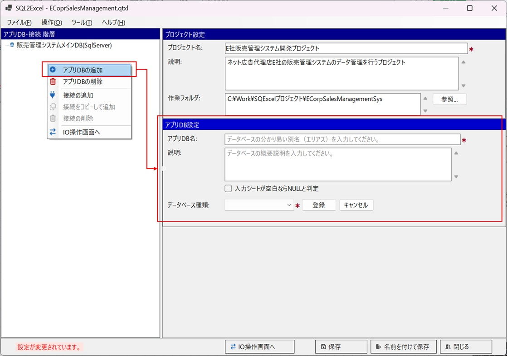

4. 新しいアプリDB情報の入力が終わり登録をクリックすると、アプリDB・接続ツリー上に追加されたアプリDB情報が表示されます（この例ではデータベース種類として Oracle を指定しています）。なお、先に最初のアプリDBの接続を作成した後でも、別のアプリDBを追加できます。

   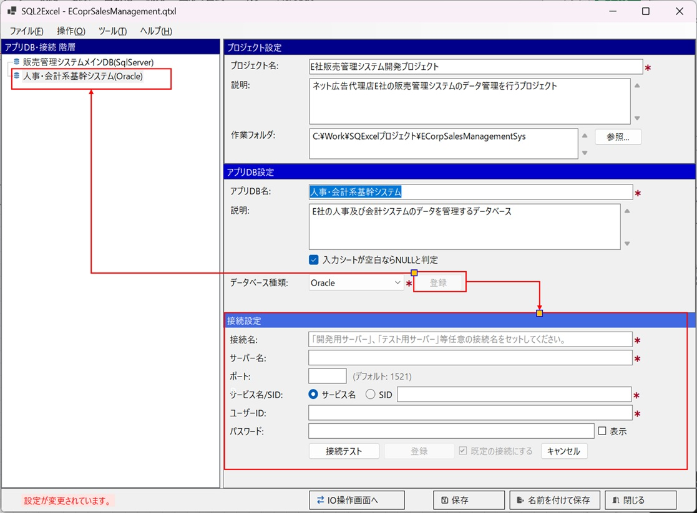

5. アプリDB設定パネルでは、登録・保存後も入力値を変更できます。入力項目の値を変更すると登録ボタンが有効になり、クリックすると直ちに変更内容が反映されます。ただしデータベース種類を変更すると、そのアプリDBの下層にある接続情報とテーブルグループが全てクリアされるため注意が必要です。下図の例では、選択したアプリDBのデータベース種類を Oracle から PostgreSQL に変更しようとしています。

   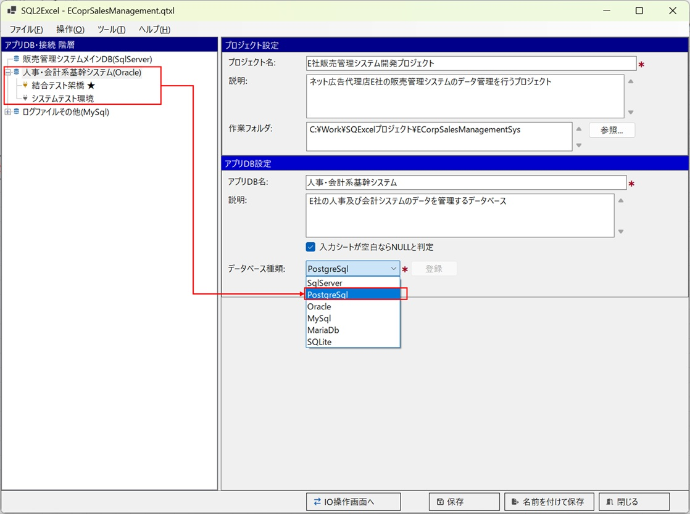

6. このようなメッセージダイアログが表示されます。

   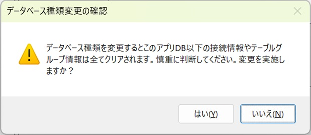

7. はいを選択してデータベース種類を変更すると、アプリDB・接続ツリー上でこのアプリDBの下層の接続がクリアされているのが確認できます。

   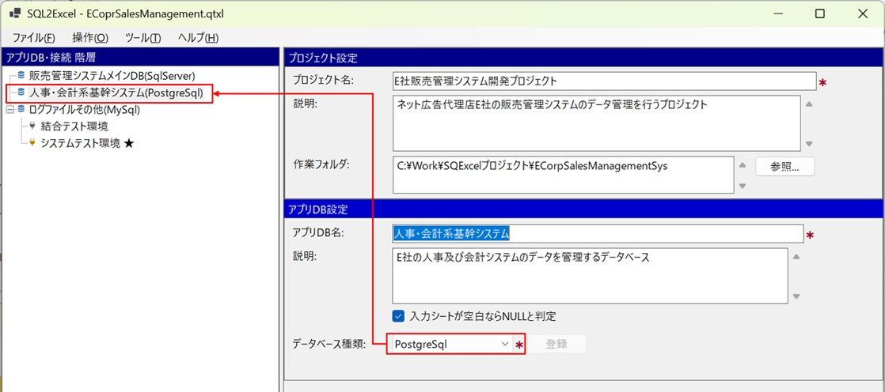

### アプリDBの削除

1. アプリDBを削除するには、アプリDB・接続ツリー上で削除対象のアプリDBノードを選択した状態で、コンテキストメニューから「アプリDBの削除」を選択します。階層ツリーで**アプリDBノード自身**を選択している場合のみこのメニューが有効になり、配下の接続ノードを選択している状態では、誤操作防止のため無効化されます。

   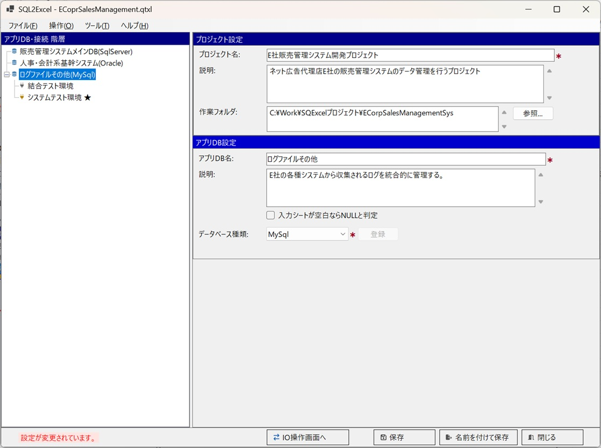

2. アプリDBを削除すると下層の接続やテーブルグループも全てクリアされるため、下図のような確認ダイアログが表示されます。

   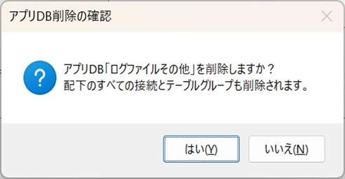

3. はいをクリックして削除を決定すると、アプリDB・接続ツリー上で削除対象となるアプリDBはクリアされます。

   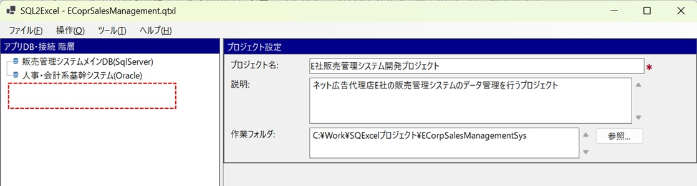

:::tip[誤操作を避ける設計になっています]
接続を削除するつもりで親のアプリDBを削除してしまう事故が起きないよう、「アプリDBの削除」はアプリDBノードそのものを選択しているときだけ実行できます。接続を削除したい場合は、次項の「接続の削除」を参照してください。
:::

### 接続の追加

新しいアプリDBの登録と同時に接続設定パネルでは接続情報を入力可能になりますが、ここではコンテキストメニューから接続を追加する例を見てみましょう。

1. アプリDB・接続ツリー上で接続を追加したいアプリDBノードを選択し、コンテキストメニューから「接続の追加」を選択します。これで接続設定パネル上に新規の接続情報を入力できるようになるので、サーバー名・ポート・データベース名・ユーザーID・パスワード等を入力し「接続テスト」をクリックします。

   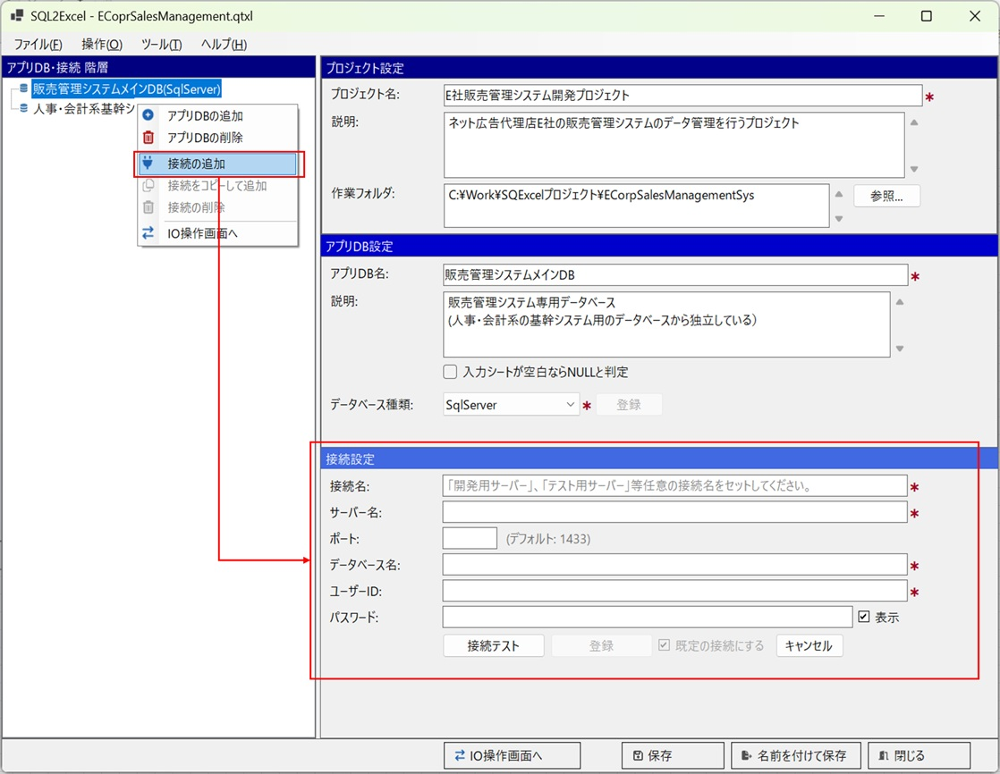

接続情報の入力項目は親のアプリDBのデータベース種類に応じて項目が変更されます。

- データベース種類=SQL Serverの場合の入力項目

          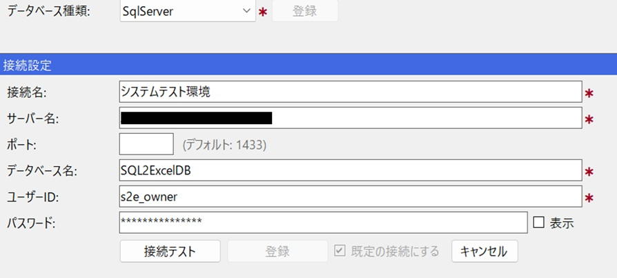

- データベース種類=PostgreSQLの場合の入力項目

          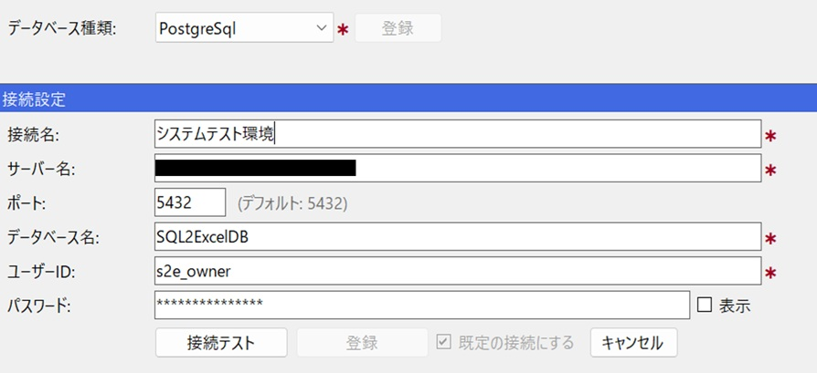

- データベース種類=Oracleの場合の入力項目

          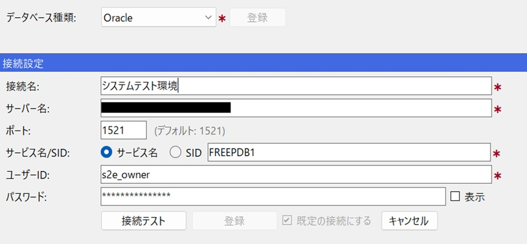

- データベース種類=MySQLの場合の入力項目

          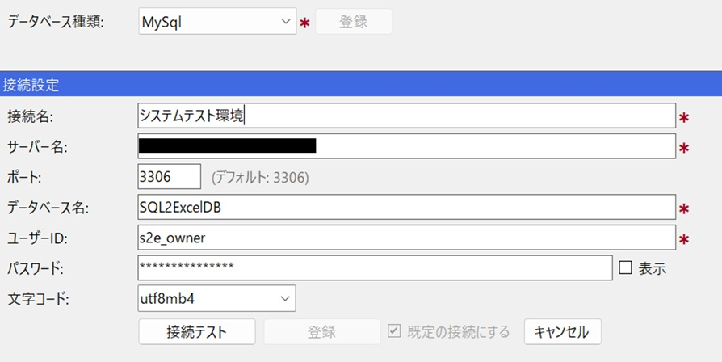

- データベース種類=MariaDB

          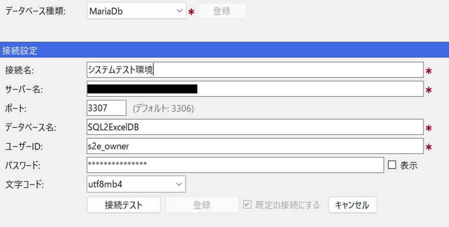

- データベース種類=SQLiteの場合の入力項目

          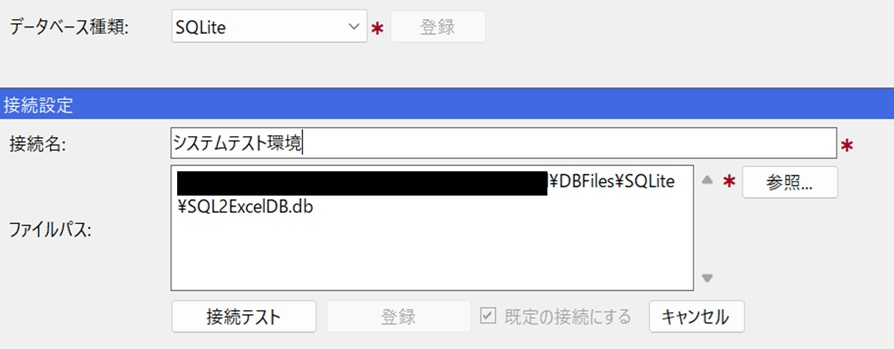

2. 接続設定パネルで接続項目を入力後、接続テストをクリックすると接続の成否が表示され、成功すると登録ボタンが表示されます。接続設定パネルでは、どの項目を変更した場合でも、接続テストを実行して成功しない限り登録できません（接続に関係のない接続名を変更した場合も同様です）。なお「既定の接続にする」チェックボックスは、最初の接続を登録するときは常に ON になります。

   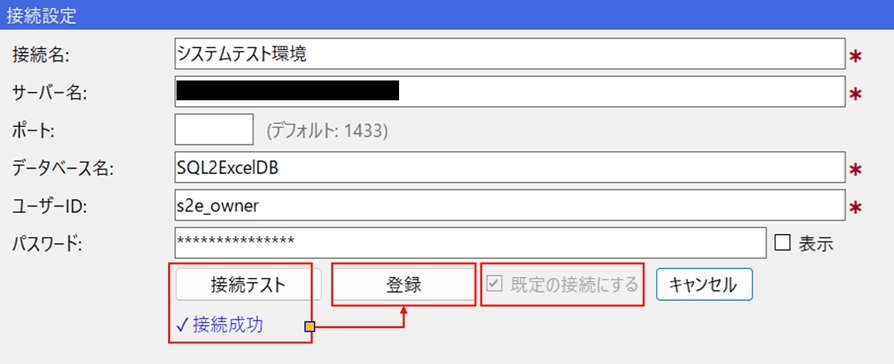

3. 登録をクリックすると、アプリDB・接続ツリー上の親アプリDBの配下に登録した接続のノードが表示されます。この例では最初から接続名を指定して登録しましたが、アプリDBの登録後に連続して登録する最初の接続は「既定の接続」として自動的に登録されます（後から変更可能）。これで接続の登録が完了し、ここから IO操作画面への遷移が可能になります。

   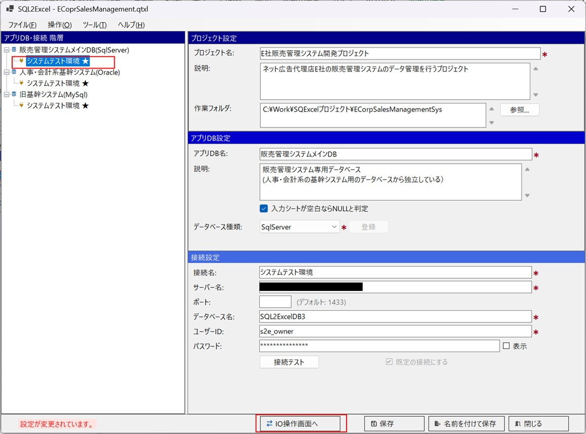

### 既定の接続

既定の接続とは、アプリDB・接続ツリー上でアプリDBノードが選択された状態で IO操作画面に遷移する場合にアクティブになる接続を指します。1つのアプリDBにつき既定の接続は1つしか指定できず、最初に登録した接続が自動的に既定の接続になります。「既定の接続にする」チェックボックスは、2つ目以降の接続情報を登録する際に使用可能になります。

1. 複数の接続がアプリDBの配下にある場合、いずれかの接続を選択して既定の接続にするチェックボックスをONにすると、その接続が既定の接続になります。

       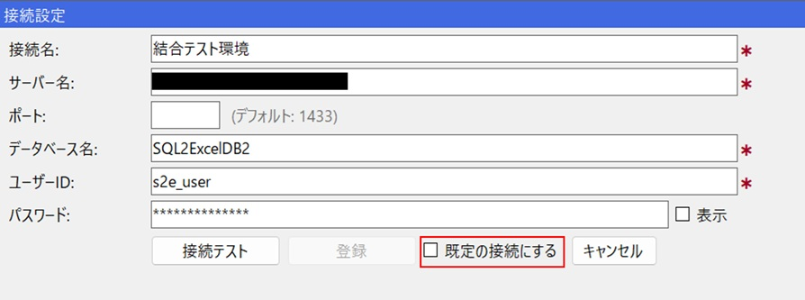

2. 接続表示・編集パネルの「既定の接続にする」チェックボックスをONにすると、そのアプリDB配下で常に1つだけ存在する「既定の接続」に設定されます。階層ツリー上では、既定の接続のノードをアイコンと接続名末尾の「★」で識別できます。

       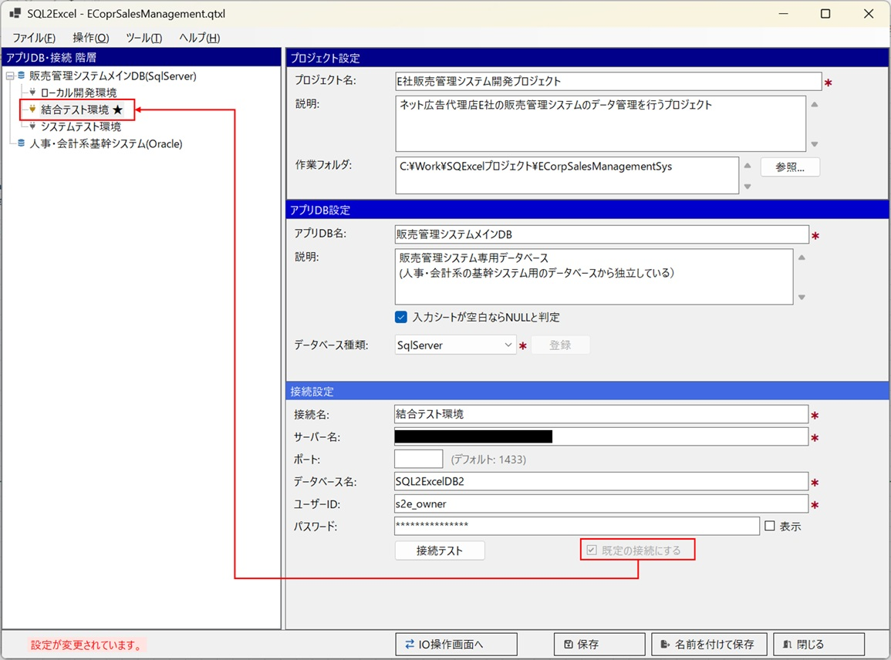

### 接続のコピー

1. アプリDB・接続ツリー上で登録済みの接続ノードを選択し、コンテキストメニューから「接続をコピーして追加」を選択すると、選択中の接続の内容（パスワードを除く）を引き継いだ状態で接続表示・編集パネルが新規入力モードになります。同一アプリDB内では異なる環境でもユーザーIDやパスワードに似た値を設定する場合が多いため、その一部を修正するだけで新しい接続を登録でき、作業がスムーズに進みます。

       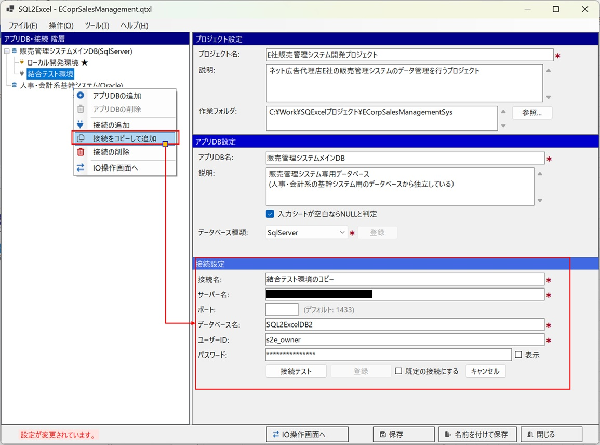

- 接続名には自動的に「〇〇のコピー」というサフィックスが付与されます。
- 「既定の接続にする」チェックは解除された状態でコピーされます。

2. 接続名以外の設定項目がコピー元、或いは親アプリDB以下の他の接続と一致している場合、以下のようなアラートが表示されます。

       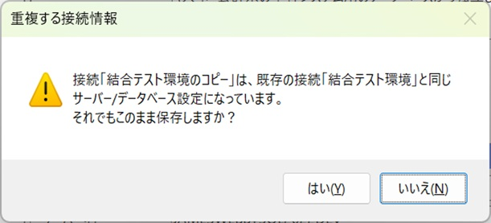

- はいをクリックすると同一の接続情報を有する異なる接続名を持つ接続が登録されることになります。

### 接続の削除

1. 接続を削除する場合は、アプリDB・接続ツリー上で削除対象となる接続ノードを選択し、コンテキストメニューから「接続の削除」を選択します。

- 階層ツリーで**接続ノード**を選択している場合のみ、コンテキストメニューの「接続の削除」が有効になります。

       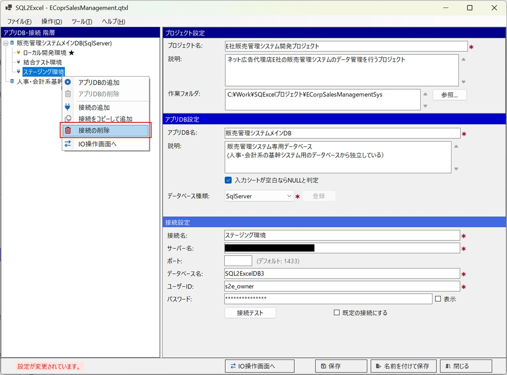

2. 次のような削除確認ダイアログメッセージが表示されます。はいをクリックすると、選択されていた接続が削除されます。

       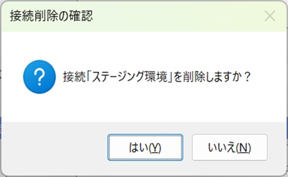

### IO操作画面への遷移

画面フッタの「IO操作画面へ」ボタンをクリックすると、選択中のアプリDB（または接続の親アプリDB）を対象に [IO操作画面](/ja/docs/features/io-operations/) に遷移します。このとき、IO操作画面のフッタにある接続先選択コンボボックスの初期選択は、遷移直前に階層ツリーで何を選択していたかによって決まります。

| 階層ツリーでの選択状態 | IO操作画面での初期選択接続 |
|---|---|
| 接続ノードを選択していた | その接続がそのままアクティブになる |
| アプリDBノードを選択していた | そのアプリDBの「既定の接続」がアクティブになる |

1. アプリDB・接続ツリー上で、任意のアプリDBの既定の接続ではない接続を選択して「IO操作画面へ」ボタンをクリックします。

       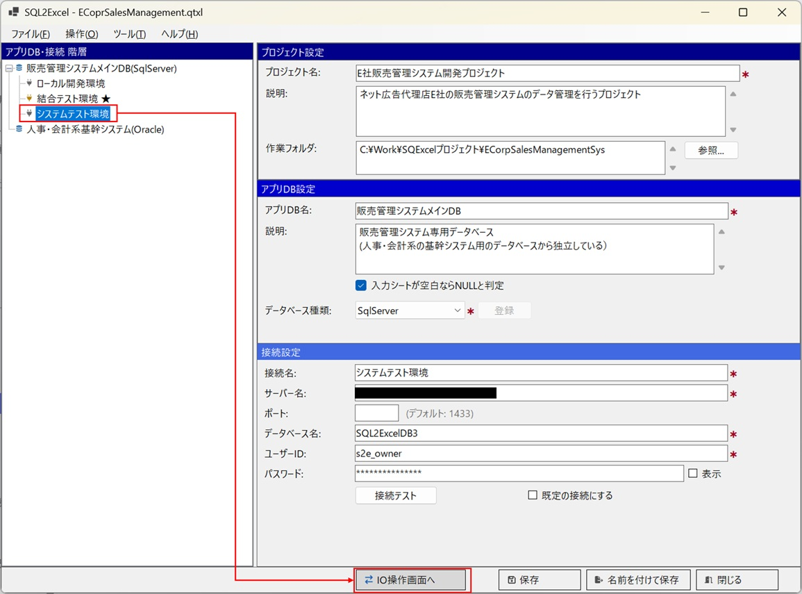

2. IO操作画面ではホーム画面で選択された接続が有効な状態になります。

       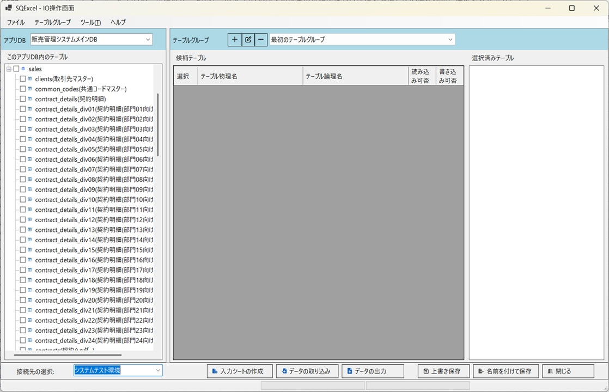

- 画面左側のテーブルツリーには、選択された接続先データベース上の選択可能なテーブルが全て表示されます。

:::tip[特定の接続先だけを対象にIO操作したいとき]
複数の接続（開発環境・テスト環境・本番環境等）を持つアプリDBで、既定の接続とは異なる接続先だけにIO操作を行いたい場合は、アプリDB・接続ツリーでその接続ノードを選択してから「IO操作画面へ」をクリックしてください。既定の接続に切り替わってしまうことなく、選択した接続がそのままアクティブな状態でIO操作画面が開きます。
:::

### 保存・終了

「保存」ボタンで現在のデータモデル階層を `.qtxl` ファイルに出力します。初回保存時はファイル保存ダイアログが表示され、「名前を付けて保存」では常に保存先を指定するダイアログが開きます。またホーム画面では、現在のデータモデル階層に `.qtxl` ファイルへ未保存の変更がないか常にチェックしています。

1. 未保存の変更箇所がある場合、ホーム画面フッタ部左側に下図のようなインジケータが表示されます。

       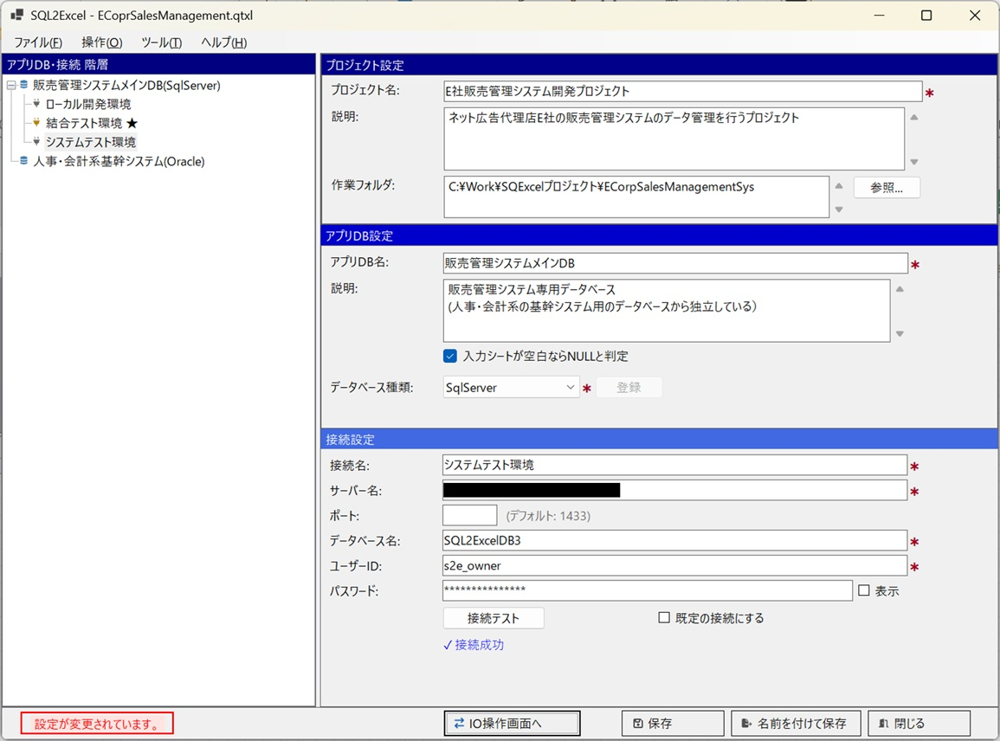

    このインジケータが表示されている場合は、「保存」ボタンをクリックしてから SQExcel を終了してください（データモデル階層の変更に誤りがあり、現在の設定を破棄したい場合は、保存せずに終了してください）。

2. 未保存の変更箇所が残っている状態で「閉じる」ボタンをクリックして SQExcel を終了しようとすると、次のようなアラートメッセージが表示されます。

       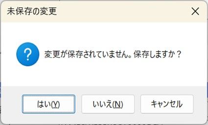

### 操作ガイダンスツールチップ

1. ホーム画面、及びIO操作画面では画面のエリアごとに、しばらくマウスカーソルを止めておくと簡単な操作ガイダンスのツールチップが表示されます。

       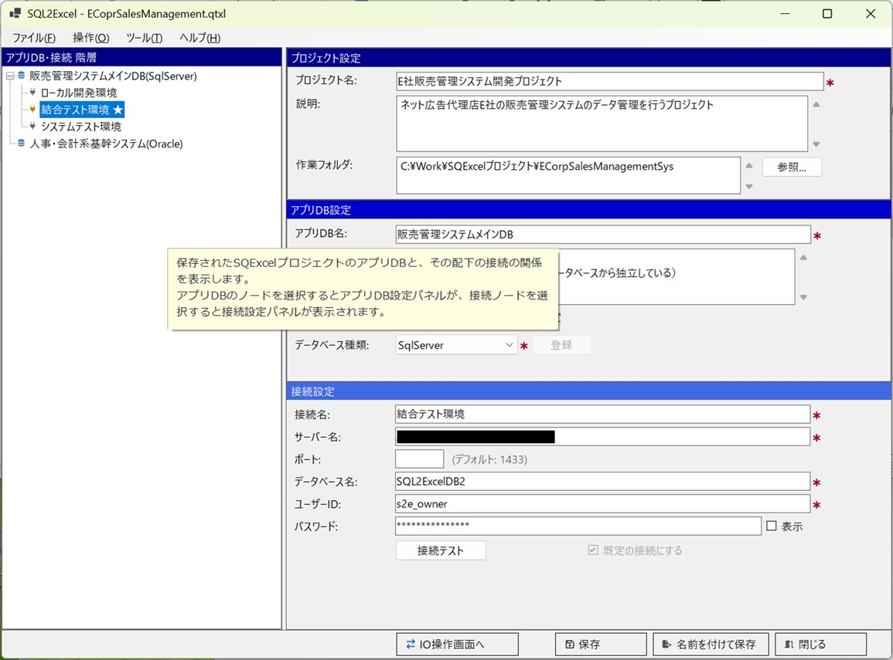

2. 操作に慣れてツールチップの表示が煩わしくなってきたら、表示を停止できます。トップメニューの[ヘルプ]直下にある[ツールチップを表示する]項目のチェックを外してください。これにより操作ガイダンス用ツールチップの表示が停止します。

       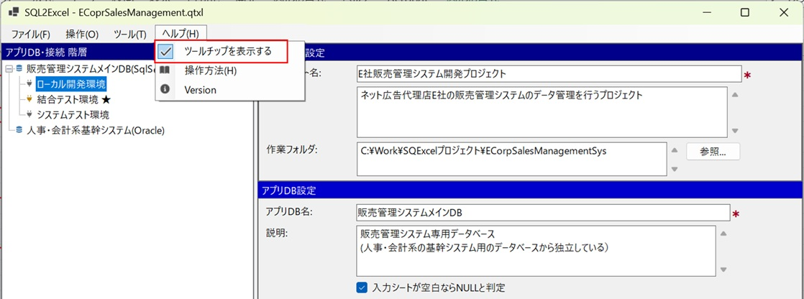

- この設定はIO操作画面でのツールチップの表示も制御します。
（IO操作画面で同じメニューからツールチップの表示をONにしてホーム画面に戻ると、再度操作ガイダンス用ツールチップが表示されるようになります。）
