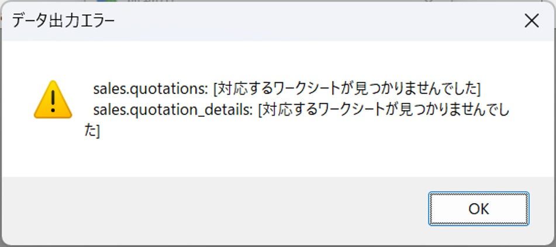
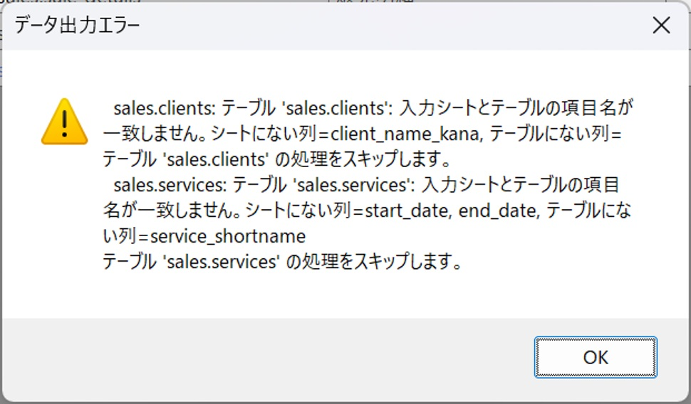
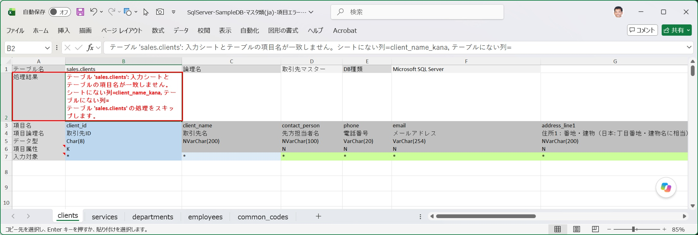
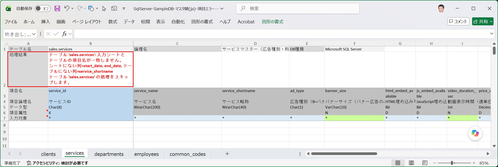
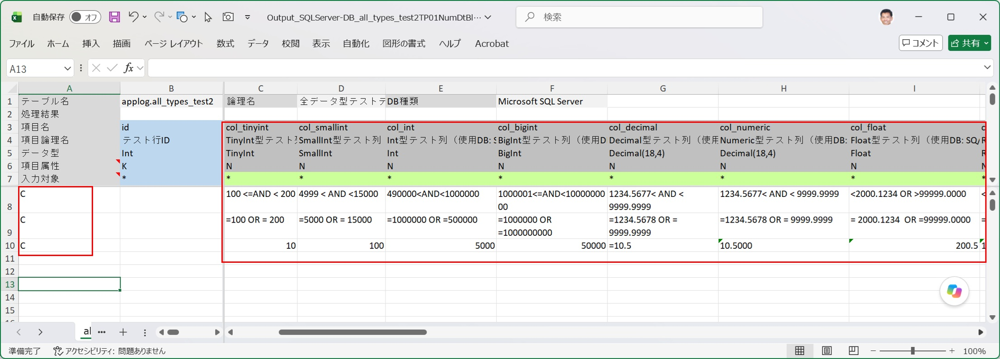
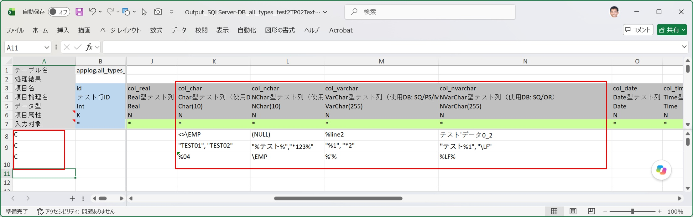
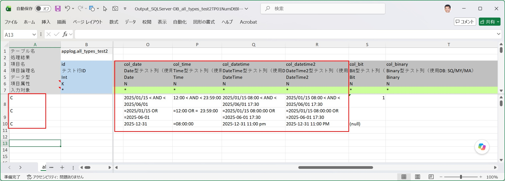
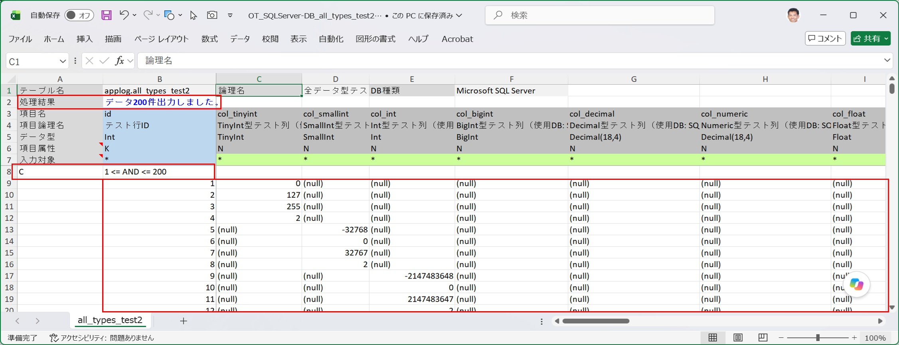

[データ出力ダイアログ](/ja/docs/features/io-operations/data-export-dialog/) からデータ出力を実行すると、入力シート上でどのような処理が行われているかを説明します。

## 簡易出力の場合
<strong>『新規入力シートを作成してデータを出力』</strong>が選択されている場合

1. 簡易出力の場合、指定された新規入力シート用ワークブックに、出力対象テーブルの入力用ワークシートが作成されます。 
このとき入力データ行の各項目列は、テーブル項目の項目列のデータ型に対応する既定の書式、及び既定の列幅が設定されます。

   - テーブル項目のデータ型に対応する既定の書式と列幅については[「入力シートの構造と作成」の「データ型とセル書式の対応」](/ja/docs/features/input-sheet/structure/#データ型とセル書式の対応)をご参照ください。

2. 作成された入力シートに、出力対象テーブルのデータが先頭から出力上限に指定されたレコード数の分だけ検索され、入力データエリアに出力されます。出力に際しては出力順の指定は行われません。従ってデータ出力順は各々のDBの規約に従います。
   - SQL Server/ MySQL/ MariaDBは主キーの昇順で出力されます。
   - PostgreSQL/ Oracleは主キーに関わらず不定（挿入順に近い）です。
   - 主キーのないテーブルはいずれも不定（挿入順に近い）です。

## 通常出力の場合
<strong>『既存の入力シートを指定して出力』</strong>が選択されている場合

### テーブルとシートの対応確認

入力シートを開くと、まずテーブル情報ヘッダ（B1セル）の値と、出力対象テーブルのテーブル名（`スキーマ名.テーブル物理名`）が一致するシートを探します。一致するシートが見つからない場合、そのテーブルはエラーとしてスキップされ、処理終了時にエラーダイアログが表示されます。

- 出力対象テーブルが指定された入力シートに含まれていない場合に表示されるエラーダイアログ

   

   - これは出力対象テーブルとしてsales.quatationsとsales.quatation_detailsが指定されている場合に、出力対象ファイルとした入力シートにこれらのテーブルの入力用ワークシートが含まれていないことを示しています。

 ### 入力シートとテーブルの項目照合

接続先データベースから取得したテーブルの項目一覧と、入力シートの項目ヘッダに定義された項目一覧を突き合わせます。どちらか一方にしか存在しない項目がある場合、そのテーブルの処理はスキップされ、処理終了時にエラーダイアログが表示されるとともに、処理結果表示エリア（B2セル）にエラーメッセージが記入されます。

- 出力対象テーブルと入力シートの間に項目の不一致がある場合に表示されるアラートダイアログ

   

   以下の項目不一致があることを示しています。
   - 出力対象テーブル`sales.clients`について、出力対象ファイルとした入力シートに、項目`client_name_kana`が欠落している。
   - 出力対象テーブル`sales.services`について、出力対象ファイルとした入力シートに、項目`start_date`と`end_date`が欠落し、一方入力シート側にしかない項目`service_shortname`が存在する。

- 入力シート側の項目欠落エラー表示： 
処理結果エリアに、入力シートにはテーブルには定義されている項目「client_name_kana」が欠落していることを表示しています。

   

- 入力シート側の項目欠落エラー及び不明項目の表示： 
処理結果エリアに、入力シートにはテーブルには定義されている項目「start_date」と「end_date」が欠落し、かつテーブルに定義されていない項目「service_shortname」が定義されていることを表示しています。

   

### 検索条件からWHERE句を組み立てる

入力エリアの中で、A列に `C`（または `c`）が記入されている行を「検索条件行」として認識します。

- **同一の検索条件行内**の複数カラムの条件は `AND` で結合されます
- **異なる検索条件行**同士は `OR` で結合されます
- 検索条件行が1つもない場合は、全件が検索対象になります

検索条件の具体的な記入書式（数値・日付・文字列・真偽値それぞれの表記ルール）は [入力シートへの検索条件記入方法](/ja/docs/features/input-sheet/search-conditions/) を参照してください。

- 数値型項目への検索条件設定例

   

- 文字型項目への検索条件設定例

   

- 日付型項目への検索条件設定例

   

### 出力件数の上限とSELECT文

[データ出力ダイアログ](/ja/docs/features/io-operations/data-export-dialog/) で指定した上限件数と、実際にヒットした件数のうち小さい方が出力されます。上限を実現する SELECT 文の書き方は DB種類によって異なります。

| DB種類 | SELECT文の構文 |
|---|---|
| SQL Server | `SELECT TOP {上限} 項目リスト FROM テーブル名 [WHERE 条件式]` |
| PostgreSQL / MySQL / MariaDB / SQLite | `SELECT 項目リスト FROM テーブル名 [WHERE 条件式] LIMIT {上限}` |
| Oracle | `SELECT 項目リスト FROM テーブル名 [WHERE 条件式] FETCH FIRST {上限} ROWS ONLY` |

### 検索結果の出力と結果の書き込み

検索条件行の直後（データ出力エリアの先頭）から、取得したデータが1行ずつ書き込まれます。（※この位置に既存データが残っている場合は、書き込み前にいったんクリアされます。） 
処理完了後、処理結果表示エリア（B2セル）に「データ〇〇件出力しました。」のメッセージが記入されます。

- 出力対象テーブル：alltyes_test2の主キー：idの値が1以上200以下であるデータを検索した結果、200件のデータが入力シート上に出力された状態

:::tip[出力したデータをそのまま更新に使う]
出力されたデータをそのまま編集し、[データ取り込みダイアログ](/ja/docs/features/io-operations/data-import-dialog/) で UPDATE を実行すれば、検索→確認→修正→反映までを1つの入力シート上で完結できます。詳しい活用例は [大規模システムのメンテナンスで使う](/ja/docs/real-world/large-scale/) を参照してください。
:::
