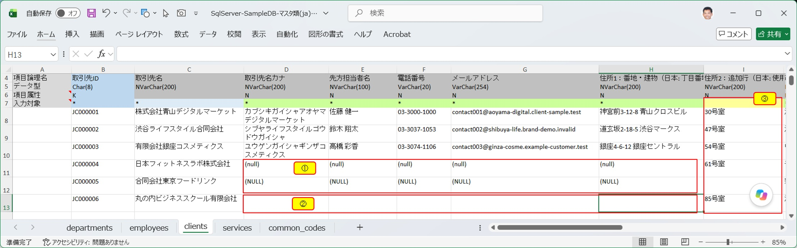

このページでは、[データ取り込み](/ja/docs/features/io-operations/data-import-dialog/) 機能が入力シートの内容から SQL を生成する際の規則と、データ型・DB種類ごとに実際どのような値が受け付けられ、どのような値がエラーになるかを詳しく説明します。<br/>

## SQL生成の基本ルール

- SQL の予約語（`INSERT`、`UPDATE`、`WHERE` 等）は大文字で表記されます
- テーブル名・項目名は定義された物理名の通りに表記されます
- 読みやすい位置で改行し、適切なインデントが加えられます（インデント幅は [データ取り込みダイアログ](/ja/docs/features/io-operations/data-import-dialog/) で設定可能）
- スキーマに対応する DB 種類（SQL Server／PostgreSQL／Oracle）では、テーブル名がスキーマ名で修飾されます
- テーブル名・項目名にスペースや予約語が含まれる場合は、DB種類ごとの識別子クォート（`[ ]` / `" "` / `` ` ` `` 等）で囲まれます
- `UPDATE` 文でキー項目を変更することはできません（主キーの値を変更する場合は `DELETE` と `INSERT` を個別に実行してください）

### INSERT文・UPDATE文のスタイル

[データ取り込みダイアログ](/ja/docs/features/io-operations/data-import-dialog/) の「INSERT文１行当たりの項目数」「INSERT文のスタイル」「UPDATE文スタイル」の組み合わせにより、生成される SQL の見た目（括弧やカンマの位置）が変わります。<br/>

■ 生成される文例(INSERT文)：

```sql
-- 1行あたり1項目、スタイル1(項目ブロック、値ブロックの前後に()を記入)
INSERT INTO table1
(   field1,
    field2,
    field3 )
VALUES
(   value1,
    value2,
    value3 );
```

```sql
-- 1行あたり5項目、スタイル2(INSERT句、VALUES句の前後に()を記入)
INSERT INTO table1 (
    field1, field2, field3, field4, field5
) VALUES (
    value1, value2, value3, value4, value5
);
```

■ 生成される文例(UPDATE文)：

```sql
-- スタイル1(SET句を2行目先頭、項目設定後に「,」、WHERE句のAND/ORは第1条件の後方)
UPDATE table1
SET field1 = value1,
    field2 = value2,
    field3 = value3,
WHERE
    key1 = keyvalue1 AND
    key2 = keyvalue2;
```

```sql
-- スタイル3(SET句を1行目後方、項目設定前に「,」、WHERE句のAND/ORは2番目以降の条件の前方)
UPDATE table1 SET
    field1 = value1
   ,field2 = value2
   ,field3 = value3
WHERE
    key1 = keyvalue1 
  AND key2 = keyvalue2;
```

### UPDATE or INSERT（UPSERT）の場合

DB種類ごとに構文が異なるため、それぞれ最適な UPSERT 構文が生成されます。

<div class="standard-table">

| DB種類 | 使用される構文 |
|---|---|
| SQL Server | `MERGE INTO ... USING ... WHEN MATCHED / WHEN NOT MATCHED` |
| Oracle | `MERGE INTO ... USING ... FROM dual` |
| PostgreSQL / SQLite | `INSERT ... ON CONFLICT (...) DO UPDATE SET` |
| MySQL / MariaDB | `INSERT ... ON DUPLICATE KEY UPDATE` |

</div>

<br/>
■ 生成される文例(SQL Server、パラメータ化クエリを使用しない場合)：

```sql
-- SQL ServerのUPSERT文例
MERGE INTO hr.departments AS T
USING (
    SELECT
        'OF0001' AS dept_id, '東京本社' AS dept_name, NULL AS parent_dept_id, '2022-04-01 09:00:00' AS created_at,
        'system' AS created_by, '2026-04-01 10:15:00' AS updated_at, 'sys_administrator' AS updated_by
) AS S
ON (
    T.dept_id = S.dept_id
)
WHEN MATCHED THEN
    UPDATE SET
        dept_name = S.dept_name,
        parent_dept_id = S.parent_dept_id,
        created_at = S.created_at,
        created_by = S.created_by,
        updated_at = S.updated_at,
        updated_by = S.updated_by
WHEN NOT MATCHED THEN
    INSERT (
        dept_id, dept_name, parent_dept_id, created_at,
        created_by, updated_at, updated_by
    )
    VALUES (
        S.dept_id, S.dept_name, S.parent_dept_id, S.created_at,
        S.created_by, S.updated_at, S.updated_by
    );
```

■ 生成される文例(Oracle、パラメータ化クエリを使用する場合)：

```sql
-- Oracle DBのUPSERT文例
DECLARE
    p1 CHAR(6)        := 'OF0001';  -- DEPT_ID
    p2 NVARCHAR2(100) := '東京本社';  -- DEPT_NAME
    p3 VARCHAR2(20)   := '2022-04-01 09:00:00';  -- CREATED_AT
    p4 VARCHAR2(20)   := 'system';  -- CREATED_BY
    p5 VARCHAR2(20)   := '2026-04-01 10:15:00';  -- UPDATED_AT
    p6 VARCHAR2(20)   := 'sys_administrator';  -- UPDATED_BY
BEGIN
    MERGE INTO HR.DEPARTMENTS T
    USING (
        SELECT
            p1 AS DEPT_ID, p2 AS DEPT_NAME, NULL AS PARENT_DEPT_ID, TO_DATE(p3, 'YYYY-MM-DD HH24:MI:SS') AS CREATED_AT,
            p4 AS CREATED_BY, TO_DATE(p5, 'YYYY-MM-DD HH24:MI:SS') AS UPDATED_AT, p6 AS UPDATED_BY
        FROM dual
    ) S
    ON (
        T.DEPT_ID = S.DEPT_ID
    )
    WHEN MATCHED THEN
        UPDATE SET
            T.DEPT_NAME = S.DEPT_NAME,
            T.PARENT_DEPT_ID = S.PARENT_DEPT_ID,
            T.CREATED_AT = S.CREATED_AT,
            T.CREATED_BY = S.CREATED_BY,
            T.UPDATED_AT = S.UPDATED_AT,
            T.UPDATED_BY = S.UPDATED_BY
    WHEN NOT MATCHED THEN
        INSERT (
            DEPT_ID, DEPT_NAME, PARENT_DEPT_ID, CREATED_AT,
            CREATED_BY, UPDATED_AT, UPDATED_BY
        )
        VALUES (
            S.DEPT_ID, S.DEPT_NAME, S.PARENT_DEPT_ID, S.CREATED_AT,
            S.CREATED_BY, S.UPDATED_AT, S.UPDATED_BY
        );
END;
```

## 文字列項目の特殊文字

文字列項目にシングルクォート・ダブルクォート・改行・バックスラッシュが含まれる場合、DB種類ごとに異なるエスケープが自動的に適用されます。<br/>
※入力シートでこれらの特殊文字を使用する場合は、セル値にこの規約に沿った入力を行う必要があります。

### シングルクォート/ダブルクォート

<div class="three-column-table433">

| DB種類 | シングルクォート | ダブルクォート |
|---|---|---|
| SQL Server/ PostgreSQL/ MySQL/ MariaDB/ SQLite/ Oracle | `''`でエスケープ | エスケープ不要(`"`をそのまま記入可能) |

</div>

### バックスラッシュ/改行

<div class="four-column-table-equal">

| DB種類 | バックスラッシュ | 改行 | 特殊構文 |
|---|---|---|---|
| SQL Server | エスケープ不要(「\」をそのまま記入可能) | エスケープ不要(改行をそのまま記入可能) | なし |
| PostgreSQL | E'...'内で\n等を使用する | エスケープ不要(改行をそのまま記入可能) | E'...' |
| MySQL/ MariaDB | エスケープ不要(「\」をそのまま記入可能) | \nが推奨されている | なし |
| SQLite | エスケープ不要(「\」をそのまま記入可能) | エスケープ不要(改行をそのまま記入可能) | なし |
| Oracle | エスケープ不要(「\」をそのまま記入可能) | q[...]構文を用いる | q[...] |

</div>

※特殊構文とはバックスラッシュや改行コードを使用する際にそのDB特有の特殊構文内で指定を行う場合に用いる構文のことを指す。詳しくは以下のDB種類ごとの特殊文字のSQL文への適用例を参照すること。

### DB種類ごとの特殊文字のSQL文への適用例

以下にシングルクォート/ ダブルクォート/ バックスラッシュ/ 改行を含む文字時列を1つの文字列項目にセットするINSERT文の例をDB種類毎に例示します。文字列項目のセル値の入力の際に参照してください。

■ SQL Server
```sql
INSERT INTO MyTable (StringField1)
VALUES (
'He said "Hello".
I''m happy.
C:\temp\test
改行あり
次の行'
);
----
・シングルクォート → ''、・ダブルクォート → そのまま、・バックスラッシュ → そのまま、
・改行 → そのまま書ける
```

■ PostgreSQL
```sql
INSERT INTO MyTable (StringField1)
VALUES (
E'He said "Hello".
I''m happy.
C:\\temp\\test
改行あり
次の行'
);
----
・シングルクォート → ''、・ダブルクォート → そのまま、
・バックスラッシュ →E'...' を使うと \\ や \n が使える、・改行 → そのまま書ける
```

■ MySQL/ MariaDB
```sql
INSERT INTO MyTable (StringField1)
VALUES (
'He said "Hello".\nI''m happy.\nC:\\temp\\test\n改行あり\n次の行'
);
----
・シングルクォート → ''、・ダブルクォート → そのまま、・バックスラッシュ →\\、
・改行 → \n 推奨（そのままでも動くが非推奨）
```

■ SQLite
```sql
INSERT INTO MyTable (StringField1)
VALUES (
'He said "Hello".
I''m happy.
C:\temp\test
改行あり
次の行'
);
----
・シングルクォート → ''、・ダブルクォート → そのまま、・バックスラッシュ → そのまま、
・改行 → そのまま書ける
```

■ Oracle
```text
INSERT INTO MyTable (StringField1)
VALUES (
q'[He said "Hello".
I'm happy.
C:\temp\test
改行あり
次の行]'
);
----
・シングルクォート → q'[...]' 内ならエスケープ不要、・ダブルクォート → そのまま、
・バックスラッシュ → そのまま、・改行 → q'[...]' 内なら書ける
```

## NULLと空文字列の指定

<div class="standard-table">

| 指定したい内容 | 入力方法 |
|---|---|
| NULL | 入力対象マーク（`*`）を外す、または `(null)` / `(NULL)` と入力する |
| 空文字列 `''` | セルを空白にする(スペースなどを入力しないこと) |
| 文字列としての `(null)` | 先頭を `\` でエスケープして `\(null)` と入力する |

</div>


   <div class="medium-scale-img95">

   

   </div>

<div class="two-column-table28">

| No | 説明 |
|---|---|
| ① | セルに`(null)` / `(NULL)` が入力されている場合は項目にはNULLがセットされる。 |
| ② | セルが空白であれば項目には空白(長さ0の文字列)がセットされる。(Oracleの場合NULLと空白は同値なので結果的にNUUがセットされる) |
| ③ | 入力対象行の*マークが外れるとその項目はSQL処理対象外となるためセルに指定されている値は無視させる。(INSERT文ではNULLがセットされる。UPDATE文ではSET句による値の設定対象外になる。) |

</div>

## パラメータ化クエリの生成と実行

[データ取り込みダイアログ](/ja/docs/features/io-operations/data-import-dialog/) の「パラメータ化クエリを使用する」を ON にすると、SQL インジェクション対策として値をバインドパラメータとして渡す形式で SQL が生成・実行されます。

### 6種類のDB種類に対応

パラメータ化クエリを使用する場合はSQL文は単一の文ではなく、複数のSQL文から構成されるコードブロックとして実行されます。
またパラメータ化クエリの定義やコードブロックの記載方法やDB種類毎に異なります。
<br/>
SQExcelはDB種類に応じてそれぞれの表記規則に則ったコードブロックを出力します。

以下にパラメータ化クエリによるINSERT文の生成例を示します。<br/>
■ SQL Server

```sql
BEGIN
    DECLARE @p1 CHAR(6)      ;  -- dept_id
    DECLARE @p2 NVARCHAR(100);  -- dept_name
    DECLARE @p3 DATETIME2    ;  -- created_at
    DECLARE @p4 VARCHAR(20)  ;  -- created_by
    DECLARE @p5 DATETIME2    ;  -- updated_at
    DECLARE @p6 VARCHAR(20)  ;  -- updated_by

    SET @p1 = N'OF0001';
    SET @p2 = N'東京本社';
    SET @p3 = '2022-04-01 09:00:00';
    SET @p4 = N'system';
    SET @p5 = '2026-04-01 10:15:00';
    SET @p6 = N'sys_administrator';

    INSERT INTO hr.departments (
        dept_id, dept_name, parent_dept_id, created_at,
        created_by, updated_at, updated_by
    ) VALUES (
        @p1, @p2, NULL, @p3,
        @p4, @p5, @p6
    );
END;
GO;
```

■ PostgreSQL

```sql
DO $$
DECLARE
    p1 CHAR(6)   := 'OF0001';  -- dept_id
    p2 TEXT      := '東京本社';  -- dept_name
    p3 TIMESTAMP := '2022-04-01 09:00:00';  -- created_at
    p4 TEXT      := 'system';  -- created_by
    p5 TIMESTAMP := '2026-04-01 10:15:00';  -- updated_at
    p6 TEXT      := 'sys_administrator';  -- updated_by
BEGIN
    INSERT INTO hr.departments (
        dept_id, dept_name, parent_dept_id, created_at,
        created_by, updated_at, updated_by
    ) VALUES (
        p1, p2, NULL, p3::timestamp,
        p4, p5::timestamp, p6
    );
END $$;
```

■ MySQL/ MariaDB

```sql
SET @p1 = 'OF0001';  -- dept_id
SET @p2 = '東京本社';  -- dept_name
SET @p3 = '2022-04-01 09:00:00';  -- created_at
SET @p4 = 'system';  -- created_by
SET @p5 = '2026-04-01 10:15:00';  -- updated_at
SET @p6 = 'sys_administrator';  -- updated_by

INSERT INTO departments (
    dept_id, dept_name, parent_dept_id, created_at,
    created_by, updated_at, updated_by
) VALUES (
    @p1, @p2, NULL, @p3,
    @p4, @p5, @p6
);
```

■ SQLite

```sql
WITH params AS (
    SELECT 'OF0001' AS p1,  -- dept_id
           '東京本社' AS p2,  -- dept_name
           '2022年4月1日 9:00:00' AS p3,  -- created_at
           'system' AS p4,  -- created_by
           '2026年4月1日 10:15:00' AS p5,  -- updated_at
           'sys_administrator' AS p6  -- updated_by
)
INSERT INTO departments (
    dept_id, dept_name, parent_dept_id, created_at,
    created_by, updated_at, updated_by
)
SELECT
    p1, p2, NULL, p3,
    p4, p5, p6
FROM params;
```

■ Oracle

```sql
DECLARE
    p1 CHAR(6)        := 'OF0001';  -- DEPT_ID
    p2 NVARCHAR2(100) := '東京本社';  -- DEPT_NAME
    p3 VARCHAR2(20)   := '2022-04-01 09:00:00';  -- CREATED_AT
    p4 VARCHAR2(20)   := 'system';  -- CREATED_BY
    p5 VARCHAR2(20)   := '2026-04-01 10:15:00';  -- UPDATED_AT
    p6 VARCHAR2(20)   := 'sys_administrator';  -- UPDATED_BY
BEGIN
    INSERT INTO HR.DEPARTMENTS (
        DEPT_ID, DEPT_NAME, PARENT_DEPT_ID, CREATED_AT,
        CREATED_BY, UPDATED_AT, UPDATED_BY
    ) VALUES (
        p1, p2, NULL, TO_DATE(p3, 'YYYY-MM-DD HH24:MI:SS'),
        p4, TO_DATE(p5, 'YYYY-MM-DD HH24:MI:SS'), p6
    );
END;
/
```

### SQLインジェクション対策

パラメータ化クエリを使用する目的は、SQLインジェクション攻撃を完全に防御し、データベースの安全性を確保することです。また、処理の高速化という副次的なメリットもあります。<br/>
ただしSQExcelではパラメータ化クエリを使用せずに通常のリテラルSQLを生成する場合でも、最低限のSQLインジェクション対応を行っています。<br/>
<br/>
リテラルSQLを使用する際にSQLインジェクション対応を行う場合は、シングルクォーテーションなどのSQL文の構造を変更して任意のコマンドを挿入する可能性のある文字や記号をエスケープする必要があります。SQExcelは入力シートのセル内にそのような文字を見つけると自動的にエスケープ処理を行い無害化します。<br/>

- SQExcelの機能と入力シートを使用してDBに対してSQLインジェクション攻撃を行うことは実質的に不可能ですが、出力されたSQL文を編集して攻撃を行うことは可能です。また入力シートからもDB内のテーブル情報が読み取れるようになっています。SQExcelが取り扱う入力シートや出力されたSQL文は機密情報として必要なセキュリティ管理を行ってください。


### パラメータ化クエリの使用・不使用により結果が異なる場合

入力値が同一でもパラメータ化クエリの使用・不使用により結果が異なる場合がある

重要なポイントとして、**同じ入力値でも、パラメータ化クエリとリテラルSQLとで処理結果（成功／エラー）が異なる場合があります**。これはパラメータバインド時にドライバ・SQExcel 側で型変換が行われるためで、SQExcel の仕様上の挙動です。<br/>

■ 代表的な例：

<div class="standard-table">

| 状況(データ型) | リテラルSQL | パラメータ化クエリ |
|---|---|---|
| 整数型(TinyInt/SmallInt/Int)項目値に少数を与えた場合 | DB側で自動的に整数に丸められエラーにならない。 | 型指定されたパラメータへの代入時にエラーになる。 |
| 日付型(Date/DateTime)項目値に区切り文字が不均一な日付文字列（例：`2026/05-13`）を与えた場合 | 区切り文字が不均一な日付文字列（例：`2026/05-13`）はSQL実行時エラー | パラメータ設定時に日付書式が自動調整されるためエラーにならない |
| UniqueIdentifier / Uuid（例：SQL Server） | ハイフンなしのGUID文字列はSQL実行時エラー | パラメータ変数へ設定する際にGUID形式へ自動整形されるためエラーにならない |

</div>


## データ型のDB種類ごとの対比

SQExcelが取り扱う6つのDB種類では基本的な数値型・日付時刻型・文字型の項目は定義域を共有しますが、一部DB種類特有のデータ型を有するものがあります。以下に一覧を定義します。

<div class="standard-table">

| DB種類 | 項目・データ型 | 入力値の例 | 結果 | 補足 |
|---|---|---|---|---|
| SQL Server | col_tinyint（TinyInt） | `1.5`（小数） | パラメータ化クエリ使用時：エラー | TinyInt型パラメータに小数値をバインドできないため |
| SQL Server | col_date（Date） | `2026/05-13`（区切り文字不均一） | リテラルSQL：エラー／パラメータ化クエリ：成功 | 上表「パラメータ化クエリとリテラルSQLの違い」を参照 |
| SQL Server | col_uniqueidentifier（UniqueIdentifier） | ハイフンなしGUID文字列 | リテラルSQL：エラー／パラメータ化クエリ：成功 | 同上 |

</div>