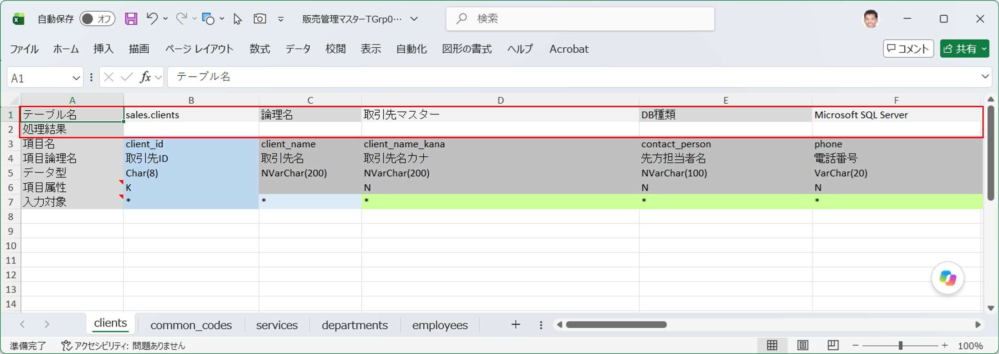
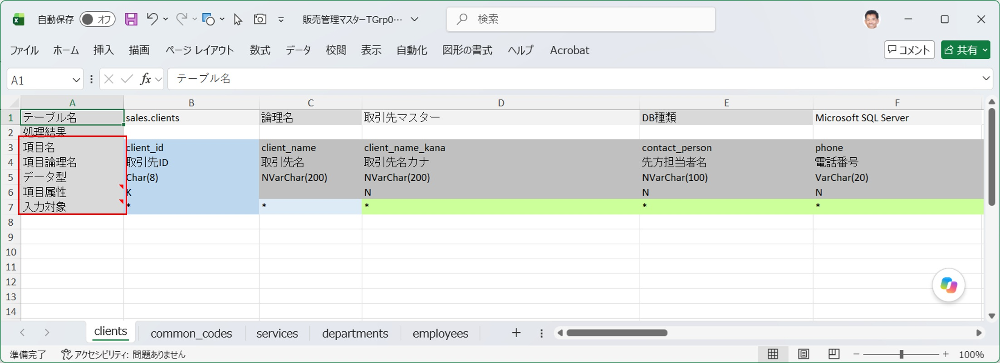
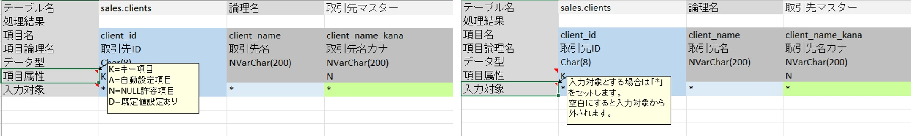
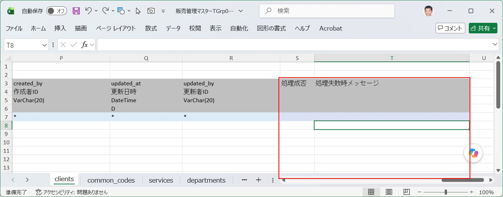
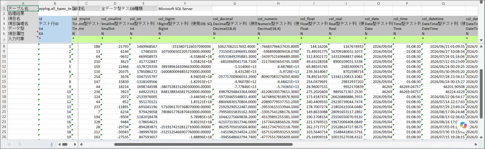
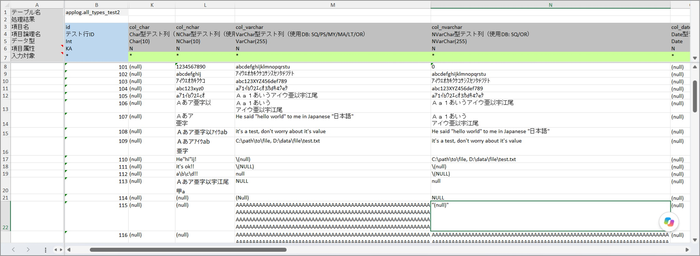
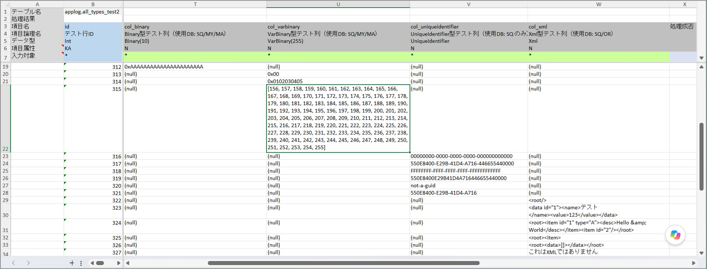
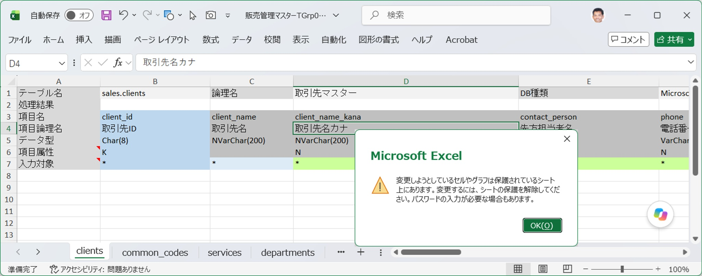

## ワークブックとワークシートの対応

SQExcelの入力シートには、1つのワークブックの中に1つのテーブルグループの選択済みテーブルリストに含まれるDBテーブルのデータ入力用ワークシートがまとめて作成されます。 
SQExcelの「入力シート」はこのワークブックを指し、個々のテーブルデータ入力用ワークシートは「テーブルワークシート」、または「○○○○テーブルのワークシート」のように呼びます。
- テーブルワークシートは所定の構造を持つ必要があります。この条件については後続の「テーブルワークシートの構成」で説明します。
- 入力シート内にはテーブルワークシート以外に任意のワークシートを含めることが可能です。

## テーブルワークシートの構成

### テーブル情報ヘッダ部（1〜2行目）

| セル | 内容 |
|---|---|
| A1 / C1 / E1 | 見出しラベル「テーブル名」「論理名」「DB種類名」 |
| B1 | `スキーマ名.テーブル物理名` 形式のテーブル名 |
| D1 | テーブル論理名（DB側に論理名が登録されていない場合は論理名を含めてブロック単位で非表示） |
| F1 | DB種類名（Microsoft SQL Server/ Oracle Database/ PostgreSQL/ MySQL/ MariaDB/ SQLite のいずれか  ） |
| A2 | 見出しラベル「処理結果」 |
| B2 | データ取り込み・データ出力の処理結果メッセージがここに書き込まれる |

### 項目ヘッダ部（3〜7行目）

| 行 | 内容 |
|---|---|
| 3行目 | 項目物理名 |
| 4行目 | 項目論理名（取得できない場合は行自体が省略され、以降の行が1行ずつ繰り上がる） |
| 5行目 | データ型。DB種類に応じて定義されたデータ型を桁数や精度を含めて表示する。 |
| 6行目 | 項目属性。その列のテーブル項目が有する属性の種類を次の文字の組み合わせで表示する（K＝キー項目、A＝自動設定項目、N＝NULL許容項目、D＝既定値あり） |
| 7行目 | 入力対象マーク欄（`*` を入れた項目のみデータ取り込みの対象になり、実行されるSQLの処理対象項目となる。ただし処理種別=DELETEの場合は無視される。） |

 
※項目ヘッダ部の項目属性と入力対象マーク欄をアクティブにすると項目の説明がメモとして表示されます。

### データ取り込み結果列（テーブル項目列右端2列）

データ入力エリアの項目列の右端の2列がデータ取り込みの処理結果が記入されるエリアです。
[データ取り込み機能](/ja/docs/features/input-sheet/data-import/)処理の結果とエラーが発生した場合の利用を記入するエリアです。

| 列 | 内容 |
|---|---|
| 処理成否(テーブル項目列右端から1列目) | データ取り込み処理の成否をtrueまたはfalseで表す |
| 処理失敗時メッセージ(テーブル項目列右端から2列目) | データ取り込みがエラーになった場合、その原因と実行されたSQLを表示する |

※実際の書き込み例は [データ取り込みダイアログ](/ja/docs/features/io-operations/data-import-dialog/) の「処理結果の書き込み」を参照。

### データ入力エリア（8行目以降）

項目ヘッダより下がデータの入力エリアです。[入力シートへのデータ投入方法](/ja/docs/data-entry/) で紹介したいずれかの方法でデータを入力します。 
また、入力エリアの先頭から開始する行で、A列に C（または c）が連続して記入されている行はSQExcelでは「検索条件行」として取り扱われデータ取込み時の入力データ対象外となります。 
詳細については [データ出力機能](/ja/docs/features/input-sheet/data-export/) の「検索条件からWHERE句を組み立てる」を参照してください。

## データ型とセル書式の対応

入力シート作成時、テーブル項目のデータ型に応じて、Excel のセル書式が自動的に設定されます。主な対応は次の通りです（詳細な桁数範囲やデフォルト値は [入力シート作成ダイアログ](/ja/docs/features/io-operations/input-sheet-builder-dialog/) のワークシート設定タブ・列幅設定タブで調整できます）。

| データ型カテゴリ | 対応するセル書式 |
|---|---|
| 整数型（TinyInt/SmallInt/Int/BigInt） | 標準（General）、または整数表示 |
| 固定小数点型（Decimal/Numeric） | 桁数に応じた小数点表示（例：`0.0000`） |
| 浮動小数点型（Float/Real/Double） | 標準（General）、または誤差を抑えた固定桁表示 |
| 文字列型（Char/VarChar/Text/Clob 等） | 標準（General）、または文字列（`@`）＋折り返して全体を表示 |
| 日付・時刻型（Date/Time/DateTime 等） | `yyyy/mm/dd` 等、複数の書式から選択可 |
| 真偽値型（Bit/Boolean/Number1 等） | 標準（General） |
| バイナリ型（Binary/Blob/Bytea 等） | 標準（General）、または文字列（`@`）＋折り返して全体を表示（16進数文字列） |
| その他（Guid/Xml/Json/RowId 等） | 標準（General）、または文字列（`@`）＋折り返して全体を表示 |

※`@`はセルの書式が文字列に設定されていることを示す記号です。

- 数値型、日付型項目のデータ設定例

- 文字型項目のデータ設定例

- バイナリ型、BLOB型データの設定例

:::tip[列幅もデータ型に応じて自動調整]
例えば `Char/VarChar` 等の文字列型は桁数帯（1〜10／11〜20／21〜）ごとに既定の列幅が設定されており、`Decimal/Numeric` も桁数帯によって列幅が変わります。詳細な対応表は [入力シート作成ダイアログ](/ja/docs/features/io-operations/input-sheet-builder-dialog/) の列幅設定タブで確認・変更できます。
:::

## ワークシート保護

テーブル情報ヘッダ・項目ヘッダ部まではセルロックがかけられ、データ入力エリアはロック対象外となった状態でワークシート保護がかけられます（保護の有無は入力シート作成ダイアログで設定可能）。ロックされた範囲でもセルの書式変更・行列の挿入削除・並べ替え・オートフィルターは許可されており、実質的にピボットテーブルの使用とシナリオの編集以外はすべて操作可能です。

- ワークシート保護解除用のパスワードは設定されません。 
(従って解除するときにパスワードを入力する必要はありません。)
- ワークシート保護が有効な状態で、セルがロックされている項目ヘッダ内のセル値を変更しようとするとエラーが表示されます。

:::note[長いテーブル名の扱い]
ワークシート名は最大31文字です。テーブル名が30文字以上の場合、先頭29文字で切り、30・31文字目に2桁の16進数連番（`01`〜`FF`）を接尾辞として付与します。データ取り込み・出力時のテーブル照合はワークシート名ではなく、後述のテーブル情報ヘッダの値で行われるため、この省略によって処理が誤動作することはありません。
:::
