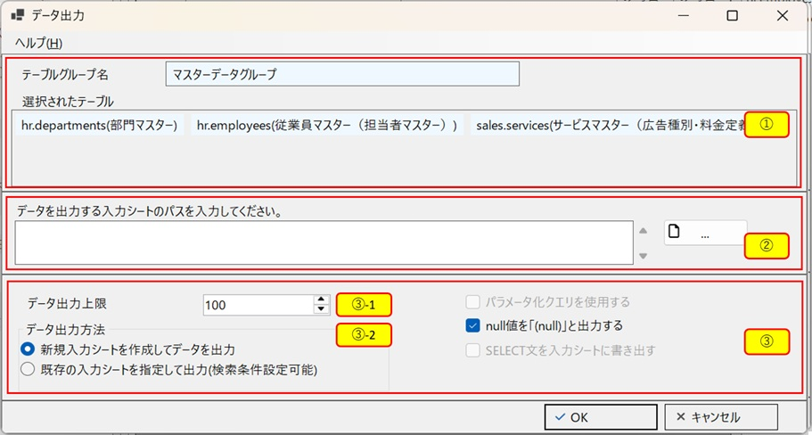
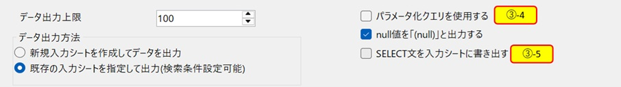
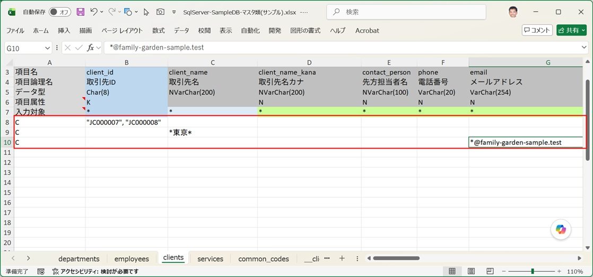
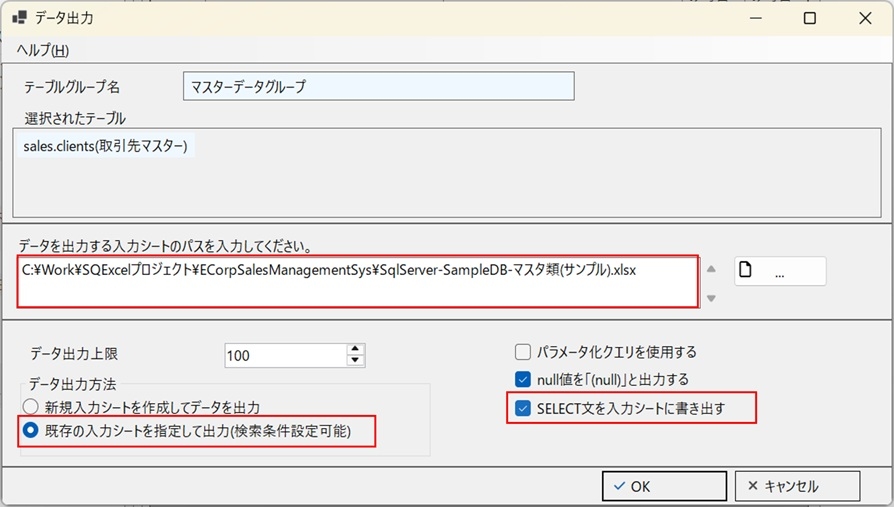
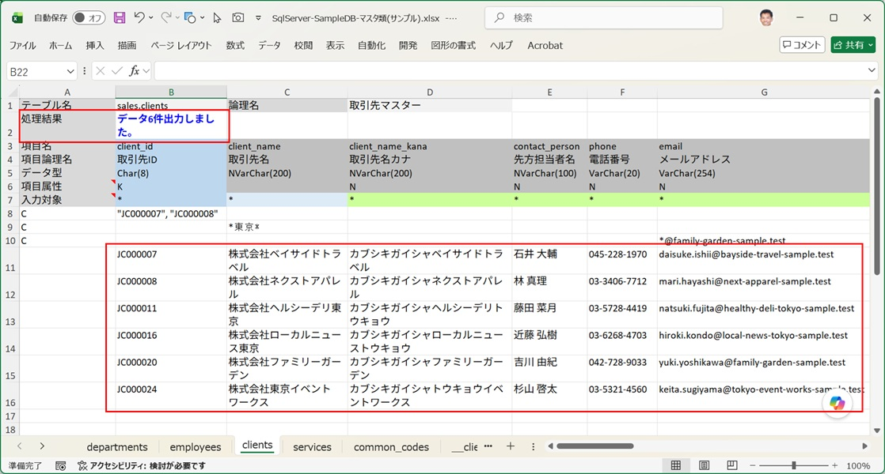
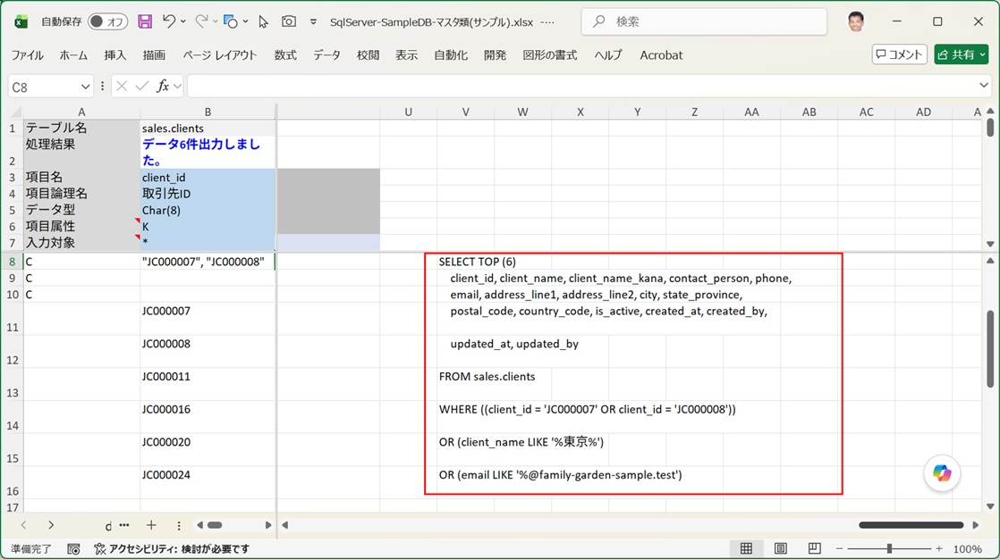

[IO操作画面](/ja/docs/features/io-operations/) で「データ出力」ボタンをクリックすると、このダイアログが開きます。データベースから検索条件に合致するデータを取得し、入力シートへ書き出します。

## 画面構成

### 新規入力シートを作成してデータを出力(簡易出力)する場合

   

| No. | エリア | 内容 |
|---|---|---|
| ① | テーブルグループ情報パネル | 呼び出し元の IO操作画面で選択されていたテーブルグループ名と、選択済みテーブルの一覧を表示します |
| ② | 入力シートのパス入力欄 | データを出力するシートのパスを指定します（ファイルはSQExcel入力シートフォーマットで出力されます） |
| ③ | オプション設定エリア | データ出力処理の各種オプションの設定入力エリアです |
| ③-1 | データ出力上限 | 入力シートに出力するテーブルデータの上限を設定します。 |
| ③-2 | データ出力方法ラジオボタン | データ出力方法を選択します。データ出力方法の詳細は「出力方法：通常出力／簡易出力」で説明します。 |
| ③-3 | null値を「(null)」と出力するチェックボックス | SQExcelの既定の設定ではnull値は空白ではなく「(null)」と出力されます。このチェックボックスをOffにするとnull値は入力シートのセル上では空白になります。 |

### 既存の入力シートを指定して出力(通常出力)する場合

   

| No. | エリア | 内容 |
|---|---|---|
| ③-4 | パラメータ化クエリを使用するチェックボックス | ONにするとSELECT文、WHERE句の検索値をパラメータ化クエリを使用して出力します。 |
| ③-5 | SELECT文を入力シートに書き出すチェックボックス | ONにすると、検索結果を出力した入力シートの右端に、実行されたSELECT文を出力します。 |

## 出力方法：通常出力／簡易出力

出力方法は、データ出力方法ラジオボタンで選択します。「新規入力シートを作成してデータを出力」が選択されると簡易出力モード、「既存の入力シートを指定して出力(検索条件設定可能)」が選択されると通常出力モードになります。

| 出力方法 | 動作 |
|---|---|
| **通常出力** | 既存の入力シート（検索条件が記入済み、または未記入）を指定し、その内容に従ってデータを出力する |
| **簡易出力** | 入力シートの新規作成とデータ出力を1操作で連結して実行する。検索条件を入力する手間なく、対象テーブルの内容をすぐに確認したいときに使う |

### 通常出力(入力シートへの検索条件記入例)

通常出力とは、あらかじめ作成済みの入力シートを指定してデータ出力を行う機能です。SQExcelでは、このとき入力シート側に検索条件を記入することができます。

- 検索条件を記入しなくてもデータの出力は可能ですが、その場合は簡易出力機能と同様、出力上限まで検索対象テーブルの先頭からデータが抽出され、入力シートに出力されるだけです。

以下に実例を示します。

1. データ出力用の入力シートには、検索条件をデータエリアの先頭に記入します。**A列に「C」を記入した行**が検索条件行になります。検索条件は複数行記入可能で、同一行の異なる項目列に設定された条件はAND結合、異なる行に記入された条件はOR結合されます。

   

- ここでセットされている検索条件は以下の通りです。
  - `client_id`(取引先ID) が JC0000007 または JC0000008
  - または `client_name`(取引先名) に「東京」が含まれる
  - または `email`(メールアドレス) に「@family-garden-sample.test」が含まれる

   詳しい記入規則は [入力シートへの検索条件記入方法](/ja/docs/features/input-sheet/search-conditions/) を参照してください。

2. 検索条件が記入された入力シートを指定して、データ出力方法で「既存の入力シートを指定して出力(検索条件設定可能)」を選択します。今回は、SELECT文を入力シートに書き出すチェックボックスをONにして試してみます。

   

3. 検索条件に一致するデータが、検索条件行の直下のデータエリアに出力されていることが確認できます。検索されたデータ件数は、入力シートの処理結果表示エリア（B2セル）にメッセージとして記入されます。

   

   SELECT文を入力シートに書き出すオプションを付けたので、入力シートの右端を見てみます。出力対象テーブルに対する検索条件を含むSELECT文が出力されていることが確認できます。

   

### 簡易出力

簡易出力を選ぶと、入力シートのパス入力欄は「SaveFileDialog」（新規保存用ダイアログ）になり、既存ファイルへの上書きは選択できません。検索条件が存在しない状態で実行されるため、**主キー昇順の `ORDER BY` を付けて**先頭から指定件数分のデータを取得します。

:::tip[簡易出力の使いどころ]
[小規模開発で使う](/ja/docs/real-world/small-scale/) や [入力シートに直接入力する](/ja/docs/data-entry/manual-entry/) で紹介した「まず少数件を出力してから編集する」というテクニックには、この簡易出力が最適です。
:::

## 出力後の再利用

出力された入力シートは、そのままデータ内容を編集して [データ取り込みダイアログ](/ja/docs/features/io-operations/data-import-dialog/) の UPDATE を実行することができます。検索・出力・編集・取り込みを1つの入力シート上で完結できるのが SQExcel の特徴です。
