[IO操作画面](/ja/docs/features/io-operations/) で「データの読み込み」ボタンをクリックすると、このダイアログが開きます。データが入力された入力シートを元に SQL を生成し、データベースへ反映します。

## 画面構成

### ダイアログ全体図

   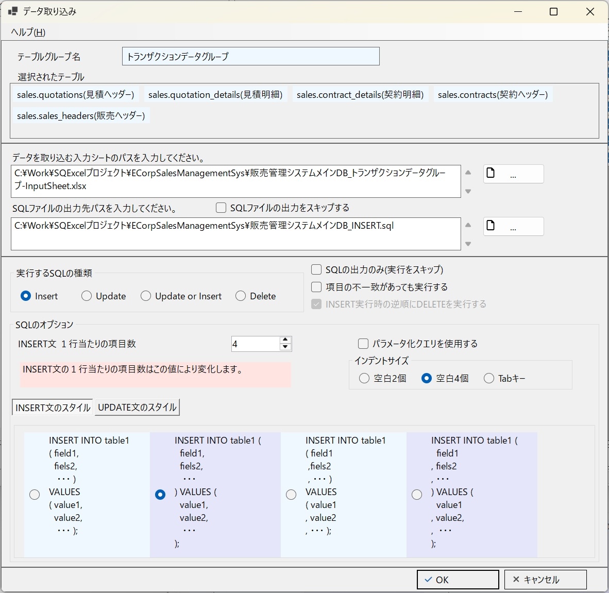

:::tip[データ取り込みの処理種類]
SQExcelのデータ取り込みで実行する処理の種類は、SQLによるデータ更新処理の INSERT／UPDATE／UPDATE or INSERT（UPSERT）／DELETE の4種類です。DELETE（削除）処理もデータ取り込みに含めるのは、少し違和感があるかもしれません。ここでは「入力シートからデータを**取り込んで**、それを元にDBテーブルに対して何らかの処理を行う」のがデータ取り込み機能である、とご理解ください。
:::

### ダイアログ上部

   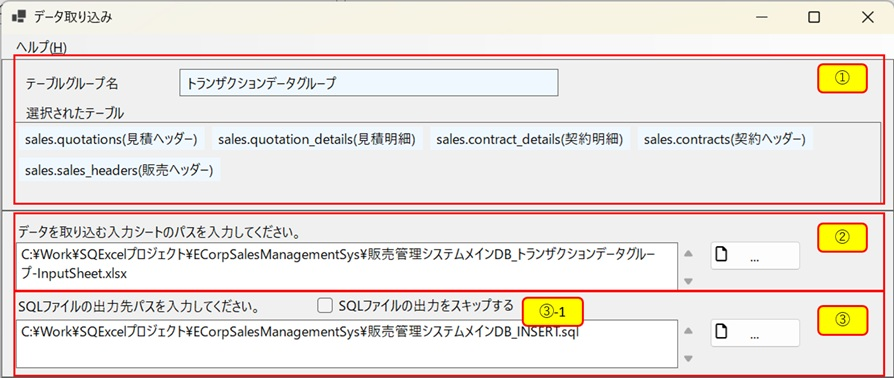

| No. | エリア | 内容 |
|---|---|---|
| ① | テーブルグループ情報パネル | 呼び出し元の IO操作画面で選択されていたテーブルグループ名と、選択済みテーブルの一覧を表示します |
| ② | 入力シートのパス入力欄 | データ取り込み元となる入力シートのパスを指定します（アプリDBごとに記憶されます） |
| ③ | 出力するSQLファイルのパス入力欄 | 実行したSQLを保存するファイルのパスを指定します（アプリDBごとに記憶されます） |
| ③-1 | SQLファイル出力スキップ | ONにすると、SQLの実行のみを行いファイルへの保存を省略します |

### ダイアログ中間部

   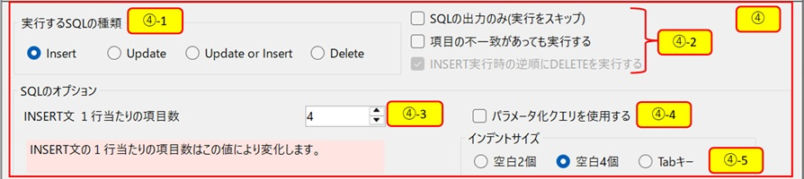

| No. | エリア | 内容 |
|---|---|---|
| ④ | データ取り込みオプションパネル | データ取り込み処理の各種オプションの設定入力エリアです |
| ④-1 | SQLの種類 | 実行する処理種類をINSERT／UPDATE／UPDATE or INSERT（UPSERT）／DELETE から選択します |
| ④-2 | SQL出力のみ | ONにすると、SQLファイルを出力するだけで実際の実行は行いません（入力シートの処理結果も更新されません） |
| "" | 項目に不一致があっても実行する | 入力シートとテーブルの項目が完全に一致しなくても、一致する項目だけでSQLを生成して実行します |
| "" |DELETE時にテーブル順・行順を逆順にする | SQLの種類がDELETEのときのみ操作可能。詳細は [外部キー参照のあるテーブルへのデータ挿入及び削除手順（重要）](/ja/docs/data-entry/foreign-key-order/) を参照 |
| ④-3 | INSERT文1行当たりの項目数 | 1〜10の範囲で指定します |
| ④-4 | パラメータ化クエリを使用する | SQLインジェクション対策としてパラメータ化クエリを使用するかどうかを指定します。「SQLファイル出力スキップ」がONの場合でも常に操作可能です（エラー時に入力シートへ書き込むSQL表示の書式に影響するため） |
| ④-5 | インデントサイズ | SQL生成時のインデント幅を指定します |

### INSERT文とUPDATE文のスタイルタブ

   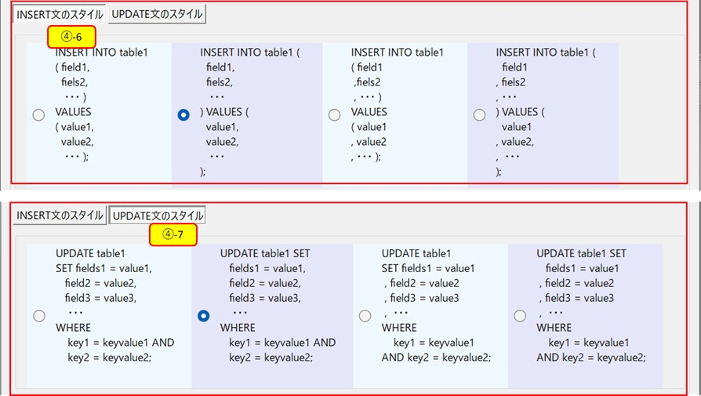

| No. | エリア | 内容 |
|---|---|---|
| ④-6 | INSERT文のスタイル | それぞれ4種類のスタイルから選択します。生成されるSQLの具体的な書式は [データ取り込み機能](/ja/docs/features/input-sheet/data-import/) で例示しています |
| ④-7 | UPDATE文のスタイル | それぞれ4種類のスタイルから選択します。生成されるSQLの具体的な書式は [データ取り込み機能](/ja/docs/features/input-sheet/data-import/) で例示しています |

## データ取り込みの実行とSQLファイル出力の実行制御

1. データ取り込みダイアログでは、取り込み対象の入力シートを指定すると、既定で入力シートと同じフォルダに実行されるSQLスクリプトファイルを出力します。既定のSQLファイル名は、入力シート名の先頭から最後に現れる `_`（アンダースコア）までを切り取り、末尾に実行するSQLの種類（INSERT／UPDATE／UPSERT／DELETE）を付けたものになります。

   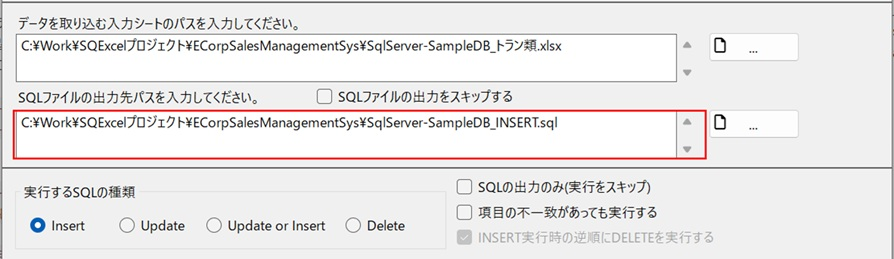

2. SQLファイルの出力が不要な場合は、「SQLファイル出力スキップ」チェックボックスをONにします。これにより、SQLファイルの出力先パス入力欄と「SQL出力のみ（実行をスキップ）」チェックボックスは使用できなくなります。

   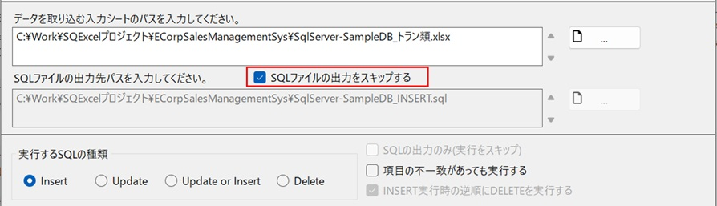

    - このオプションを使用するのは、開発環境やテスト環境でテストデータを手早く投入したり削除したりする場合です。

3. 逆に、SQLファイルの出力のみを行い、入力シートから直接データ取り込みを行うのを禁止する場合は、「SQL出力のみ（実行をスキップ）」チェックボックスをONにします。

   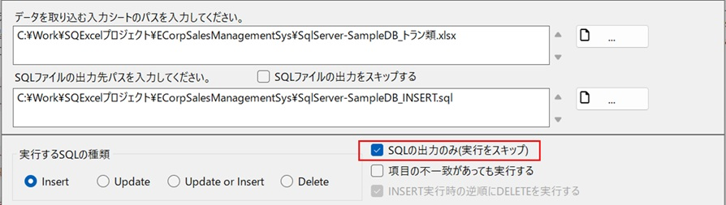

    - このオプションを使用するのは、本番環境などSQExcelから直接データベースへ接続しない環境向けに、SQLスクリプトだけを作成してリリース手順に乗せたい場合です。

## 処理結果の書き込み

処理が完了すると、入力シートの各行の「処理成否」列・「処理失敗時メッセージ」列に結果が書き込まれます。テーブルごとの処理結果表示エリア（B2セル）には、成否のメッセージに加えて**実行したSQLの種類（INSERT／UPDATE／UPSERT／DELETE）のラベル**が先頭に付与されます。

### INSERT処理が成功した入力シートの処理結果

   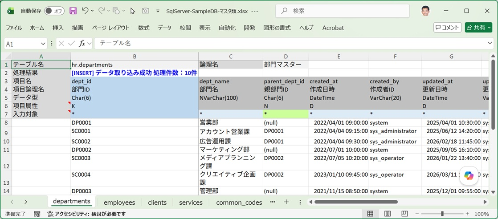

### DELETE処理が成功した入力シートの処理結果

   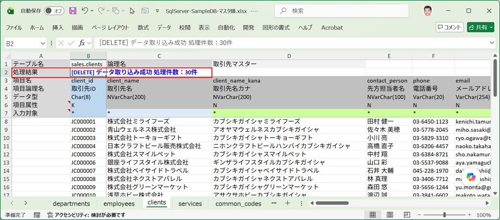

### 取り込みエラーが発生した入力シートの処理結果

   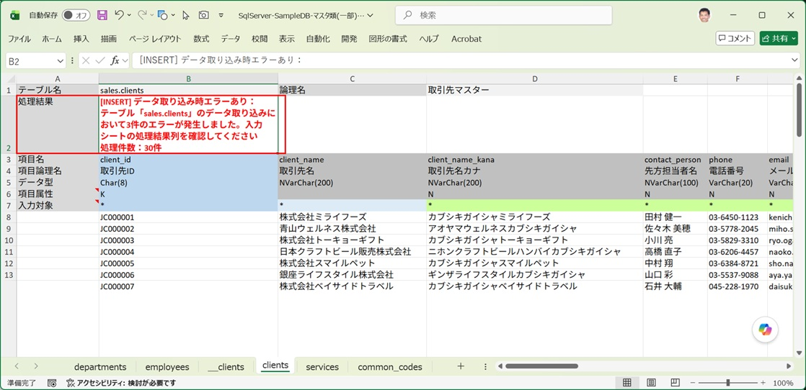

入力シート上で取り込みエラーとなった行は処理成否がFALSEとなり、処理失敗時メッセージが表示されます。処理失敗メッセージにはエラーの原因と、実行されたSQLスクリプトが表示されます。

   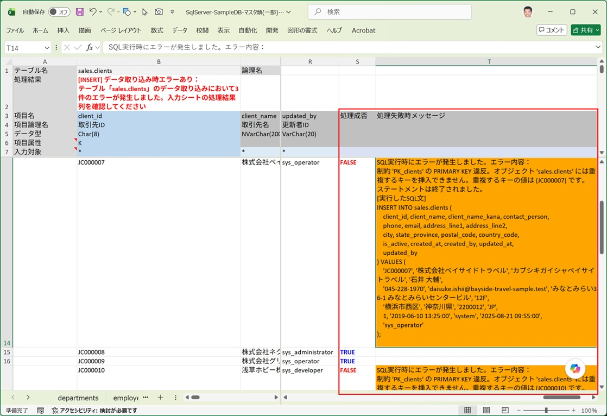

### テーブルとワークシートの項目・型不一致でエラーになる場合

:::tip[項目・型不一致で1件も処理されなかった場合、結果表示は必ず空欄に戻ります]
「項目に不一致があっても実行する」がOFFの状態で、入力シートとテーブルの項目・型に不一致があると、そのテーブルは1行も処理されずスキップされます。このとき、B2セルには不一致の内容がエラーとして表示され、各データ行の「処理成否」列・「処理失敗時メッセージ」列は**必ず空欄・既定色にクリアされます**。前回の実行結果（例えば直前にDELETEが全件成功していた場合の `TRUE` 表示）がそのまま残ることはないため、今回の不一致に気づかず「処理は成功した」と誤解する心配はありません。
:::

入力シートとテーブルの項目・型の不一致によるエラーの場合は、処理結果欄に具体的に不一致となった項目情報を表示します。

   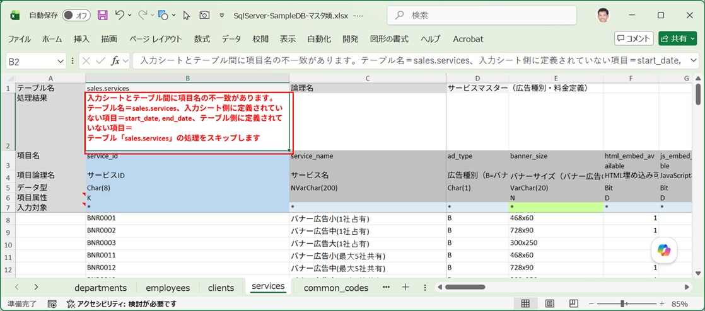

入力シートの取り込みがスキップされた場合は処理成否列と処理失敗時メッセージ列は空白になります。

   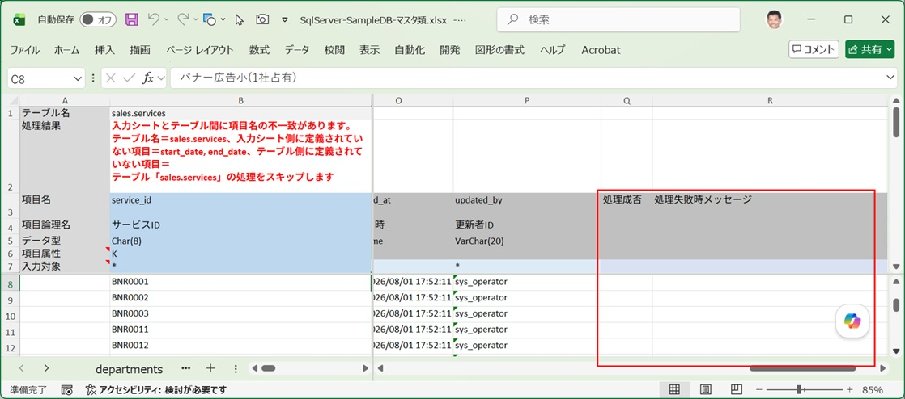

## データの入力ルールのポイント

### 入力シートのルール

| ルール | 内容 |
|---|---|
| 入力エリアに空白行が現れた場合 | データ取り込みを行う行をここで停止します。空白行の後方にデータが入力されている行が続いてもそれらは無視されます。 |
| 入力対象行の「*」マークを削除した項目列 | 実行するデータ処理からこの項目を除外します。実行するSQLの種類が INSERT／UPDATE／UPDATE or INSERT（UPSERT）の場合に反映されます。出力されるSQLスクリプトにもこの設定が反映されます。 |

   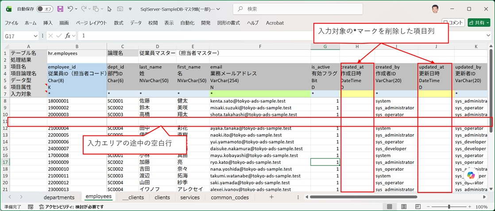

- 入力対象行の「*」マークを削除するのは、データ作成日時や更新日時のように既定値が設定される項目です。既定値が設定される項目は項目属性列に「D」が表示されます。

### 入力行セルの入力ルール

| ルール | 内容 |
|---|---|
| NULLを指定する | セルに `(null)` または `(NULL)` と入力する。あるいは項目の入力対象を外す（`*` を消す） |
| 空文字列を指定する | 文字列項目のセルに `\EMP` または `\emp` と入力する |
| 真偽値 | `TRUE` / `FALSE` / `YES` / `NO` / `1` / `0` のいずれかで入力する（大文字小文字は区別しない） |
| バイナリ（BLOB等） | 16進数文字列で入力する |

データ型ごとの入力可能な値・エラーになる値の詳しい境界は [データ取り込み機能](/ja/docs/features/input-sheet/data-import/) を参照してください。
