IO操作画面は、テーブルグループを編集し、入力シート操作（作成・データ取り込み・データ出力）を実行するための中心的な画面です。ウィンドウタイトルには「SQExcel - [プロジェクト名]」が表示されます。

## 画面構成

   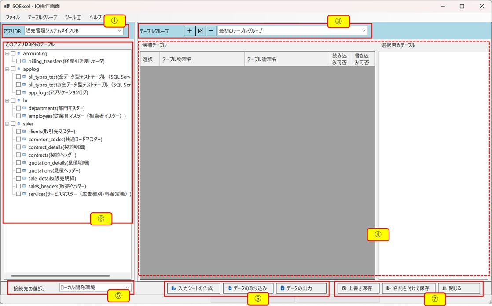

| No. | エリア | 内容 |
|---|---|---|
| ① | アプリDB選択コンボボックス | 表示対象のアプリDBを選択します。切り替えるとスキーマ・テーブルツリー、テーブルグループ、接続先選択コンボボックスの内容が連動して更新されます |
| ② | スキーマ・テーブルツリー | 選択中のアプリDBの現在の接続に関連付けられたスキーマとテーブルを階層表示します。チェックしたテーブルを候補テーブルグリッドへドラッグ＆ドロップします |
| ③ | テーブルグループ選択コンボボックス | 編集対象のテーブルグループを選択します |
| ④ | テーブルグループ操作パネル | 候補テーブルグリッド（左）と選択済みテーブルリスト（右）から成ります。候補テーブルグリッドにはドラッグ＆ドロップで追加したテーブルが並び、その中から実際に処理対象とするテーブルを選択済みテーブルリストへ移動します |
| ⑤ | 接続先選択コンボボックス | 現在有効な接続を切り替えます |
| ⑥ | 入力シート操作ボタン | 入力シート作成・データ取り込み・データ出力の各ダイアログを開きます |

※フッタ部を除く①、②、③、④のエリアを合わせたメイン画面上のエリアを**メインパネル**と称します。

## スキーマ・テーブルツリーの操作

1. スキーマ・テーブルツリーに表示されるのは、アクティブな接続先データベースに含まれているテーブルです。画面構成セクションの例では、ローカル開発環境（データベース名＝SQL2ExcelDB）内に配置されている全てのテーブルが表示されています（以下は SSMS（SQL Server Management Studio）に表示したローカル開発環境のテーブルです）。

   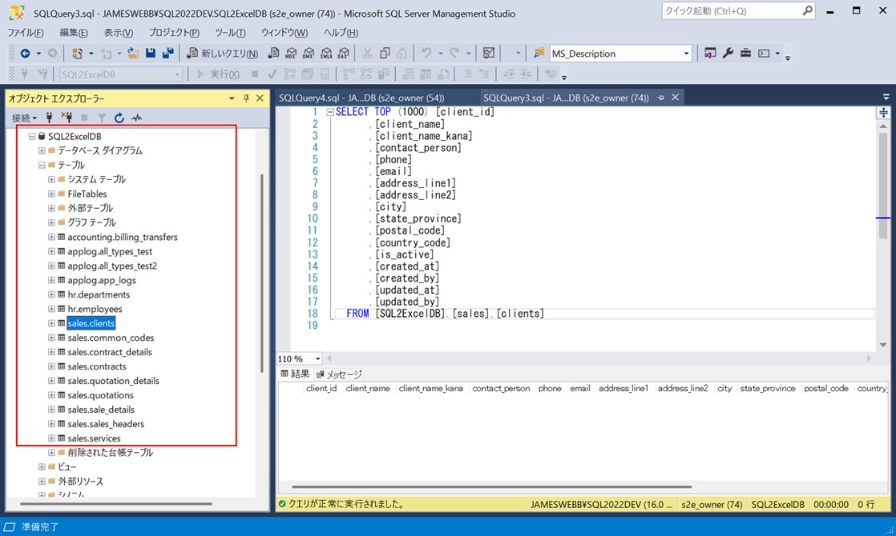

2. 同じアプリDBの接続でも、ローカル開発環境・結合テスト環境・システムテスト環境など、環境ごとに配置されているテーブルには違いがあります。次の例は、同じアプリDBの接続で結合テスト環境のテーブル群を表示したものです（結合テスト環境などでは、他のユーザーが試験的に作成したテーブルが多数配置されている場合があります）。なお、DB上でテーブル論理名が定義されている場合は、テーブル物理名の後方にテーブル論理名を付加して表示します。

   

   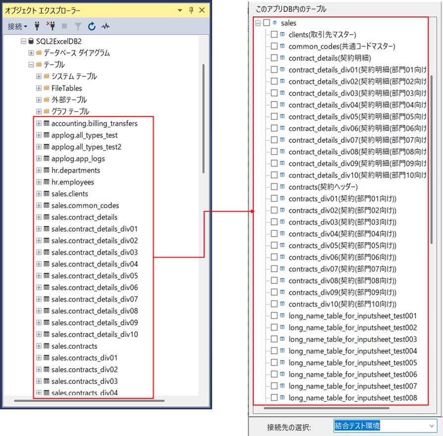

   

3. SQExcelが対応するデータベース種類のうち、SQL Server・Oracle・PostgreSQL の3種類はスキーマの下層にテーブルを配置するモデルのため、スキーマ・テーブルツリー上でもテーブルはスキーマの下層に表示されます（クライアントツール側での表示方法はデータベース種類によって異なり、例えば SSMS（SQL Server Management Studio）ではスキーマ名がテーブル名の接頭辞として表示されます）。

   

   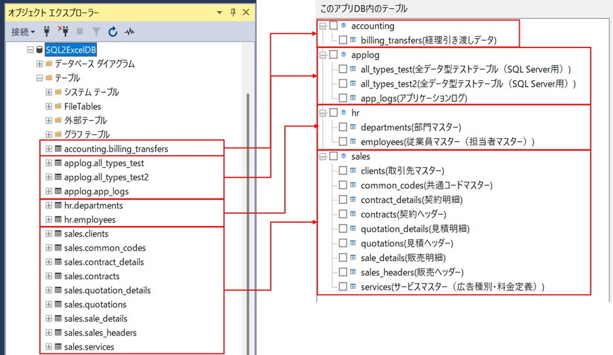

   

4. SQExcelが対応するデータベース種類のうち、MySQL・MariaDB・SQLite の3種類にはスキーマというコンセプトが存在しないため、スキーマ・テーブルツリー上ではテーブルツリーの最上位レベルに並列で表示されます（以下は、MySQLのクライアントツール MySQL Workbench 上のテーブル一覧と、それらが SQExcel のスキーマ・テーブルツリー上でどう表示されるかを示した例です）。

   

   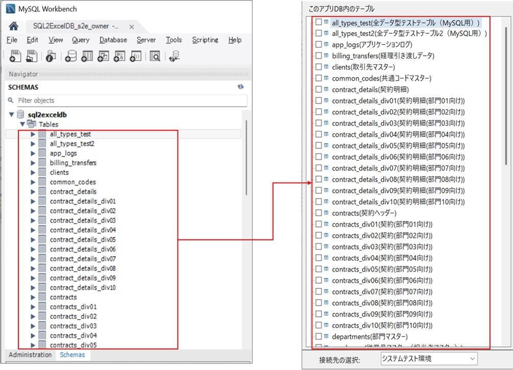

   

### DB種類ごとのスキーマの有無

スキーマ・テーブルツリーの見え方は、DB種類によって異なります。

| DB種類 | スキーマの扱い |
|---|---|
| SQL Server | スキーマあり（`dbo` 等）。ツリーはスキーマ→テーブルの2階層 |
| PostgreSQL | スキーマあり（`public` 等）。ツリーはスキーマ→テーブルの2階層 |
| Oracle | スキーマ＝ユーザーとして扱われる。ツリーはユーザー（スキーマ）→テーブルの2階層 |
| MySQL | スキーマの概念なし（データベース＝スキーマ相当）。ツリーはテーブルのみのフラット構成 |
| MariaDB | 同上（MySQL互換） |
| SQLite | スキーマの概念なし。ツリーはテーブルのみのフラット構成 |

:::tip[スキーマなしDBのツリー表示]
MySQL・MariaDB・SQLite ではスキーマ階層が存在しないため、ツリーの最上位に直接テーブル一覧が表示されます。テーブルグループの候補テーブルグリッドには、これらのDBの場合スキーマ名を含まないテーブル物理名のみが表示されます。
:::

### テーブル情報の再取得

ツリー上で右クリックすると、「テーブル情報の再取得」メニューが表示されます。DB側でテーブル定義（列の追加・変更等）を行った後、SQExcel側でキャッシュされたスキーマ・テーブル情報を最新化したいときに使います。以下に使用例を示します。

1. スキーマ・テーブルツリーにテーブルが表示されている状態で、接続先にテーブルが追加されたり既存のテーブルが削除されたりした場合を想定します。ここでは例として、IO操作画面でアクティブなローカル開発環境のデータベースに新規のテーブルを追加します。

   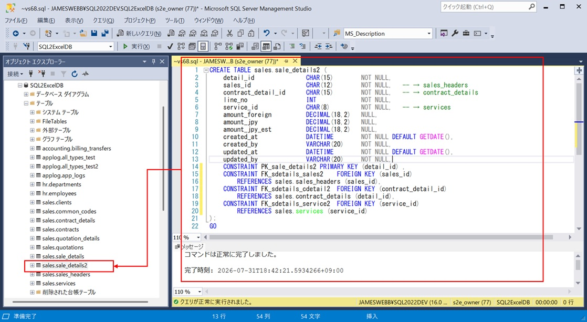

2. 追加したテーブルに対して入力シート操作を行うには、まずこのテーブルをスキーマ・テーブルツリーに表示させる必要があります。スキーマ・テーブルツリーのコンテキストメニューから「テーブル情報の再取得」をクリックすると、追加したテーブルがツリー上に表示されます。

   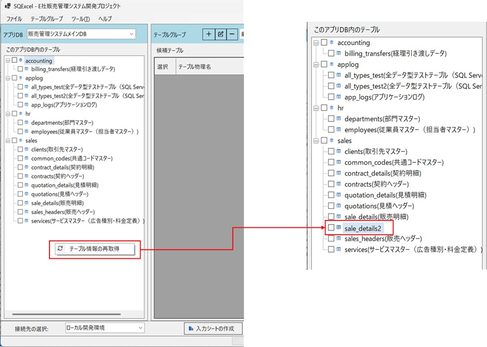

- テーブルの追加・削除が発生した場合はテーブル情報の再取得が必要ですが、**テーブル項目定義が変更された場合にはこの操作は不要**です。SQExcelは入力シート操作（作成・データ取り込み・データ出力）を実行するたびにテーブル構造を再検索するため、処理対象のテーブルがリストされていれば、項目のデータ型・主キー・必須項目・既定値などは常に最新の情報に基づいて処理されます。

## メインパネルでの操作

### スキーマ・テーブルツリーから候補テーブルグリッドへ

1. IO操作画面で最初に行う作業は、テーブルグループに入力シート操作の対象となるテーブルを配置することです。初期状態では、画面左側のテーブルグループパネル内は空白になっています。スキーマ・テーブルツリーから、最初のテーブルグループで扱うテーブルのチェックボックスをONにして、テーブルグループパネルの候補テーブルグリッドにドラッグ＆ドロップします。

   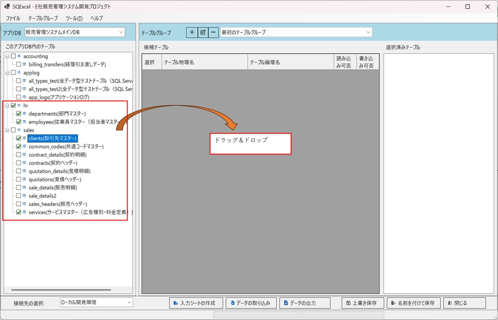

※テーブルグループの詳細については[データモデル階層のカージナリティ](/ja/docs/operation-flow/#データモデル階層のカージナリティ)以下をご参照ください。

2. ドラッグ＆ドロップされたテーブルが候補テーブルグリッドに表示されます。候補テーブルグリッドに追加されたテーブルは、スキーマ・テーブルツリー上ではフォント色が変わってノードの背景がグレーアウトされ、チェックボックスが選択できなくなります。これは、1つのテーブルが複数のテーブルグループに登録されるのを防ぐためです。

   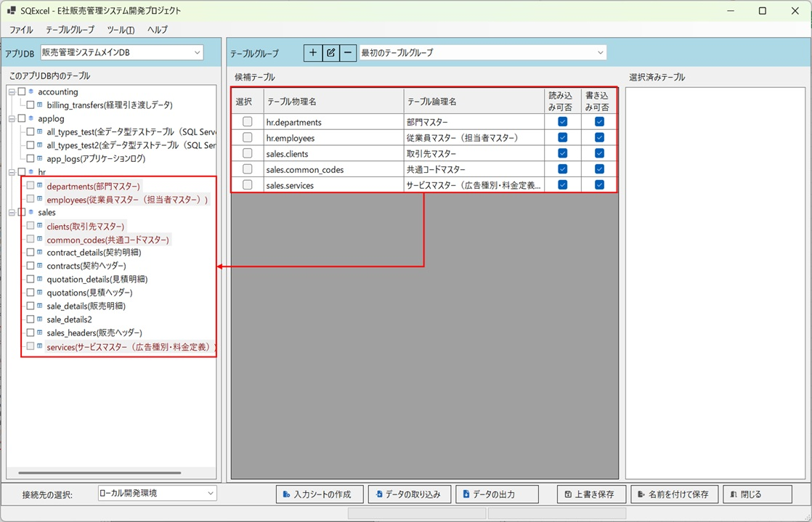

※IO操作画面では複数のテーブルグループを作成できますが、データベース上のテーブルはそれらのうち何れか一つにしか属することが出来ません。

### 候補テーブルグリッドの説明

ここでは候補テーブルグリッドについて説明します。候補テーブルグリッドに表示されるデータは、あくまでも入力シート操作を行う候補となるテーブルです（実際に入力シート操作の対象とするには、右隣の選択済みテーブルリストへドラッグ＆ドロップする必要があります。この操作は後述します）。候補テーブルグリッドは読み取り専用の一覧表で、スキーマ・テーブルツリーからドラッグ＆ドロップした順にテーブルを表示します（グリッドの項目名をクリックすると、表示順を変更できます）。

   

   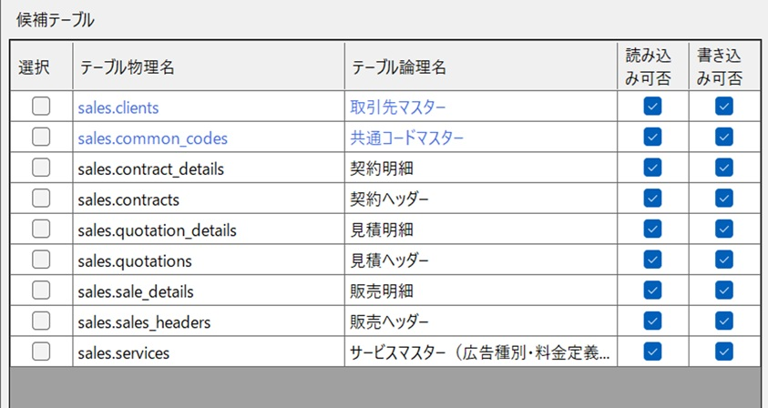

   

| 項目名 | 説明 |
|---|---|
| 選択チェックボックス | 選択済みテーブルリストにコピーしたり、グリッドから削除するテーブルを指定する際にチェックします。 |
| テーブル物理名 | テーブルの物理名を表示します。スキーマがある場合は[スキーマ名].[テーブル物理名]のように表示されます。 |
| テーブル論理名 | テーブル論理名が正規の方法で定義されている場合に論理名を表示します。定義されていない場合には空白が表示されます。テーブル論理名の正式な定義方法は対象となるデータベースの公式ヘルプなどをご参照ください。 |
| 読み込み可否 | 接続ユーザーがこのテーブルに対して読み込み権限があるかをチェックします。このチェックがOffであれば、SQExcelはそのテーブルに対するデータ出力を実行できません。 |
| 書き込み可否 | 接続ユーザーがこのテーブルに対するINSERT/UPDATE/DELETEの各処理に対する権限があるかをチェックします。INSERT/UPDATE/DELETEのいずれか一つの権限が不足している場合にはチェックはOffになります。このチェックがOffである場合、SQExcelはそのテーブルに対するデータ取り込み処理でSQL種類INSERT/UPDATE/DELETEのいずれか、または全てでエラーになる可能性があります。 |

候補テーブルグリッドのコンテキストメニューを以下に表示します。

   

   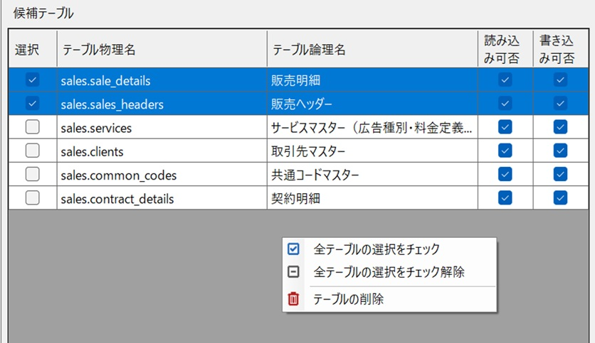

   

| 項目名 | 説明 |
|---|---|
| 全テーブルの選択をチェック | 候補テーブルグリッド内の全てのテーブルの選択チェックボックスをOnにします。 |
| 全テーブルの選択をチェック解除 | 候補テーブルグリッド内の全てのテーブルの選択チェックボックスをOffにします。 |
| テーブルを削除 | 選択チェックボックスがOnになっているテーブルをグリッド上から削除します。この結果スキーマ・テーブルツリー上でグレーアウトされていたこれらのテーブルが使用可能になり、再度選択可能になります。削除対象テーブルが、選択済みテーブルリストに表示されている場合には、自動的にリストから削除されます。 |

### 候補テーブルグリッドから選択済みテーブルリストへ

1. 候補テーブルグリッドに表示されているテーブルを、選択済みテーブルリストにドラッグ＆ドロップして貼り付けます。選択済みテーブルリストにリストされたテーブルだけが、入力シート操作の対象になります。

   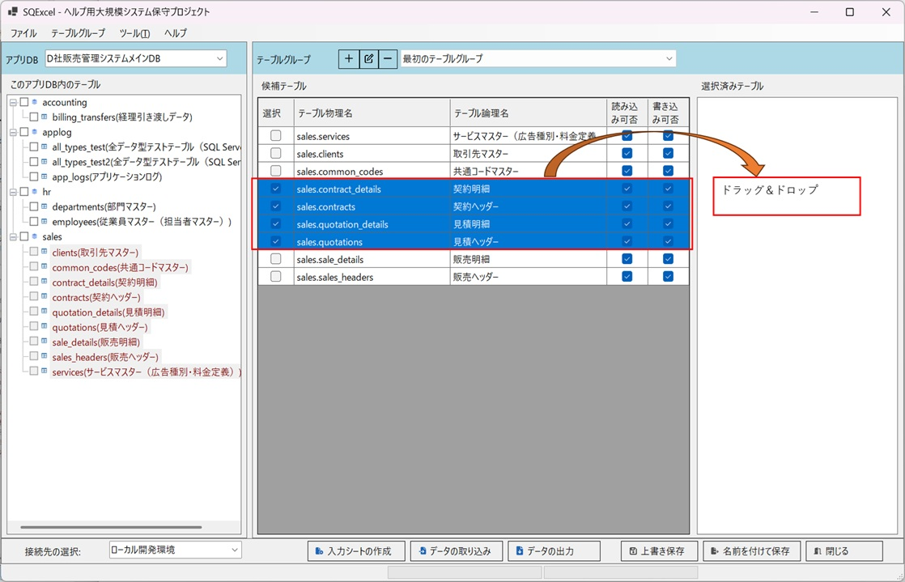

2. 選択済みテーブルリストにドラッグ＆ドロップで貼り付けられたテーブルが、入力シート操作の対象となります。リストされたテーブルは候補テーブルグリッド上ではフォント色が変わりますが、選択チェックボックスは引き続き使用できます。そのため何度でもチェックボックスをONにしてドラッグ＆ドロップできますが、既にリスト上にそのテーブルがある場合は何も変化しません。

   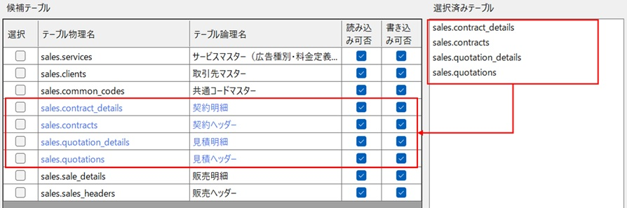

### 選択済みテーブルリストの説明

1. 選択済みテーブルリスト内でのテーブルの並び順が、入力シート操作の処理順序になります。入力シートの作成やデータ取り込み処理では、特に外部キー参照があるテーブルにおいてこの処理順が重要になります。選択済みテーブルリスト内の要素は、行を選択してドラッグ＆ドロップすることで順番を入れ替えられます。

   

   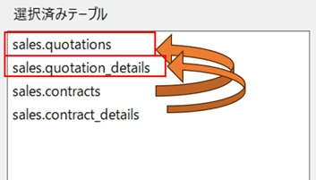

   

   ※詳しくは、[外部キー参照のあるテーブルへのデータ挿入及び削除手順（重要）](/ja/docs/data-entry/foreign-key-order/)をご覧ください。外部キー参照のあるテーブルでは、参照されるテーブルを前方に、参照するテーブルを後方に配置します。

2. 選択済みテーブルリストのコンテキストメニューとその動作について説明します。

   

   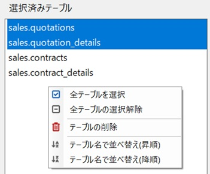

   

| 項目名 | 説明 |
|---|---|
| 全テーブルを選択 | リスト内の全テーブルを選択状態にします。 |
| 全テーブルの選択解除 | リスト内の全テーブルの選択状態を解除します。 |
| テーブルの削除 | 選択中のテーブルを選択済みテーブルリストから除外します（候補テーブルグリッドには残りますが、該当テーブル名は既定のフォント色で表示されるようになります）。 |
| テーブル名で並べ替え(昇順) | リスト内のテーブルを物理名の昇順に並べ替えます。 |
| テーブル名で並べ替え(降順) | リスト内のテーブルを物理名の降順に並べ替えます。 |

## テーブルグループの追加・編集・削除

テーブルグループパネル上部のボタン（または対応するメニュー項目）から、新規追加・編集・削除を行います。

:::tip[テーブルグループの詳しい説明が必要な場合]
SQExcelデータモデル階層におけるテーブルグループの目的や役割については [操作の流れとデータモデル階層](/ja/docs/operation-flow/) の「データモデル階層のカージナリティ」セクションで説明しています。
:::

IO操作画面には既定で「最初のテーブルグループ」が作成されています。通常は、同じような用途で使うテーブルや、アプリケーションの1つの機能で使うテーブルをグループ化するため、1つのアプリDBに対して複数のテーブルグループを作成します。その際は、個々のテーブルグループに分かりやすい名前を付けるようにします。

1. 先ずは既定の「最初のテーブルグループ」の名前を変えます。テーブルグループコンボボックス左側のテーブルグループ編集ボタンをクリックしてテーブルグループの変更ダイアログ上でテーブルグループと説明を編集します。

   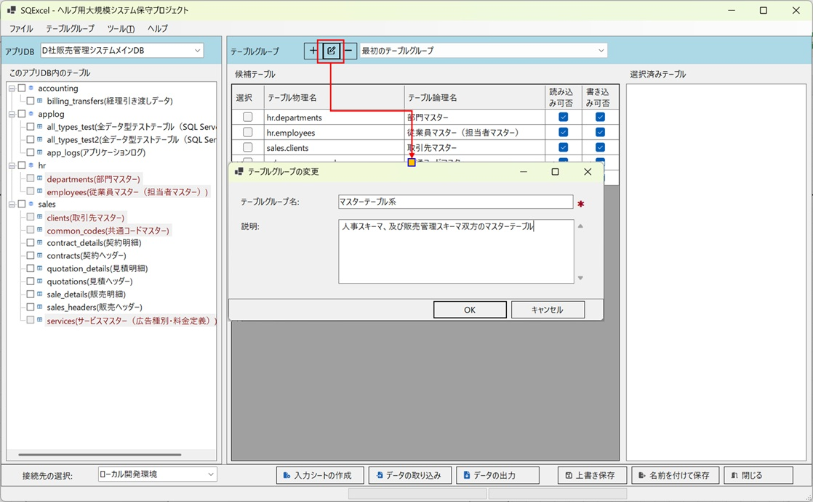

2. テーブルグループ変更の結果は直ぐにコンボボックスに反映されます。

   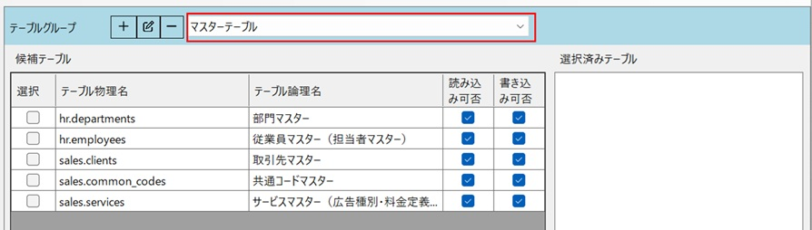

3. 新しいテーブルグループを追加するには、テーブルグループコンボボックス左側のテーブルグループ追加ボタンをクリックします。テーブルグループの追加ダイアログが開くので、入力エリアのプレースホルダーの案内に従ってテーブルグループ名と説明を入力します。

   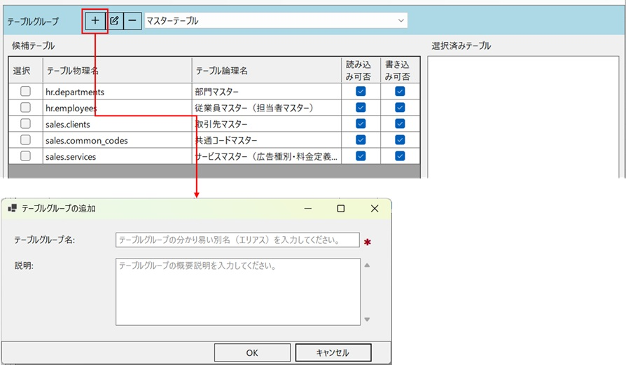

4. 新しいテーブルグループに、スキーマ・テーブルツリー→候補テーブルグリッド→選択済みテーブルリストの順にテーブルを追加します。

   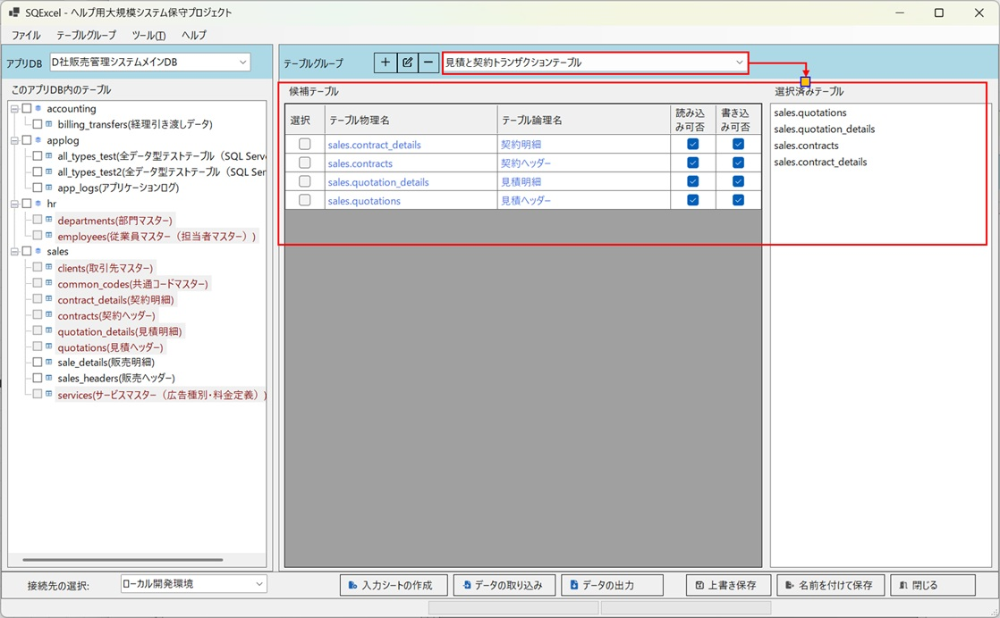

5. こうして、1つのアプリDB以下に複数のテーブルグループが作成されます。いずれかのテーブルグループをテーブルグループパネル上でアクティブにするには、テーブルグループコンボボックスから任意のグループを選択します。

   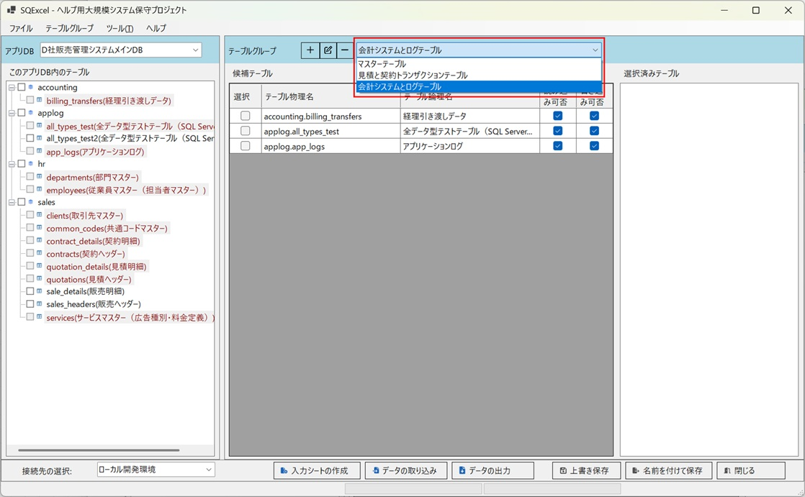

6. テーブルグループを削除する必要が生じた場合は、テーブルグループコンボボックスで削除対象のグループを選択し、テーブルグループ削除ボタンをクリックします。テーブルグループ削除の確認ダイアログが開くので、はいを選択します。

   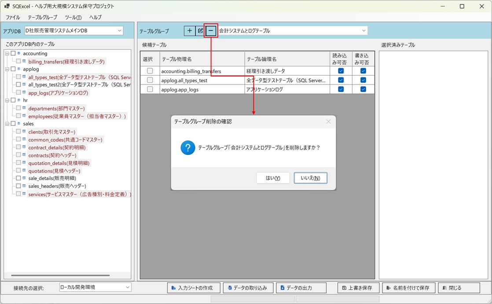

7. はいを選択すると、選択されていたテーブルグループが削除されます。テーブルグループコンボボックスのドロップダウンリストからも、削除されたテーブルグループが消えていることを確認できます。

   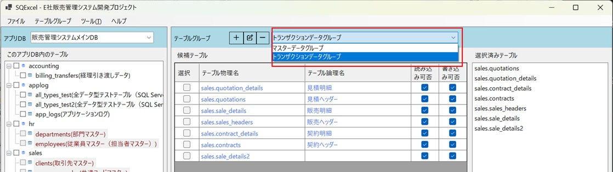

## 接続先の切り替え時の注意事項

テーブルグループと接続先（Connection）は、いずれもアプリDBに従属する独立した状態です。接続先を切り替えても、選択中のテーブルグループの内容（候補テーブル・選択済みテーブル）が変わることはありません。ただし、切り替え後の接続先に存在しないテーブル名が選択済みテーブルリストに残っている場合、そのテーブルに対する入力シート操作はエラーになります。

1. ここでは、「テーブル情報の再取得」セクションでローカル開発環境の接続先に追加した sale_details2 テーブルについて考えてみましょう。このテーブルはローカル開発環境のデータベース上には存在しますが、結合テスト環境やシステムテスト環境には存在しません。

   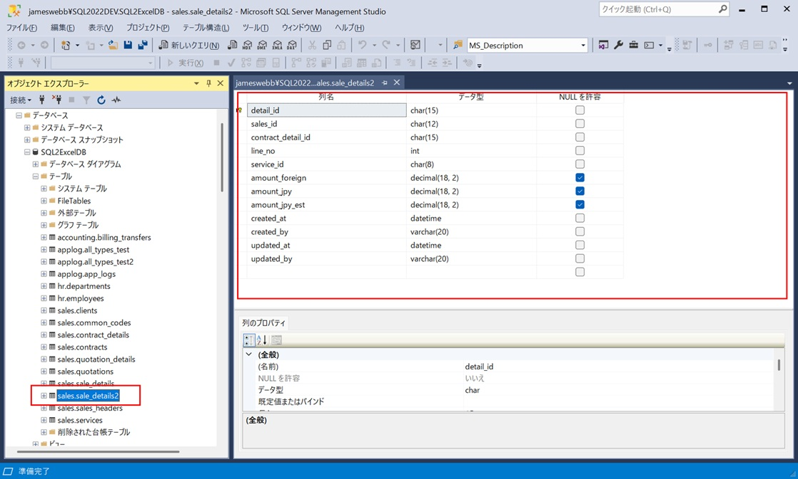

2. sale_details2 テーブルをスキーマ・テーブルツリー上の「テーブル情報の再取得」で取り込み、候補テーブルグリッドと選択済みテーブルリストに配置して保存します。

   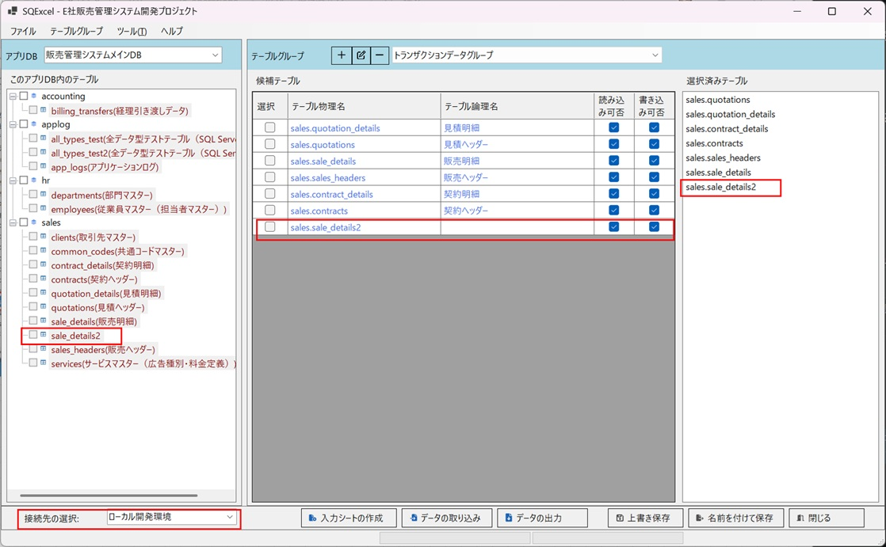

3. この状態で、接続先をこのテーブルが定義されていない結合テスト環境に変更します。テーブルグループ上には sales.sale_details2 が保存されているため、候補テーブルグリッドと選択済みテーブルリストには引き続き表示されますが、このテーブルは結合テスト環境には存在しないため、両方のリスト上でエラーを示す赤色のフォントで表示されます。

   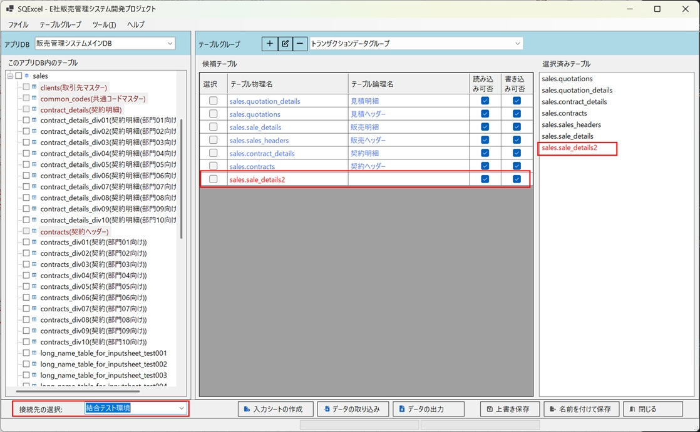

- このテーブルを選択済みテーブルリストに載せたまま入力シート操作を実行すると、このテーブルに関する処理はエラーになります。
- 問題となる sales.sale_details2 が後日結合テスト環境にも作成されるのであれば、候補テーブルグリッドの内容はこのままでもよいですが、選択済みテーブルリストからは削除する必要があります。

## 操作ガイダンスツールチップ

IO操作画面もホーム画面と同様に、画面上のエリアごとに操作ガイダンス用ツールチップが表示されます。表示が不要になったら、トップメニューの[ヘルプ]直下にある[ツールチップを表示する]項目のチェックを外してください。これにより操作ガイダンス用ツールチップの表示が停止します。

   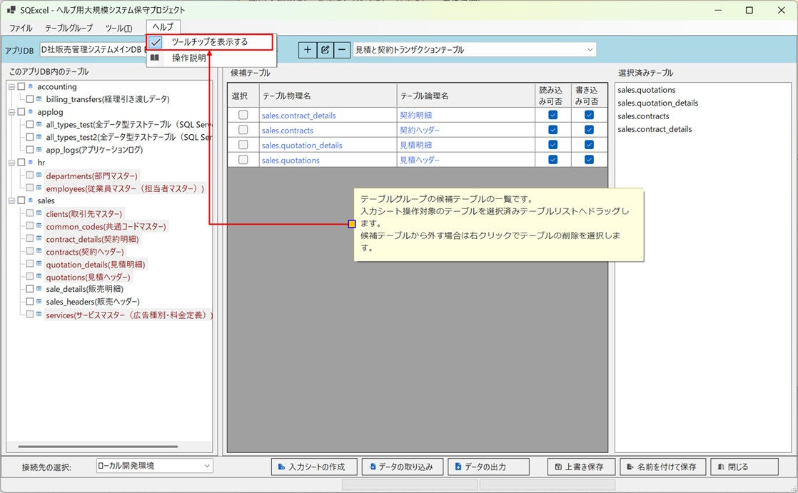

- この設定はホーム画面でのツールチップの表示も制御します（ホーム画面で同じメニューからツールチップの表示をONにしてIO操作画面を表示すると、再度操作ガイダンス用ツールチップが表示されるようになります）。

## 各ダイアログの詳細

- [入力シート作成ダイアログ](/ja/docs/features/io-operations/input-sheet-builder-dialog/)
- [データ取り込みダイアログ](/ja/docs/features/io-operations/data-import-dialog/)
- [データ出力ダイアログ](/ja/docs/features/io-operations/data-export-dialog/)
- [オプション設定ダイアログ](/ja/docs/features/option-settings-dialog/)
