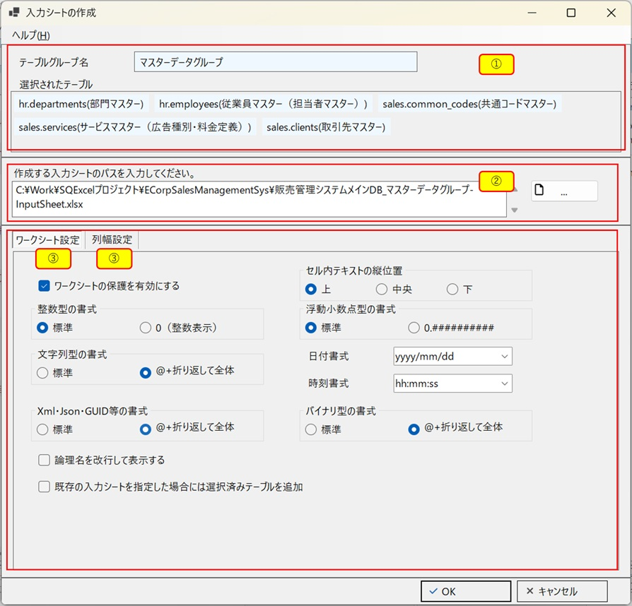
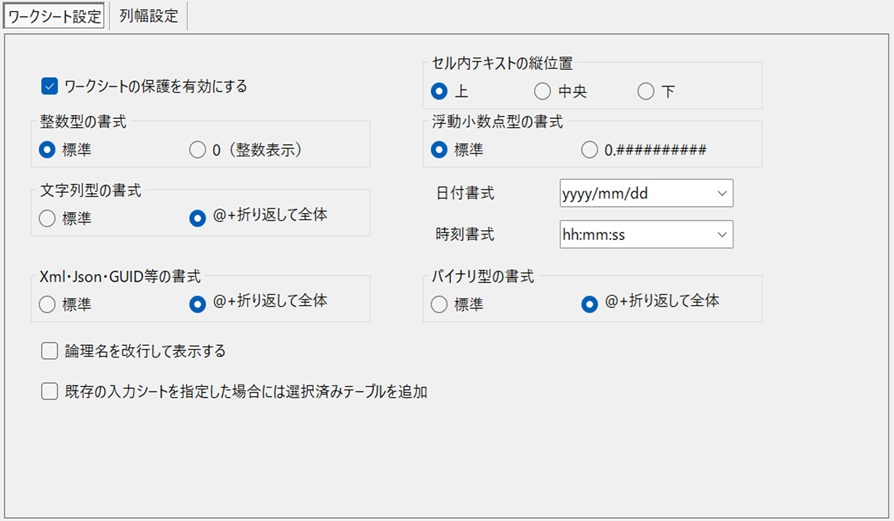
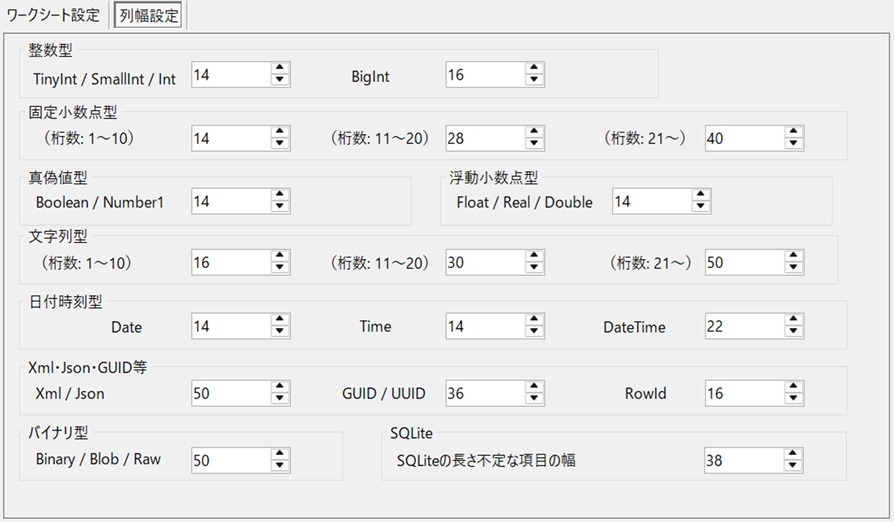
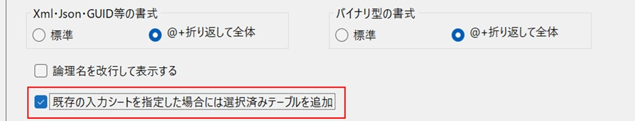
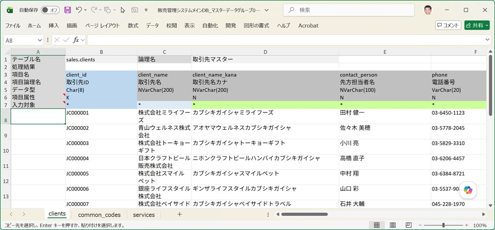
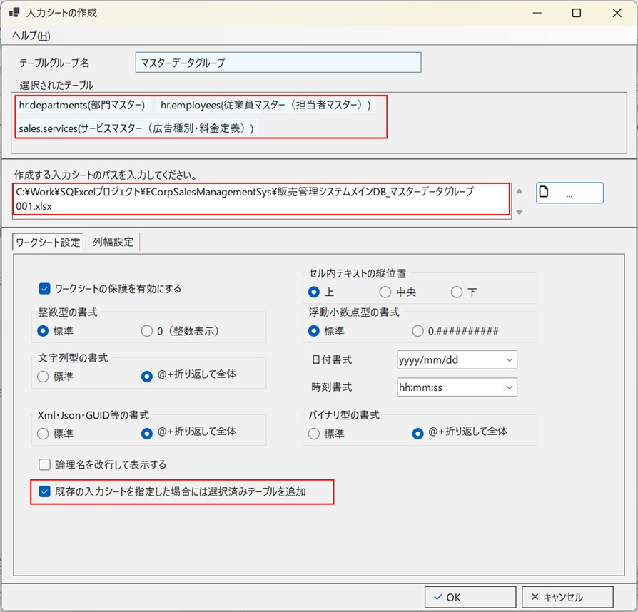
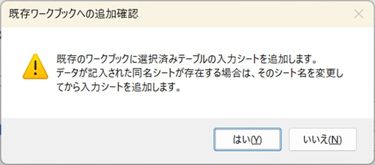
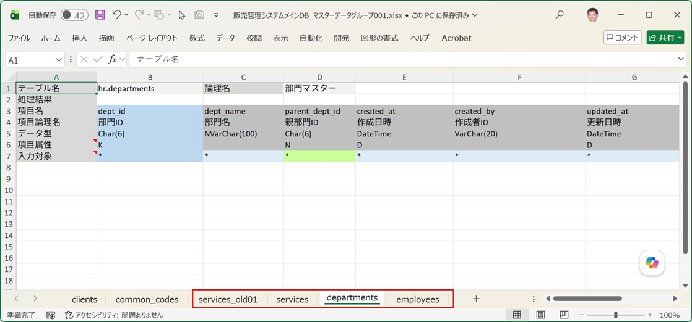

[IO操作画面](/ja/docs/features/io-operations/) で選択済みテーブルリストにテーブルを設定した状態で「入力シート作成」ボタンをクリックすると、まず保存先を選択するファイルダイアログが開き、続けて入力シート作成ダイアログが開きます。基本的な操作の流れは [SQExcelの入力シート操作概要](/ja/docs/input-sheet-overview/) の「通常の入力シート作成を実行する場合」で説明済みです。ここでは、そこでは触れていないオプション項目の詳細を説明します。

## 入力シート作成ダイアログ画面構成

   

   

   

| No. | エリア | 内容 |
|---|---|---|
| ① | テーブルグループ情報パネル | 呼び出し元の IO操作画面で選択されていたテーブルグループ名と、選択済みテーブルの一覧を表示します |
| ② | 入力シートのパス入力欄 | 作成する入力シートの保存先パスを指定します。ファイル参照ボタンで保存先を選択できます |
| ③ | ワークシート設定タブ | データ型ごとのセル書式（数値表示形式・日付書式など）を設定します |
| ④ | 列幅設定タブ | データ型・桁数ごとの入力エリアの列幅を設定します |

### ワークシート設定タブ

データ型カテゴリ（整数・小数・文字列・日付時刻・真偽値・バイナリ等）ごとに、生成される入力シートのセル表示形式を選択します。ここで選んだ内容は次回このダイアログを開いたときにも復元されます。
   

データ型とセル書式の詳しい対応表は [入力シートの構造と作成](/ja/docs/features/input-sheet/structure/#データ型とセル書式の対応) を参照してください。

### 列幅設定タブ

文字列型・数値型など、データ型と桁数帯（1〜10桁／11〜20桁／21桁以上）の組み合わせごとに、入力エリアの列幅(エクセルで列幅を指定する際の単位に準拠)を設定します。

   

- 各データ型の列幅入力エリアの単位はエクセルにおける文字数です。具体的には、標準フォント（初期設定では「11ポイントのMS Pゴシック」や「遊ゴシック」など）の半角数字の「0」が、1つのセルの中に何文字入るかを表しています。
- 固定小数点や文字列の桁数帯は、それぞれのデータ型における桁数の範囲を3つのブロック(1〜10桁／11〜20桁／21桁以上)に分けたものです。入力シートを作成する際には既定でそれぞれに割り当てられた列幅を設定しますが、その後は自由に列幅を変更することが可能です。

## パスの記憶

入力シートのパス入力欄は、[**アプリDBごとに前回入力したファイルの親ディレクトリ**]+[**既定のファイル名**]が初期設定されています。ダイアログを開くたびに空欄から入力し直す必要はありません。

:::tip[既定のファイル名]
既定のファイル名は `[アプリDB名]_[テーブルグループ名]-InputSheet.xlsx` となっています。この命名規則は[オプション設定ダイアログ](/ja/docs/features/option-settings-dialog/) で変更できます。パス記憶機能はフォルダ部分のみを復元し、ファイル名は現在の命名規則に基づいて毎回再計算されます。
:::

## 既存ワークブックへの上書き・追加

保存先パスに既存の Excel ファイルを指定した場合、ワークブック全体を上書きするか、ワークブックに選択されたテーブル用の入力シートを追加するか、ワークシート設定タブ左下の次のチェックボックスで指定します。

   

| チェックボックスの状態 | 動作 |
|---|---|
| Off | 既存ファイルの内容を全面的に刷新し、選択済みテーブル全ての入力シートを新規作成した内容に置き換えます |
| On | 選択対象外の既存シートはそのまま温存します。選択済みテーブルに対応する既存シートは、シート名ではなく**テーブル情報ヘッダ部（A1/B2付近のスキーマ名＋テーブル物理名）**で照合します |

### 実行例

1. テーブルグループ内の3つのテーブル clients(取引先マスター)、common_codes(共通コードマスター)、services(サービスマスター)の入力シートを持つワークブックが存在します。それぞれの入力シートには、既にデータ取り込み用のデータが入力されています。

   

   

   

2. このワークブックに3つのテーブルを追加して、1つのワークブックでデータ入出力を管理することになりました。追加するテーブルのうち2つは departments(部門マスター) と employees(従業員マスター)、残る1つはブック内に既に入力シートが存在する services(サービスマスター) です。

   

   

   

3. この状態でOKをクリックすると処理内容を確認する以下のようなダイアログメッセージが表示されます。

   

   

   

4. 既存のワークブックに指定されたテーブルの入力シートが追加されました。元々存在していた services テーブル用の入力シートにはデータが書き込まれていたため `services_old01` にリネームされ、新たに入力エリアが空の services シートが追加されています。

   

   

   

   「選択済みテーブルだけ追加・上書き」モードでは、対象テーブルの既存シートについて、データ入力エリアに何らかの書き込みがあるかどうかで挙動が変わります。

   - **データが書き込まれている場合**：既存シートは `_oldXX`（XXは2桁16進連番）という名前にリネームして温存し、新しく生成したシートをその直後の位置に挿入します
   - **データが書き込まれていない（未使用の）場合**：その場で同じ位置のシートを上書きします

   シートの並び順は、上記のリネーム＋直後挿入のケースを除き、既存の並びを維持し、新規テーブルのシートは末尾に追加されます。

:::caution[入力シート作成はSQExcelの機能、データ入力は別の話]
このダイアログはあくまで「テーブル構造を反映した空の入力フォーマットを作る／更新する」機能です。実際にデータを書き込む方法は [入力シートへのデータ投入方法](/ja/docs/data-entry/) を参照してください。
:::
