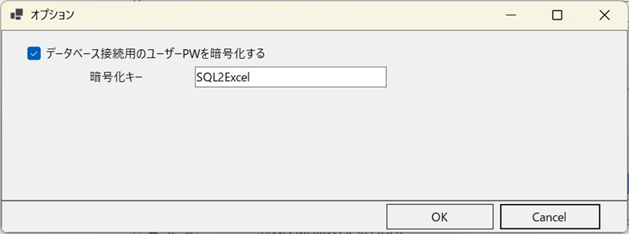
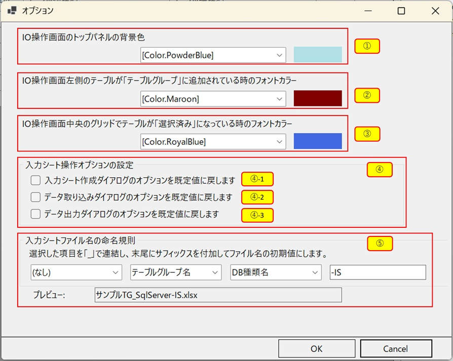
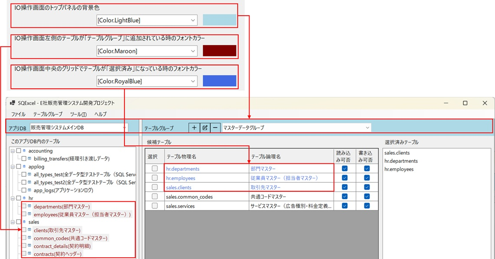
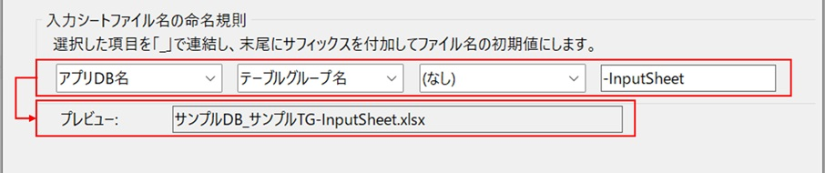

オプション設定ダイアログは、SQExcelのアプリケーション設定を変更する画面です。SQExcelのデータモデル階層の各種設定はホーム画面から、Excel入力シートの操作に関する設定はIO操作画面から実行しますが、これらの画面から実行できない細かい設定を行うためのダイアログ画面です。

オプション設定ダイアログで設定できる項目は、ホーム画面から開く場合と、IO操作画面から開く場合とで異なります。以下に順番に説明します。

## ホーム画面から開くオプション設定

ホーム画面のトップメニューから「ツール → オプション」を選択すると、下図のようなオプション設定画面が開きます。

### パスワード暗号化設定

`.qtxl` ファイルに保存する DB 接続パスワードを暗号化するかどうかを設定します。既定値はON（暗号化する）です。
- 暗号化する場合は暗号化キーを自由に設定可能です（初期値は「SQL2Excel」です。）

   

:::caution[平文保存との違い]
OFFにすると `.qtxl` ファイルにパスワードが平文で保存されます。ファイルの共有・バージョン管理に含める予定がある場合は、ON のままにすることを強く推奨します。
:::

## IO操作画面から開くオプション設定

IO操作画面のメニュー「ツール → オプション」から開くオプション設定画面では、IO操作画面や入力シート操作全般に関わる設定をここで一括管理します。設定はモーダルダイアログで、「OK」でコミット、「キャンセル」で破棄されます。

   

### ノード・パネルの色設定

| No. | 設定項目 | 対象 |
|---|---|---|
| ① | テーブルグループ名の前景色・背景色 | [IO操作画面](/ja/docs/features/io-operations/) のスキーマ・テーブルツリーで、テーブルグループに選択済み（グレー表示）のノードの文字色 |
| ② | 出力対象テーブル名の前景色 | 候補テーブルグリッドで出力対象となっているテーブル行の文字色 |
| ③ | IO操作画面のコンボボックスコンテナパネルの背景色 | [IO操作画面](/ja/docs/features/io-operations/) 上部、アプリDB選択・テーブルグループ選択コンボボックス周辺パネルの背景色 |

   

:::tip[設定はOK後すぐに反映されます]
色を変更してOKをクリックすると、開いたままのIO操作画面上でも即座に再描画され、ダイアログを開き直す必要はありません。
:::

### 入力シート操作オプションのリセット

[入力シート作成](/ja/docs/features/io-operations/input-sheet-builder-dialog/)・[データ取り込み](/ja/docs/features/io-operations/data-import-dialog/)・[データ出力](/ja/docs/features/io-operations/data-export-dialog/) の各ダイアログのオプション（SQL種類、スタイル、インデント等）は、次回ダイアログ表示時に前回設定を自動的に復元します。このセクションでは、それらをアプリ既定値にリセットできます。

- チェックボックスは、対応するオプションが「既定値と異なる（一度でも変更されたことがある）」場合のみ活性化されます。空の場合は操作不要です。
- OKをクリックすると、チェックしたオプション種別のみが既定値にリセットされる旨の確認アラートが表示され、確認後にリセットが実行されます。

   

### 入力シート命名規則の設定

[入力シート作成ダイアログ](/ja/docs/features/io-operations/input-sheet-builder-dialog/) が既定で提案するファイル名の規則を、トークンの組み合わせで設定できます。

   

- 3つのスロットにはそれぞれ「なし」「アプリDB名」「DB種類名」「テーブルグループ名」のいずれかを選択し、`_` で連結します
- 自由入力のサフィックス（既定値：`-InputSheet`。空欄も可）
- 選択の結果プレビューテキストボックスにファイル名の例が表示されます。

命名規則はプロジェクト全体で1つ設定します（テーブルグループごとの個別ルールはありません）。

これら以外の設定変更後に再起動が必要な項目については、ダイアログ内でその旨が明示されます。
