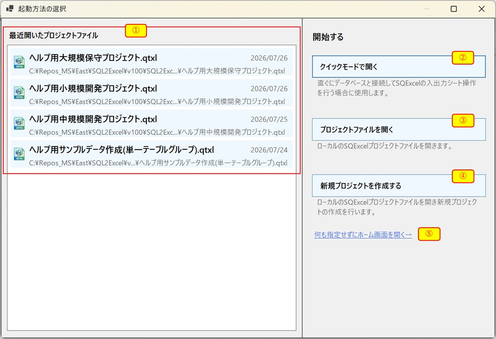
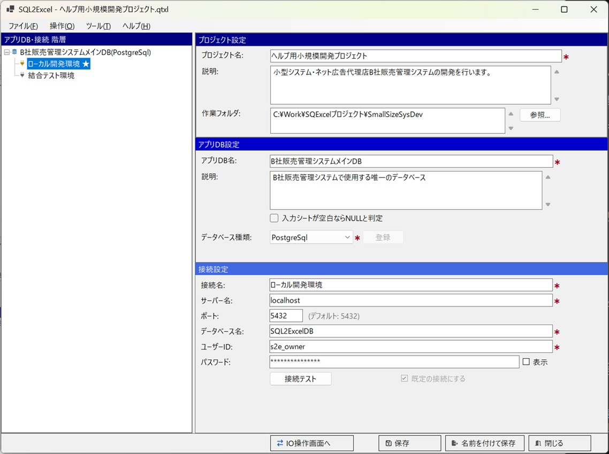
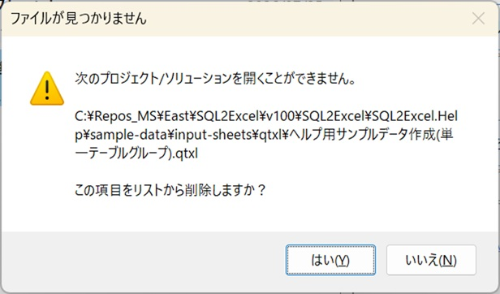
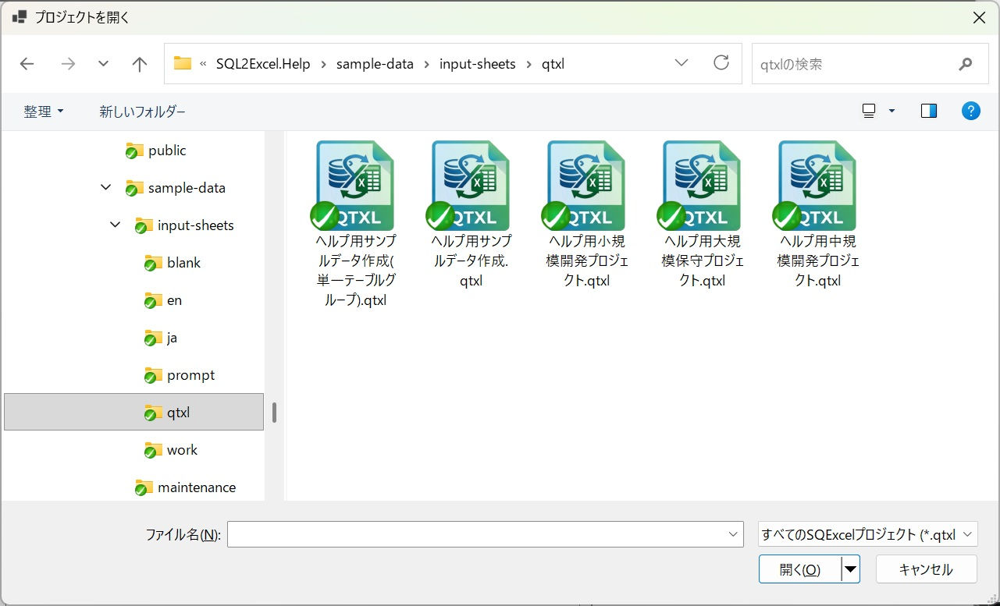
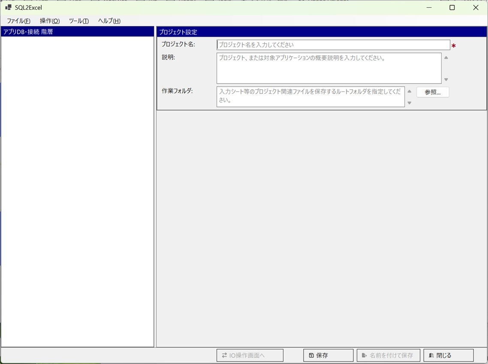
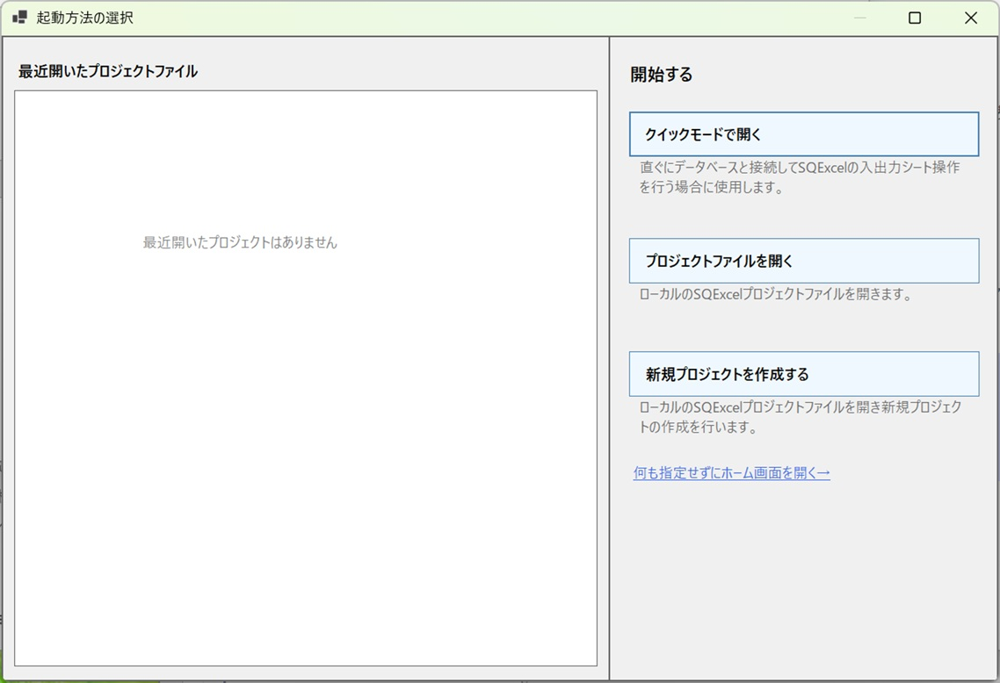
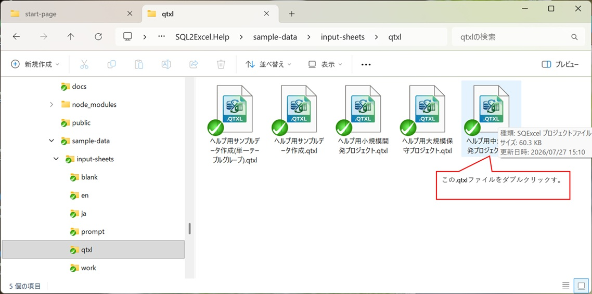
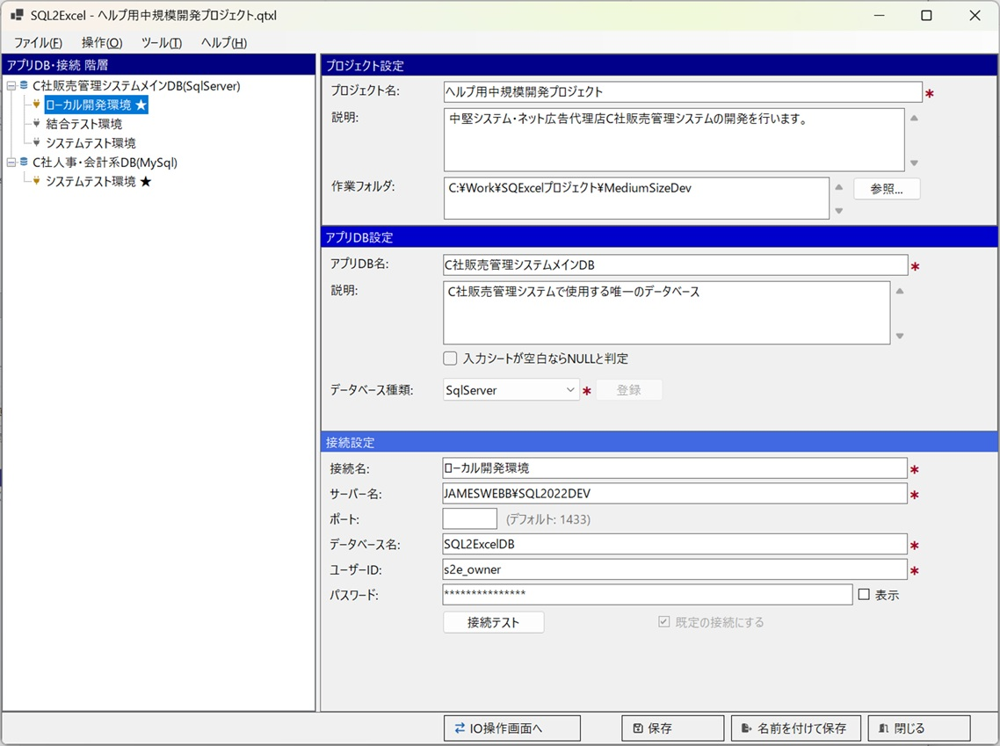

SQExcel をスタートメニューやショートカットから起動すると（`.qtxl` ファイルを直接ダブルクリックした場合を除く）、最初に表示されるのがスタートページです。Visual Studio のスタートページを模しており、「SQExcel で今すぐ何をやるか」を選びやすくすることを目的としています。

## 画面構成

   

| No. | エリア | 説明 |
|---|---|---|
| ① | 最近開いたプロジェクトファイルリスト | 最近開いた履歴のある `.qtxl` ファイルを一覧表示します。クリックするとそのファイルを読み込んだ状態で SQExcel が起動します |
| ② | クイックモードで開くボタン | [クイックモード](/ja/docs/quick-start/) で SQExcel を開きます |
| ③ | プロジェクトファイルを開くボタン | ファイルオープンダイアログを表示し、リストにない `.qtxl` ファイルを指定して開きます |
| ④ | 新規プロジェクトを作成するボタン | ホーム画面を、入力欄にガイダンス用のプレースホルダーが表示された状態で開きます |
| ⑤ | 何も指定せずにホーム画面を開くリンク | プレーンな状態でホーム画面を開きます |

## 各操作の詳細

### ①最近開いたプロジェクトファイルリストをクリックする

リスト内の項目をクリックすると、そのファイルパスを指定してホーム画面が開きます。

- プロジェクト・アプリDB・接続・テーブルグループの内容がすべて復元された状態になります。

   

- ファイルが見つからない場合（移動・削除された場合）は警告が表示され、リストから項目を削除するかどうかを確認されます。

   

   

   

- 具体的な操作例は [取り敢えず使ってみよう](/ja/docs/quick-start/) を参照してください。

### ②クイックモードで開く

最小の手間で入力シート操作にたどり着ける [クイックモード](/ja/docs/quick-start/) でホーム画面が開きます。プロジェクト名は自動的に「クイックモード」、アプリDB名は「既定のアプリDB」に固定され、名前や説明文を考える必要はありません。

- クリック直後のホーム画面の様子・以降の操作手順は [取り敢えず使ってみよう](/ja/docs/quick-start/) の「クイックモードで開く」セクションで詳しく説明しています。

### ③プロジェクトファイルを開く

標準のファイルオープンダイアログが表示され、任意の場所にある `.qtxl` ファイルを指定して開けます。①のリストに載っていない古いプロジェクトファイルを開く場合に使います。

   

### ④新規プロジェクトを作成する

ホーム画面が開き、プロジェクト情報入力欄（プロジェクト名・説明・作業フォルダ）に、それぞれ「プロジェクト名を入力してください」のようなガイダンス用プレースホルダーが薄いグレーで表示されます。

   

- 続きの操作（プロジェクト情報の入力〜保存）は [操作の流れとデータモデル階層](/ja/docs/operation-flow/) の「①プロジェクトを作成する」を参照してください。

### ⑤何も指定せずにホーム画面を開く

④と同じくガイダンス用プレースホルダー付きのホーム画面が開きますが、初回操作案内ダイアログの表示有無が異なります（次項参照）。

## 初回起動時の表示

最近開いた `.qtxl` ファイルの履歴がまだない場合、①のリストの位置に「最近開いたプロジェクトファイルはありません」というメッセージが表示されます。

   

### ④と⑤の違い

どちらも、プロジェクト情報エリアの入力欄にガイダンス用のプレースホルダー（「プロジェクト名を入力してください」等）を表示してホーム画面を開く点は同じです。両者に機能的な違いはありません。

## `.qtxl`（SQExcelプロジェクトファイル）をダブルクリックして開始する場合

SQExcel をインストーラからインストールすると、`.qtxl` ファイルは自動的にインストールフォルダの SQExcel と関連付けられます（詳しくは [SQExcelのインストール方法](/ja/docs/installation/) をご参照ください）。これにより、PC 上のフォルダをエクスプローラで開いて `.qtxl` ファイルをダブルクリックすると SQExcel が起動しますが、この場合はスタートページは表示されず、直接ホーム画面が `.qtxl` ファイルの内容を読み込んだ状態で表示されます。

1. エクスプローラ上で任意の `.qtxl` ファイルを選択してダブルクリックします。

     

2. SQExcel のホーム画面が、指定した `.qtxl` ファイルの内容が読み込まれた状態で表示されます（この場合、スタートページは表示されません）。

     

ホーム画面の詳しい使い方は [ホーム画面](/ja/docs/features/home-screen/) を参照してください。
