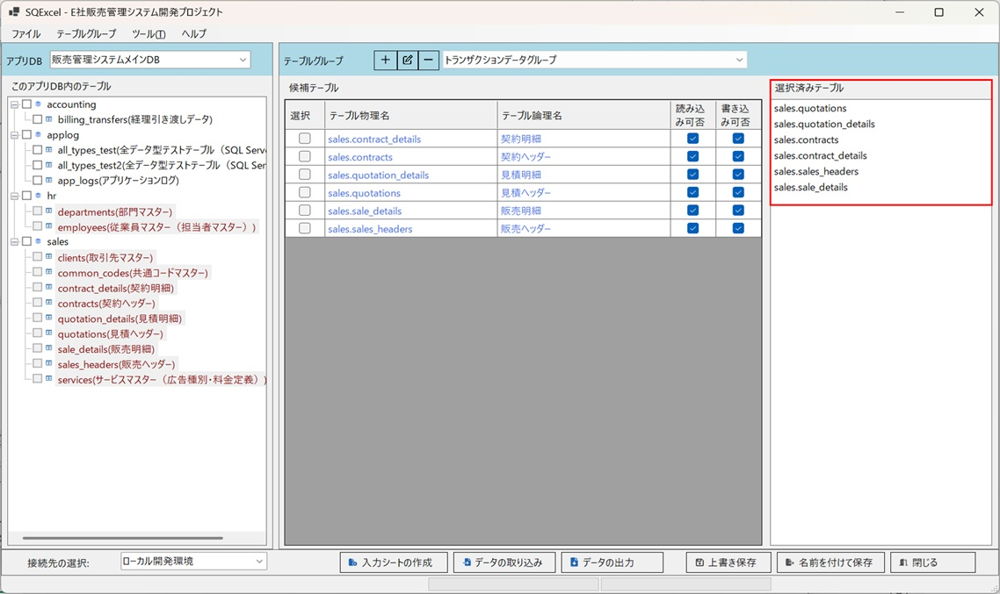
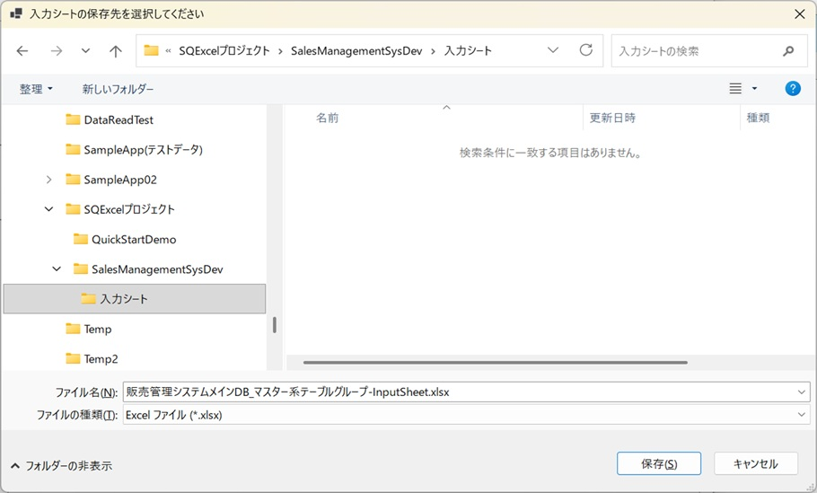
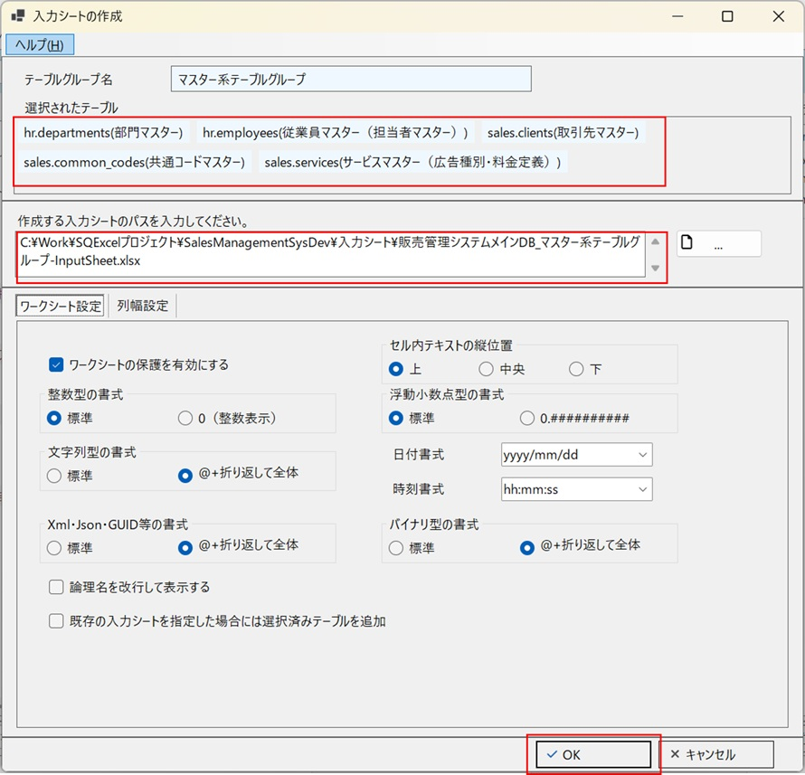
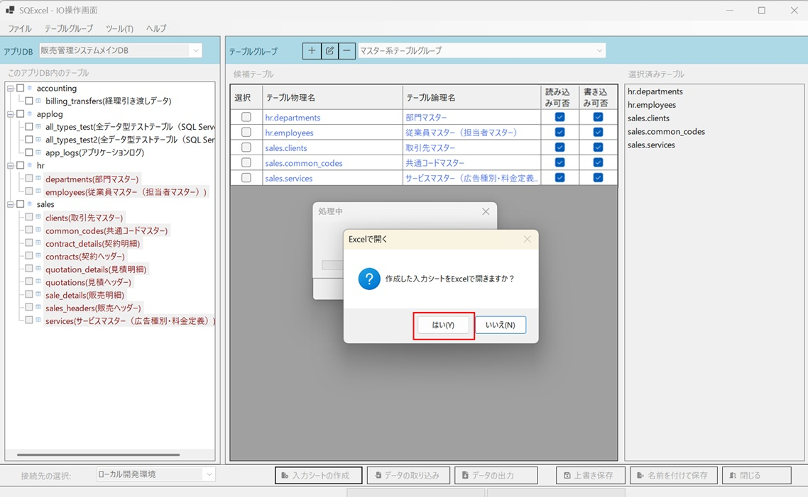
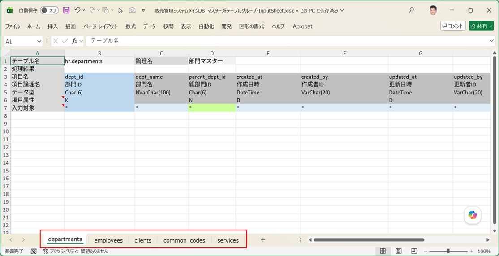

import { Steps } from '@astrojs/starlight/components';

**入力シートの操作の豊富さと処理スピードこそ、SQExcel の最大のセールスポイントです。**

このセクションでは、入力シート操作（作成・データ取り込み・データ出力）の基本的な流れと、実務で最も利用頻度が高いと思われる「テストデータ・初期データの投入」を軸に、SQExcel の使い方を説明していきます。

---

## 入力シート操作の基本フロー

入力シートを使ったデータ入出力には、大きく分けて2つの起点があります。

### パターンA：入力シートを新規作成してデータを作り込む

<Steps>

1. **入力シート作成**

2. **入力シートにデータを作成**　← ここが最も工夫のしどころ（次ページ以降で解説）

3. **データ取り込み**（DBへ反映）

4. **データ出力**（確認用）

</Steps>

### パターンB：既存データを出力してから編集する

<Steps>

1. **データ簡易出力**（DBの既存データを取得）

2. **入力シートのデータ編集**

3. **データ取り込み**（DBへ反映）

4. **データ出力**（確認用）

</Steps>

:::tip[どちらを使うべきか]
新規テーブルへ初期データを一から作る場合はパターンA、既存データの一部を修正・複製したい場合はパターンBが近道です。サンプルデータをゼロから作るときも、空白のシートから始めるよりパターンB（少数件を簡易出力してから編集）の方が効率的な場合が多いです。詳しくは[入力シートに直接入力する](/ja/docs/data-entry/manual-entry/)で説明します。
:::

いずれのパターンでも、最後の「データ出力」は必須ではありません。データ取り込みの処理結果（成功・失敗）は入力シート自体に書き戻されるため、DBへの反映を目視で再確認したい場合にのみ実行します。

---

## 入力シート作成の概要

パターンAの起点となる「入力シート作成」と、パターンBの起点となる「データ簡易出力」は、それぞれ実行方法が異なります。

### 通常の入力シート作成を実行する場合

IO操作画面でテーブルグループ内のテーブルを選択し、「入力シート作成」を実行すると、選択したテーブルの構造を反映した入力シート（データ入力エリアは空欄）が生成されます。以下に作業の概要を示します。

1. ホーム画面で、有効な接続が設定されているアプリDBを選択し、「IO操作画面へ」をクリックします。

2. IO操作画面で任意のテーブルグループを選択します。候補テーブルグリッド・選択済みテーブルリストに、すでにテーブルが配置されている状態を前提とします。
    - ここまでの手順の詳細は[操作の流れとデータモデル階層](/ja/docs/operation-flow/)の「通常モードの操作の流れ」セクションを参照してください。

3. **入力シート作成を開始する時点のIO操作画面の状態**です。画面右側の選択済みテーブルリストに配置されたテーブルの順序で、1つのワークブック内に入力シートが作成されます。
    - 「**入力シート**」という言葉は、ワークブック全体を指す場合と、ワークブック内の個々のテーブル用シートを指す場合があります。
    - 選択済みテーブルリストの並び順は、データ取り込み・データ出力の実行順序でもあります。外部キー参照があるテーブルでは、並び順に注意してください。
    - 選択済みテーブルリストの各要素は、ドラッグ＆ドロップで並び順を変更できます。

   

4. IO操作画面で**入力シートの作成**をクリックすると、まず**入力シートの保存先を選択するダイアログ**が開きます。
    - 保存先フォルダは既定でプロジェクトの作業フォルダが指定されますが、自由に変更できます。
    - 入力シートのファイル名も既定値（[プロジェクト名]_[テーブルグループ名]-InputSheet.xlsx）が設定されますが、自由に変更できます。
    - 下の例では、プロジェクトの作業フォルダの下に「入力シート」というフォルダを作成し、既定のファイル名で保存するよう指定しています。

   

5. **入力シートの作成ダイアログ**が開きます。
    - 選択されたテーブルリストには、IO操作画面の選択されたテーブルリストと同じ順番で表示されます。
    - 作成する入力シートのパスには、直前の保存先選択ダイアログで指定したパスが表示されます。
    - ダイアログ下方には入力シート作成時の各種オプションがありますが、ここでは既定の設定のままで構いません。

   この状態でOKをクリックします。

   

6. 入力シートの作成が開始されます。作業が終了したらExcelで開く確認アラートが表示されるのではい(Y)を選択します。

   

7. **作成された入力シートがデスクトップ上に表示**されます。ワークブック内の入力シートの作成順が、IO操作画面の選択済みテーブルリストの並び順と一致していることを確認してください。

   

以上が、通常の入力シート作成手順です。

- 以降のデータ投入方法の説明では、ここで作成した入力シートを使用します。
- 入力シート作成処理の詳細は[入力シート作成ダイアログ](/ja/docs/features/io-operations/input-sheet-builder-dialog/)を、入力シートについての詳細は[入力シートの構造と作成機能](/ja/docs/features/input-sheet/structure/)を参照してください。

### データ簡易出力を実行する場合

「データ簡易出力」を使うと、入力シートの新規作成とデータ出力を1回の操作で連結して実行できます。具体的な操作手順は [取り敢えず使ってみよう](/ja/docs/quick-start/) の「一番簡単な入力シートによるデータ操作」セクションをご参照ください。

---

## 3つのデータ投入方法

入力シートの入力エリアへデータを実際に書き込む方法には、主に3つの選択肢があります。

1. [入力シートに直接入力する](/ja/docs/data-entry/manual-entry/)
2. [関数やワークシートマクロ関数を使用する](/ja/docs/data-entry/formulas/)
3. [Microsoft 365 Copilotを利用する(お薦め)](/ja/docs/data-entry/copilot/)

これらはいずれも **Excel 標準機能や外部サービスを利用する方法であり、SQExcel 自体の機能ではありません**。SQExcel が提供するのは、あくまで「データベースの構造を正確に反映した入力用フォーマット（入力シート）」と、「そのシートから高速に DB へ反映する仕組み」です。どんな方法でデータを書き込むかはユーザーの自由であり、この自由度の高さこそが SQExcel の大きな差別化要因です。

詳しい使い方・使い分けは [入力シートへのデータ投入方法](/ja/docs/data-entry/) 以降のページで解説します。
