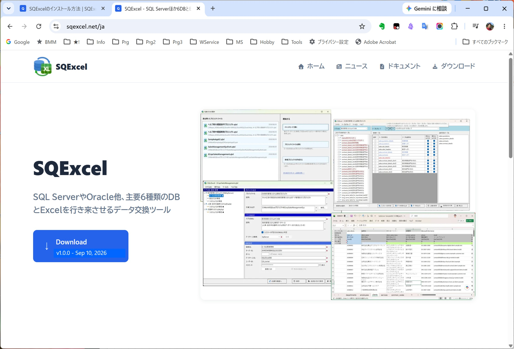
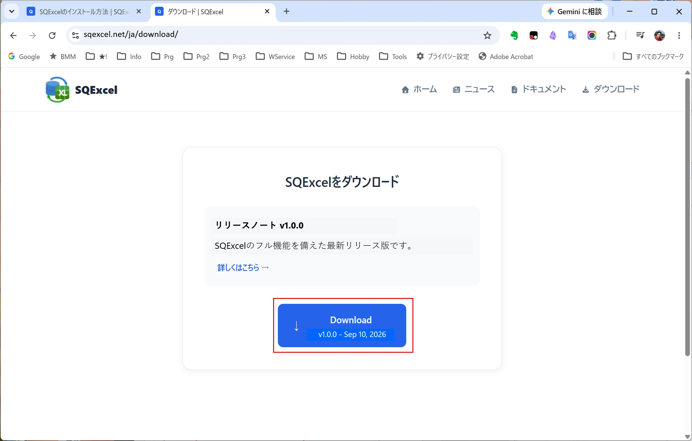
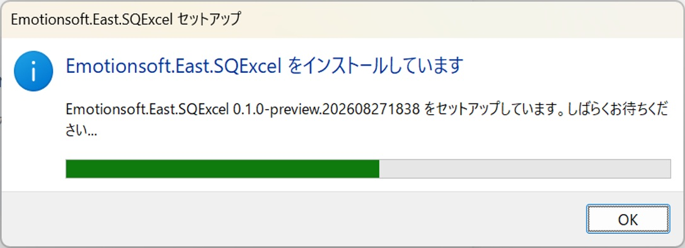
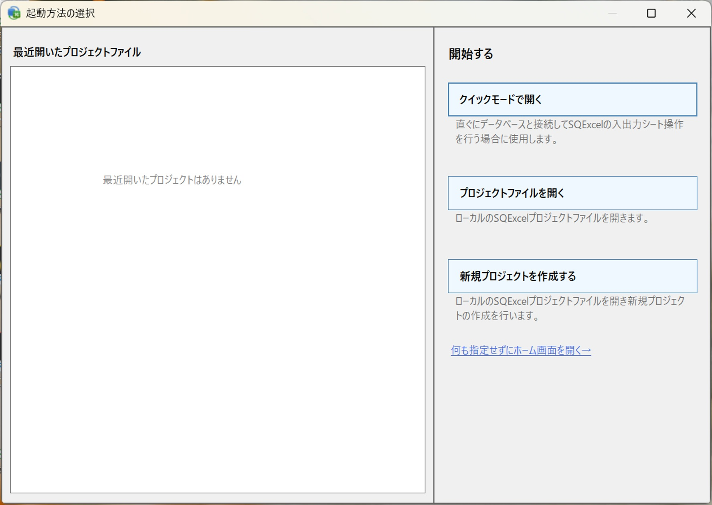
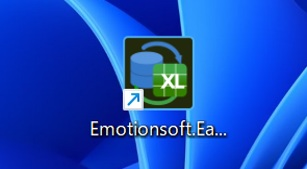
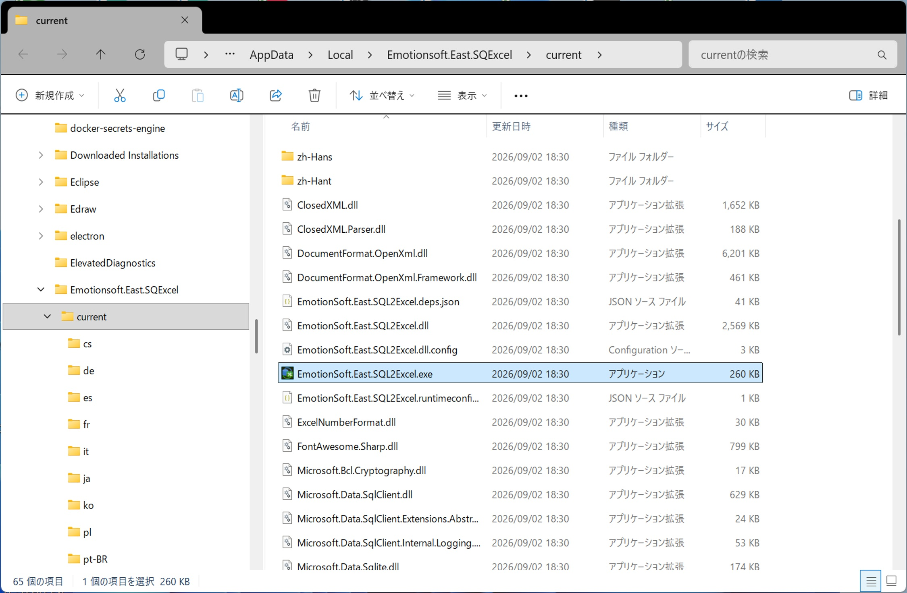
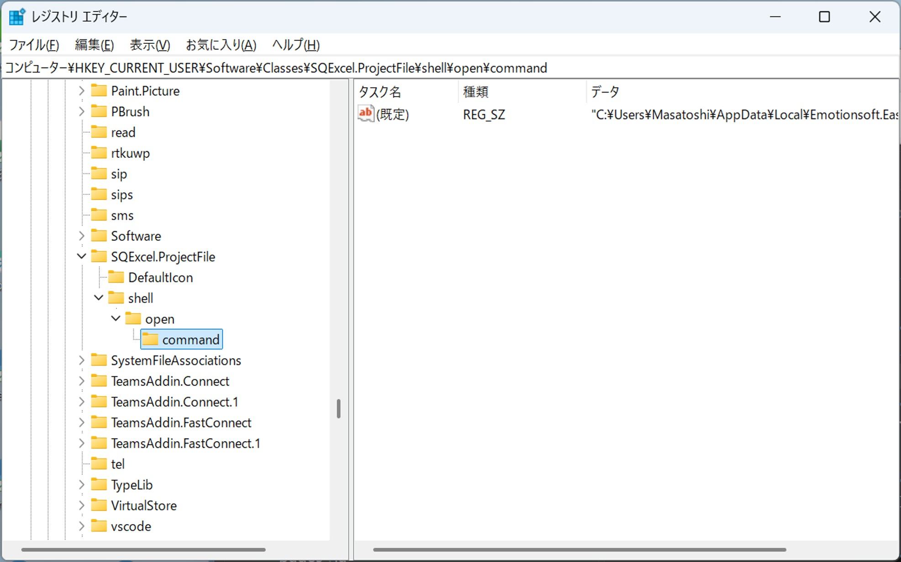
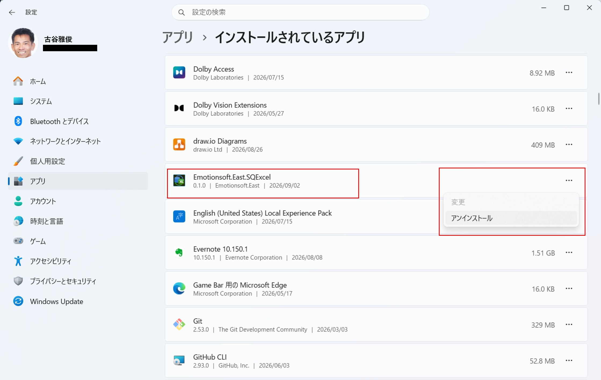

SQExcelはインターネット上のSQExcelポータルサイトからダウンロードしてインストールします。SQExcelのインストールは非常に簡単で、殆ど手間はかかりません。
一度インストールすると、アプリケーション起動時に最新アップデートの有無をチェックして、必要があれば自動アップデートを実施するように設定されています。
以下にSQExcelのインストール方法を解説します。

## インストール手順

1. SQExcelをインストールするには、ブラウザでSQExcelのポータルサイトからインストーラをダウンロードします。 
ブラウザで[SQExcelのポータルサイト](https://sqexcel.net/)を表示してトップメニューのダウンローﾄボタン、または画面左側の紹介文のすぐ下のDownloadボタンをクリックしてください。

   

2. SQExcelのダウンロードページが開きます。 
中央の枠内のダウンロードボタンをクリックしてください。ブラウザ上でダウンロードが開始されます。 
（ダウンロードボタンのすぐ上の[詳しくはこちら→]リンクをクリックすると、リリースノートページが表示されます。）

   

3. ダウンロードが開始されるとブラウザ右上のダウンロードインジケータが進捗状況を表示します。ダウンロードが終了するとインジケータはダウンロード完了マークになります。

   

4. ここでダウンロードインジケータの完了マークをクリックするとダウンロード履歴ダイアログが表示され、今回ダウンロードしたSQExcelのインストーラ(Emotionsoft.East.SQExcel-win-Setup.exe)が先頭に表示れます。

   

5. 表示されたEmotionsoft.East.SQExcel-win-Setup.exeをクリックするとインストールが開始されます。 
※もしPCにMicrofost .NET 8がインストールされていない場合(Windows10端末にインストールする場合等)には、直後に.NETのインストールが自動的に実行されます。

   

   

   

6. インストールが完了するとSQExcelが起動します。

   

7. デスクトップ上にはSQExcel起動用のショートカットアイコンが表示されます。

    

    
      

   

## インストールの詳細

### インストールディレクト
SQExcelアプリケーション一式のインストール先は以下のディレクトリになります。	 
  C:\Users\[ユーザー名]\AppData\Local\Emotionsoft.East.SQExcel  
SQExcel本体のプログラムのパスは以下のようになります。	 
  C:\Users\[ユーザー名]\Local\Emotionsoft.East.SQExcel\current\EmotionSoft.East.SQL2Excel.exe  
※SQExcelは任意のフォルダにインストールすることが出来ません。これはSQExcelがインストール時に後述するレジストリへの書き込みを行う際のセキュリティを担保するためです。	 
この制約によりSQExcelはインストールしたユーザー以外が使用することも出来ません。1つのPCで複数のユーザーがSQExcelを使用する場合は、ユーザーごとにインストールする必要があります。	

   

### レジストリの設定

SQExcelのインストーラ(Emotionsoft.East.SQExcel-win-Setup.exe)はインストール処理の最後に次の情報をレジストリに書き込みます。

| レジストリキー | 設定値 | 意味 |  
| --- | --- | --- |
| [HKEY_CURRENT_USER\Software\Classes\.qtxl] | SQExcel.ProjectFile | 拡張子「.qtxl」ファイルがSQExcelのプロジェクトファイルであることを示す。 | 
| [HKEY_CURRENT_USER\Software\Classes\SQExcel.ProjectFile] | SQExcelプロジェクトファイル | レジストリキー「SQExcel.ProjectFile]」のタイトルを定義する。 |  
| [HKEY_CURRENT_USER\Software\Classes\SQExcel.ProjectFile\DefaultIcon] | [インストールディレクトリ内の.qtxlファイルのアイコンのパス] | .qtxlファイルのアイコンを指定する。 | 
| [HKEY_CURRENT_USER\Software\Classes\SQExcel.ProjectFile\shell\open\command] | [インストールディレクトリ内のSQExcel実行ファイルのパス] | .qtxlファイルとSQExcelプログラムの関連付けを行う。これによりエクスプローラ上で.qtxlファイルがダブル句リクされたり、コマンドプロンプトからファイル名が指定されたときに、SQExcelを起動する。 | 

これらのレジストリキーを[HKEY_LOCAL_MACHINE]の階層に対して書き込む権限を与えるにはインストーラ実行プロセスに管理者アクセスキー（トークン）の付与する必要がありますが、現在のSQExcelのバージョンではインストーラーに管理者ユーザートークンを付与することが出来ないため、[HKEY_CURRENT_USER]の階層に対してのみ書き込み可能となります。 
このためSQExcelのインストール先は上に記したような制約を受けることになります。

   

## アンインストールの方法

SQExcelをアンインストールする場合は、必ずWindowsメニュー「インストールされているアプリ」からEmotionSoft.East.SQExcelを選択してアンインストールを行ってください。 
（Windows10をお使いの方はコントロールメニューの「プログラムのアンインストールまたは変更」からEmotionSoft.East.SQExcelを選択してアンインストールしてください。） 
<strong>この操作によりアンインストールしないとレジストリに不要なキーが残る</strong>ことになります。（実害はありません）

   

