import { Steps } from '@astrojs/starlight/components';
import { Image } from 'astro:assets';
import tableGroupEditImg from './images/operation-flow/OF012_TableGroupEdit.jpg';

[取り敢えず使ってみよう](/ja/docs/quick-start/) で紹介したクイックモードは、あくまで最短ルートの入り口です。本格的にプロジェクトを管理する「通常モード」では、SQExcel は次の4階層でデータを管理します。

---

## 通常モードの操作の流れ

<Steps>

1. **プロジェクトを作成する**

2. **アプリDBを追加する**（DB種類を選択）

3. **接続を追加する**（サーバー・ユーザーID・パスワード等）→ 接続テスト

4. **テーブルグループを作成する**（IO操作画面）

5. **入力シート操作**（作成／データ取り込み／データ出力）

</Steps>

### ① プロジェクトを作成する

ホーム画面を開くと、まずプロジェクト情報（プロジェクト名・説明・作業フォルダ）を入力します。プロジェクトは SQExcel が管理するデータの最上位単位で、通常は1つの開発対象システムに対応します（例：「販売管理システム」）。

1. プロジェクト情報を入力して保存ボタンをクリックします。

   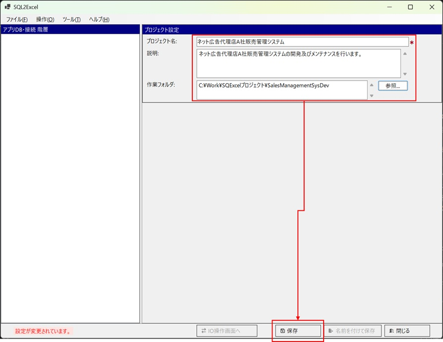

2. ファイル保存ダイアログが開きます。プロジェクトの作業フォルダが既定の保存フォルダになります（他のフォルダを指定してもかまいませんが、作業フォルダに入れておくと管理が楽になります）。SQExcelのプロジェクトファイルは拡張子「.qtxl」が付いたSQExcel専用ファイルとして保存されます。

   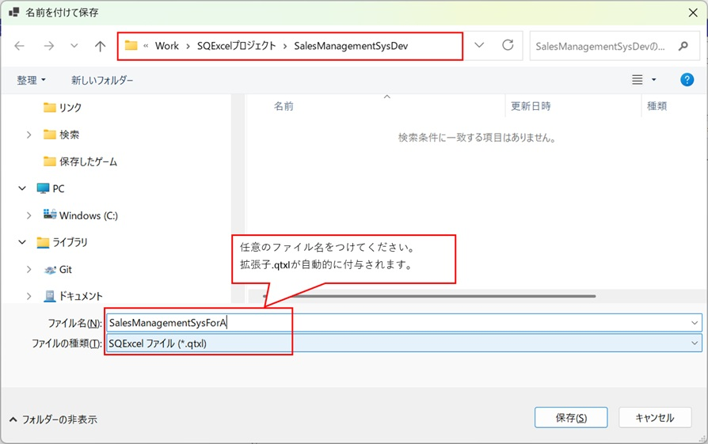

3. アプリDB設定パネルが表示され、アプリDB情報の入力が可能になります。

   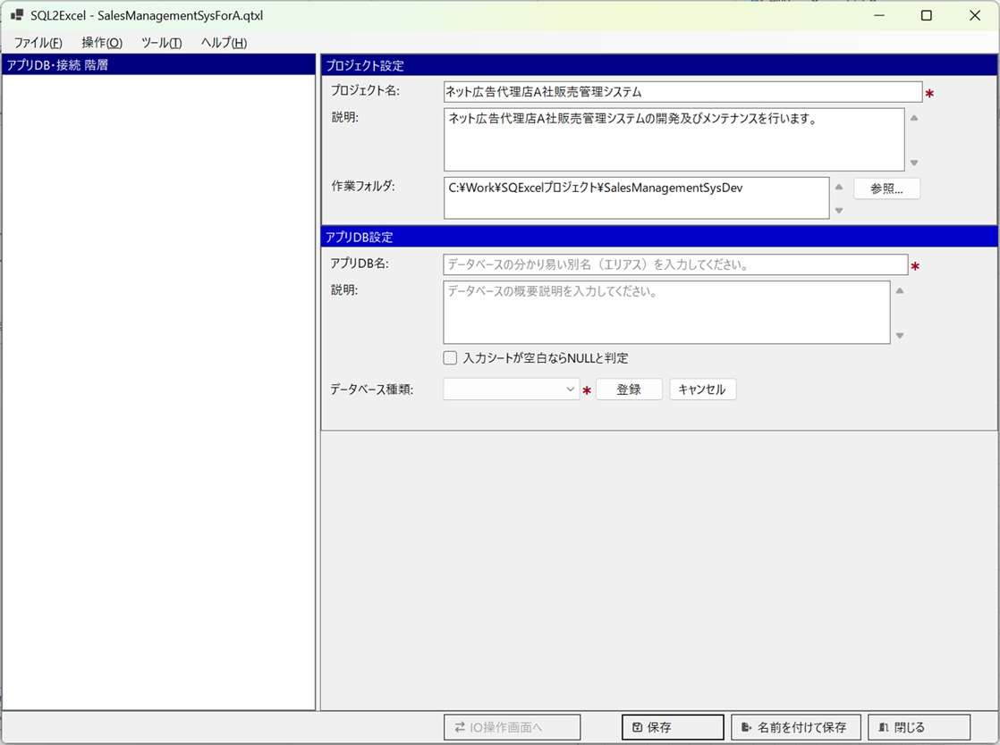

### ② アプリDBを追加する

アプリDB は、そのプロジェクトが使用するデータベースの論理的な単位です（例：「販売管理DB」）。アプリDB名・説明・DB種類（SQL Server / Oracle / MySQL / MariaDB / PostgreSQL / SQLite）を指定して登録します。

1. アプリDB情報を入力して保存をクリックすると、画面左のアプリDB・接続ツリーに登録したアプリDBが表示され、接続設定ダイアログが開きます。

   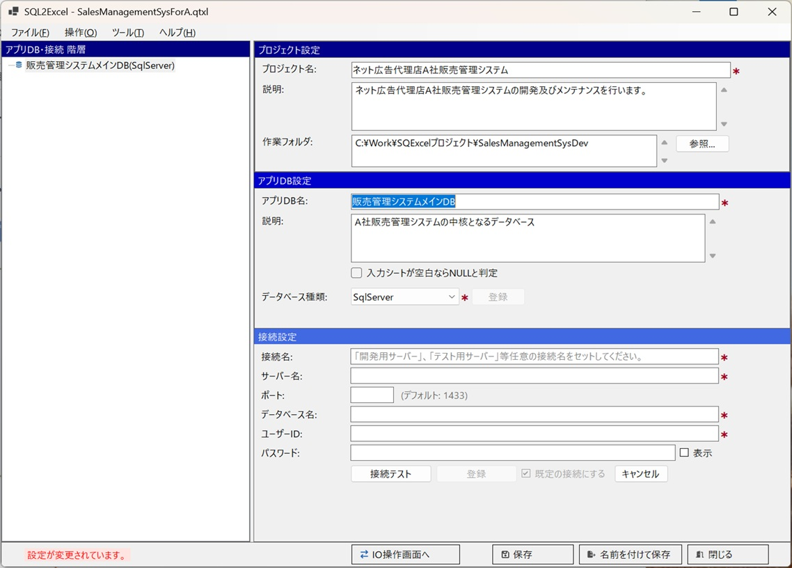

2. アプリDB・接続ツリー上のコンテキストメニューから「アプリDBの追加」を選択すると、別のアプリDBを登録できます。

   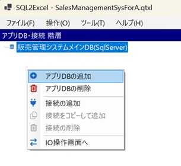

3. 操作は最初のアプリDBと同じです。アプリDB情報を入力し、登録→保存の順にクリックしてください。

   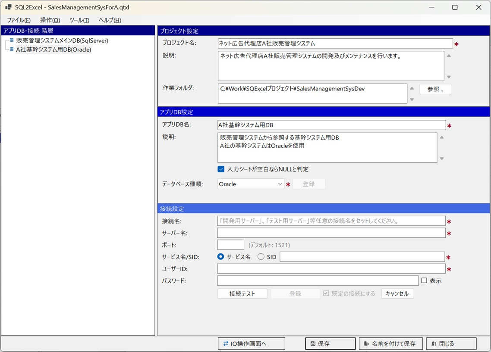

### ③ 接続を追加する

アプリDB 配下に、実際にデータベースへ接続するための情報（サーバー名・ポート・データベース名・ユーザーID・パスワード等）を登録します。1つのアプリDBに対して、開発環境・結合テスト環境・本番環境など複数の接続を持たせることができます。「既定の接続」フラグを立てておくと、IO操作画面で自動的に選択された状態になります。

1. アプリDB・接続ツリーで最初に作成したアプリDBを選択し、その下に接続を作成します。アプリDB・接続ツリーのコンテキストメニューから「接続の追加」を選択してください。

   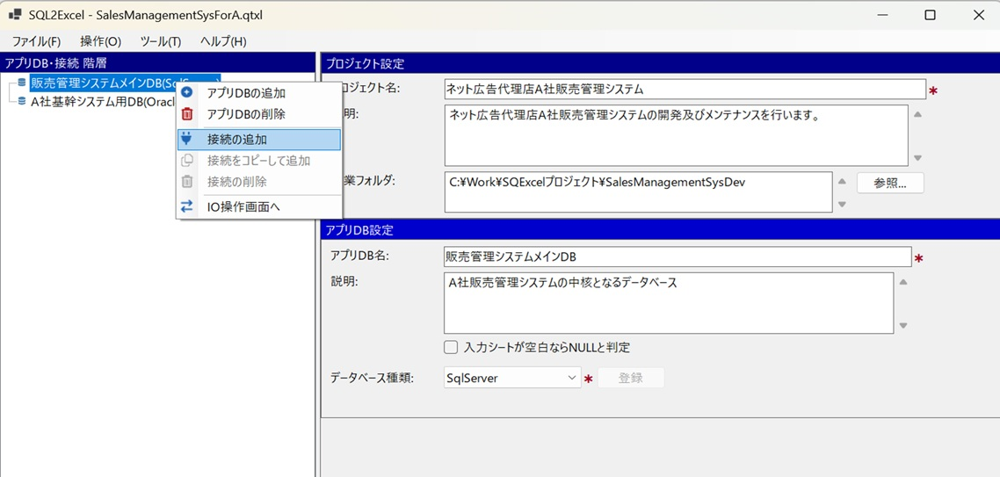

2. 接続設定項目を入力して接続テストをクリックします。接続に成功したら登録ボタンが表示されるので、クリックします。最初に作成した接続は「既定の接続」（入力シート操作の対象となる接続）として登録されますが、これは後から変更できます。登録すると、アプリDB・接続ツリー上の親アプリDBの下に新しい接続が表示されます。

   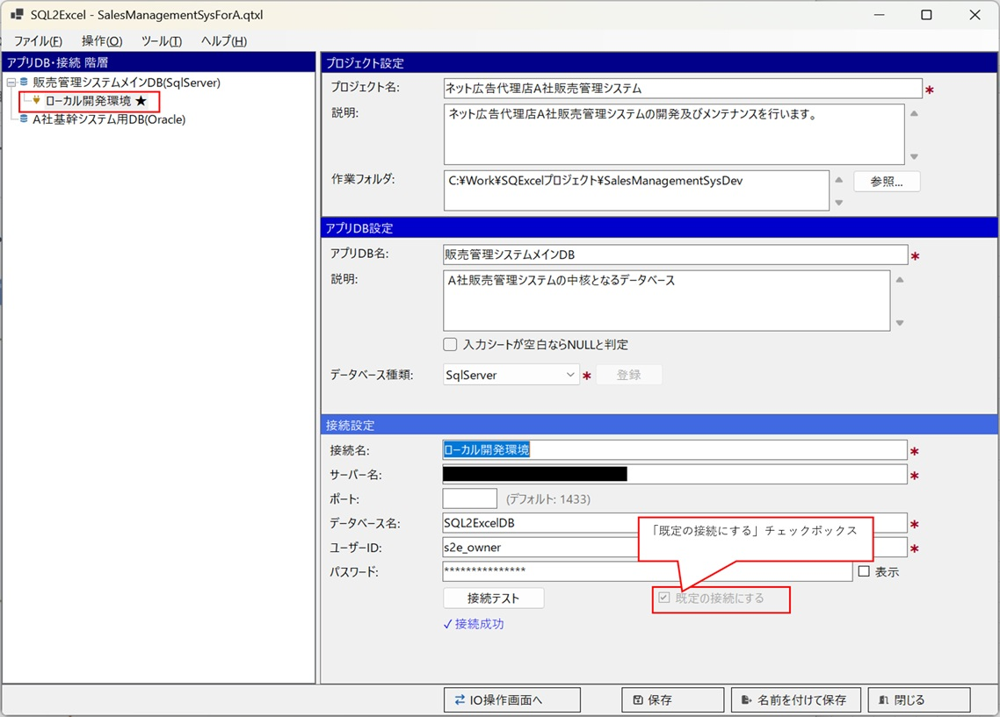

3. 同じ手順で必要な接続を登録します。この例では、販売管理システムメインDB（SQL Server）の下に、ローカル開発環境用・結合テスト環境用・システムテスト環境用の3つの接続を設定しています。

   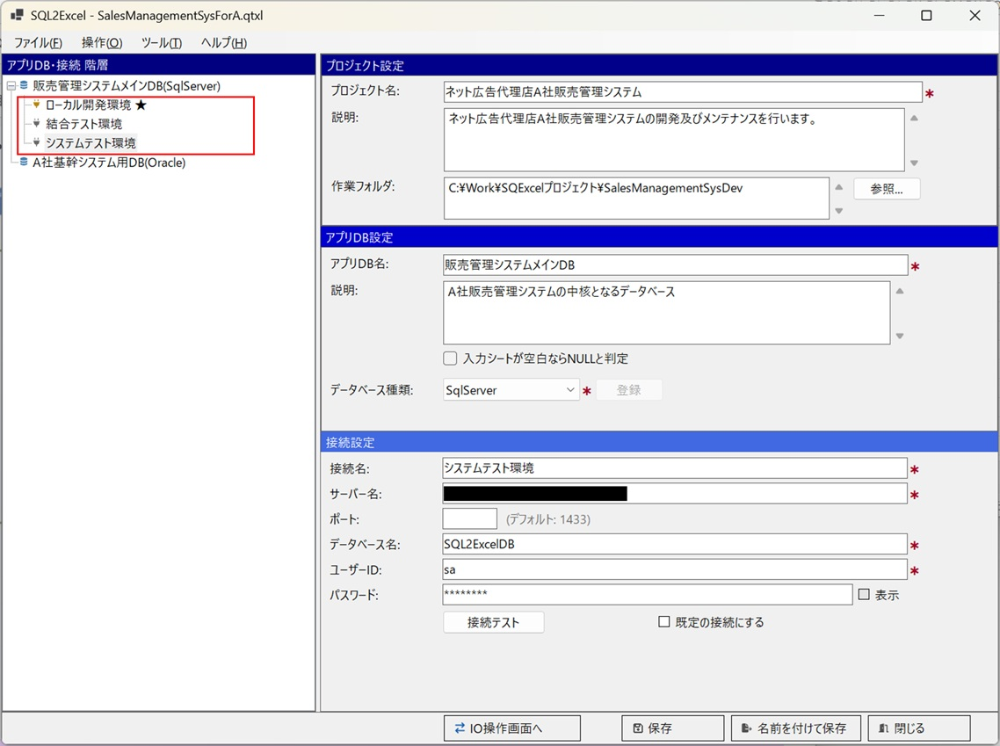

### ④ テーブルグループを作成する

IO操作画面に遷移し、接続先データベースのスキーマ・テーブル一覧を読み込みます。処理対象としたいテーブルをドラッグ＆ドロップで選択し、「テーブルグループ」としてまとめます。

1. 販売管理システムメインDBが選択された状態で「IO操作画面へ」ボタンをクリックし、IO操作画面を表示します。ヘッダ部左のアプリDBに「販売管理システムメインDB」、フッタ部左の接続先の選択に「ローカル開発環境」が選択されていることを確認してください。画面中央のテーブルグループパネルで、テーブルグループの追加・変更・削除を行います。

   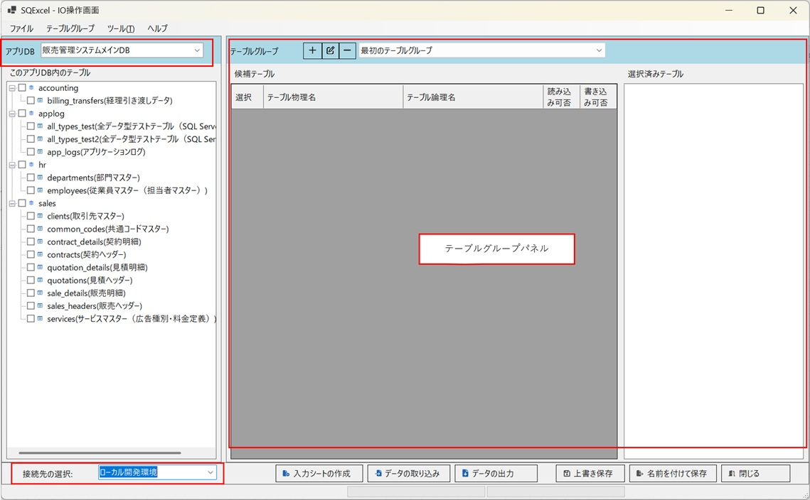

2. テーブルグループパネル上部のテーブルグループ編集ボタンをクリックして既定のテーブルグループ（「最初のテーブルグループ」）の名前と説明を任意の内容に編集します。

   <Image src={tableGroupEditImg} alt="IO操作画面（テーブルグループ編集ダイアログ)" style="max-width: 70%;" />

3. このアプリDB内のテーブルツリーから、マスター系テーブルグループに含めたいテーブルをチェックボックスで選択し、テーブルグループパネルの候補テーブルグリッドにドラッグ＆ドロップします。続けて、入力シート操作に使用するテーブルを候補テーブルグリッドで選択し、選択済みテーブルリストにドラッグ＆ドロップします。

   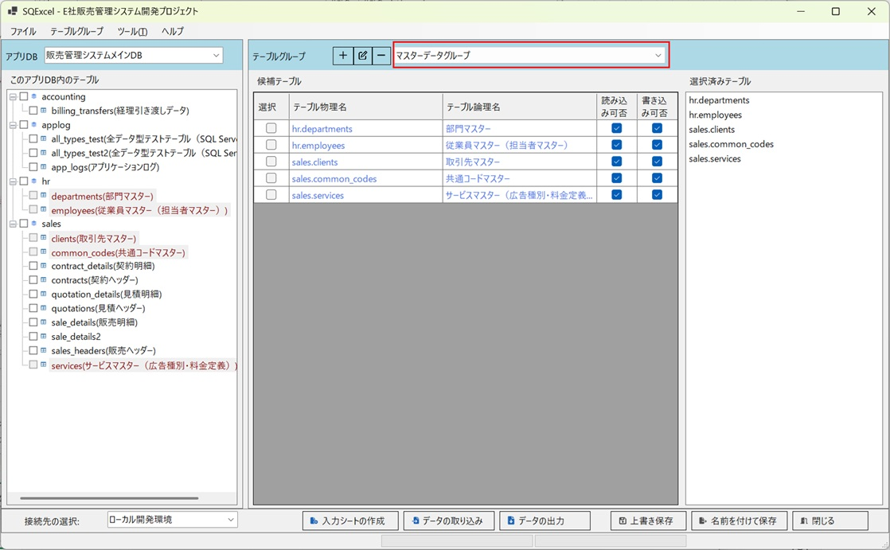

4. テーブルグループパネル上部の「テーブルグループ追加」ボタンをクリックして新しいテーブルグループを作成し、アクティブにします。手順は同じで、このアプリDB内のテーブルツリーから候補テーブルグリッドへ、さらに入力シート操作に使うテーブルを選択済みテーブルリストへドラッグ＆ドロップします。

   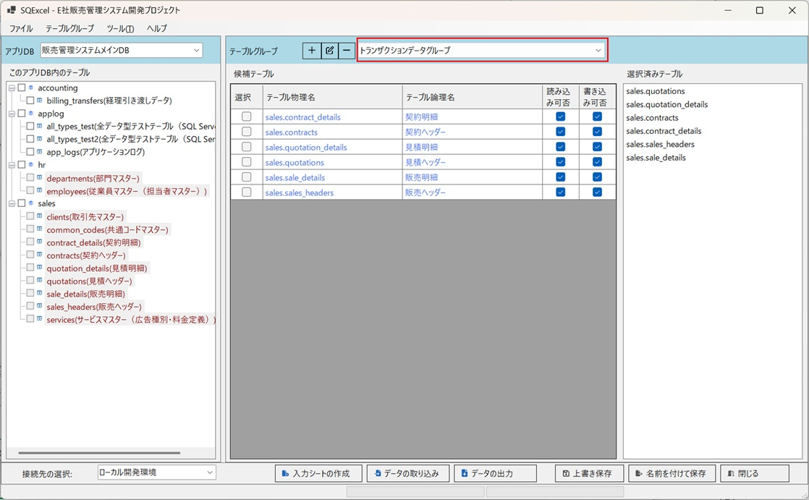

### ⑤ 入力シート操作

テーブルグループの選択済みテーブルに対して、入力シート作成・データ取り込み・データ出力を実行します。この操作の詳細は [SQExcelの入力シート操作概要](/ja/docs/input-sheet-overview/) 以降で説明します。

---

## データモデル階層のカージナリティ

SQExcel が管理するデータは、次の階層構造を持ちます。

```
プロジェクト (1)
  └─ アプリDB (0..*)
       ├─ 接続 (0..*)
       └─ テーブルグループ (1..*)
```

<div class="cardinality-table">

| 階層 | 意味・目的 |
|---|---|
| **プロジェクト** | SQExcel で管理するデータの最上位単位。通常1つの開発対象システムに対応する。名前・説明・作業フォルダを持つ |
| **アプリDB** | プロジェクトが使用するデータベースの論理的な単位。1プロジェクトが複数種類のデータベースを使う場合（例：メインDBはSQL Server、ログDBはMariaDB）に、それぞれをアプリDBとして分けて管理する |
| **接続** | アプリDBに実際に接続するための情報セット。1つのアプリDBに対して開発・結合テスト・本番など複数の接続を持てる。「既定の接続」を1つ指定できる |
| **テーブルグループ** | 一括入出力操作の単位。アプリDB直下に属し、複数テーブルをまとめて管理する。1つのアプリDBに複数のテーブルグループを作成できる |

#### プロジェクト、アプリDB、接続、テーブルグループの設定例
     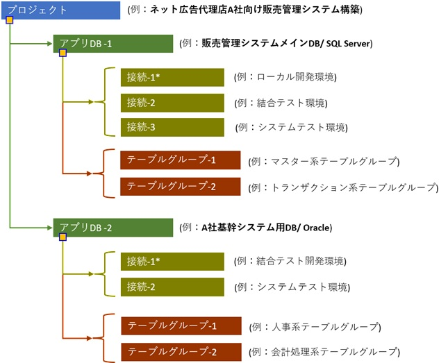

:::tip[アプリDBとテーブルグループの関係]
テーブルグループはアプリDBに従属しますが、**どの接続を使うか**とは独立しています（並列関係）。同じテーブルグループを、異なる接続（例：ローカル開発環境→結合テスト環境）に切り替えて使うことができます。テーブルグループがデフォルトで使用する接続は「既定の接続」として登録されています（上の図で「*」が付いている接続）。
:::

接続より下位の階層（スキーマ・テーブル・カラムなど）は、接続先データベースから都度読み取られる情報です。SQExcel のプロジェクトファイル（`.qtxl`）が独自に保持する管理単位ではないため、本ページでは扱いません。テーブル・カラムについては [SQExcelの入力シート](/ja/docs/features/input-sheet/) を参照してください。

## 「登録」と「保存」

### アプリDB、接続、テーブルグループの登録
ホーム画面からアプリDB・接続・テーブルグループを登録すると、PCメモリー内のSQExcelデータモデル階層に反映されます。これにより、登録した内容をSQExcel上で操作できるようになります。

     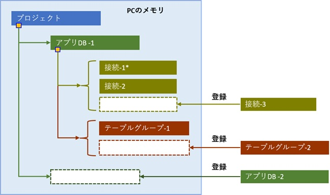

### プロジェクトの保存
ホーム画面やIO操作画面で保存を実行すると、現在のSQExcelデータモデル階層が.qtxlファイル（SQExcelプロジェクトファイル）に保存されます。.qtxlファイルには、テーブルグループ内の候補テーブル・選択済みテーブル情報も保存されるため、次回このファイルを開くと、これらの情報がすべてSQExcel上に復元されます。

     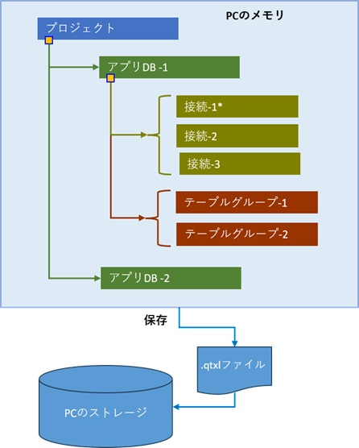

</div>
