「ちょっとだけ今すぐこのテーブルのデータを見たい」「思いついたときにサクッとテストデータを入れたい」——そんなアドホックな使い方に、SQExcel は**クイックモード**で応えます。

一般的な DB・Excel データ交換ツールでは、接続さえ済めばすぐにテーブルの入出力ができます。SQExcel はプロジェクト＞アプリDB＞接続＞テーブルグループという階層で管理する分、本来なら準備の手順が少し長くなりがちです。クイックモードは、この準備をできる限り省略し、**最短ルートで入力シート操作（作成・取り込み・出力）にたどり着く**ための入り口です。

---

## クイックモードで開く

1. SQExcel をスタートメニューやショートカットから起動すると、最初に**スタートページ**が表示されます。

   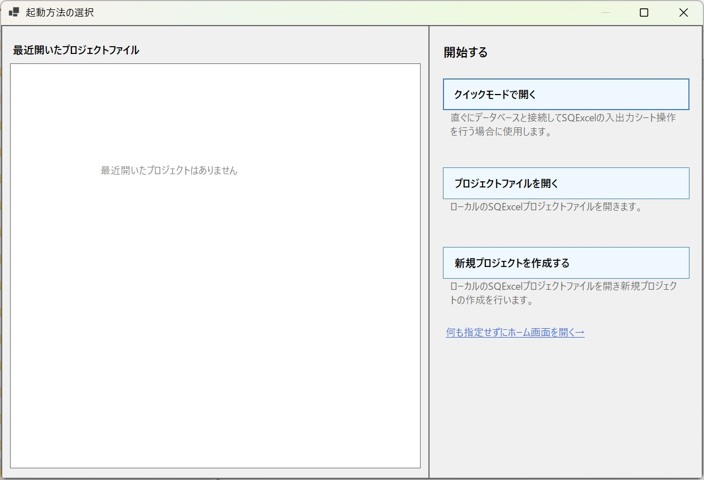

    - スタートページの詳しい説明は [スタートページ](/ja/docs/features/start-page/) で説明します。

2. 「クイックモードで開く」ボタンをクリックします。SQExcelのホーム画面がクイックモードで開きます。

   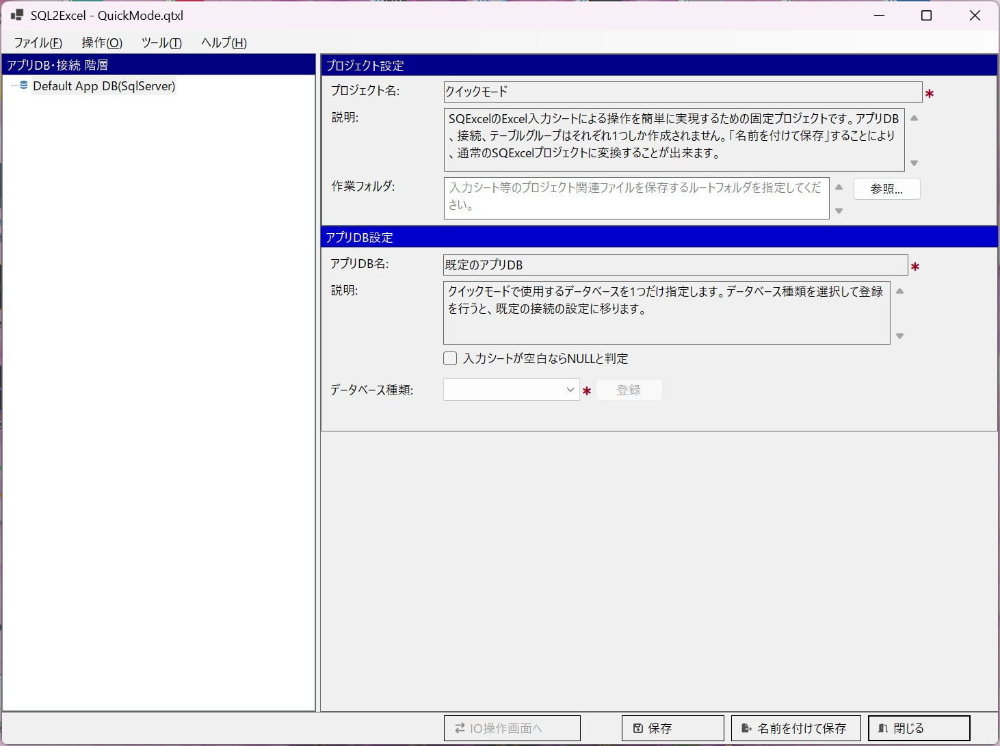

   このときプロジェクト名は自動的に「クイックモード」、アプリDB名は「既定のアプリDB」に固定されます。名前や説明文を考える必要はありません。
    - プロジェクトファイルの保存場所は、入力シートの出力先の既定のフォルダです。必要であれば変更してください。
    - ホーム画面の詳しい説明は [ホーム画面](/ja/docs/features/home-screen/) で説明します。

3. DB 種類を選択して「登録」をクリックすると、接続設定パネルが開きます。

   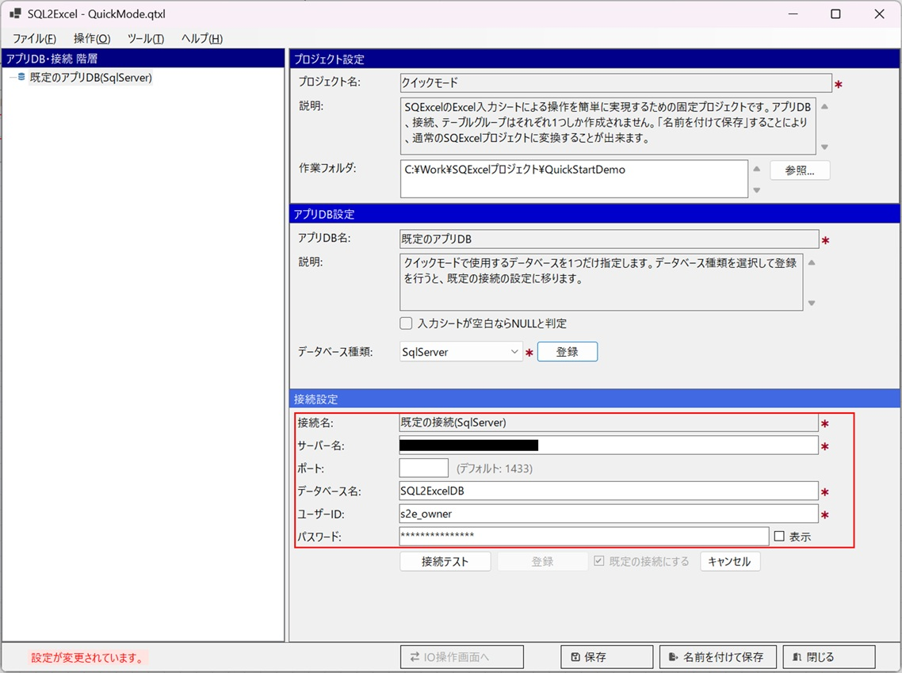

4. サーバー名・ユーザーID・パスワードなど接続情報を入力して「接続テスト」をクリックします。テストが成功すると「登録」ボタンが表示されるので、クリックします。

   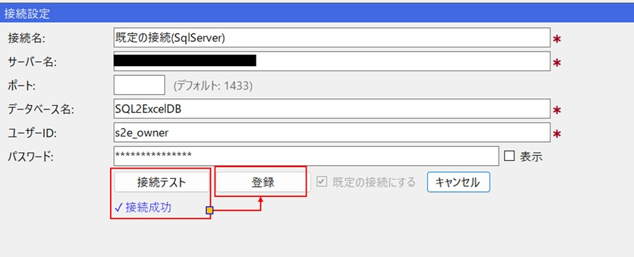

5. 登録が完了すると、「IO操作画面へ」ボタンが使用可能になります。クリックすると、自動的に作成された「既定のテーブルグループ」がアクティブな状態でIO操作画面が開きます。

   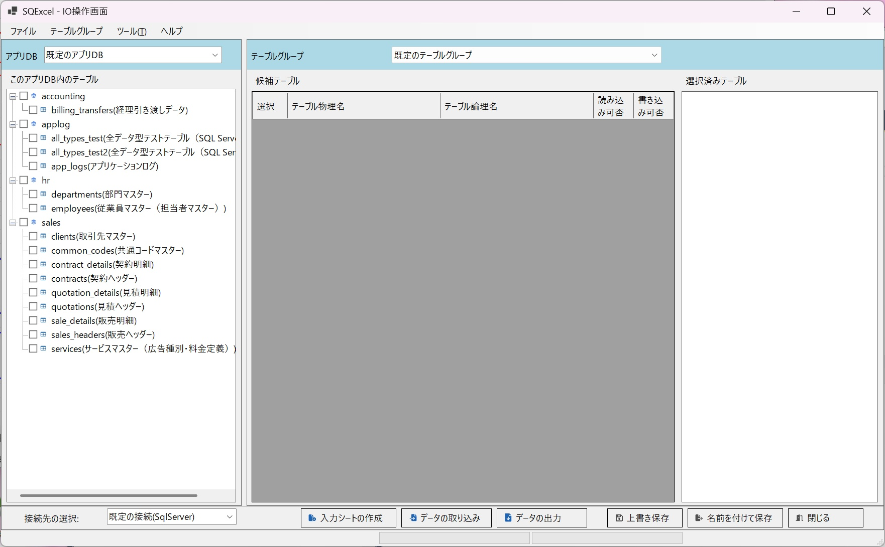

これだけで、**接続情報の入力からデータ出力の完了まで、5ステップ程度の簡単な操作**でデータ入出力にたどり着けます。あとは通常モードと全く同じ操作で、テーブルを選択して「入力シート作成」「データ取り込み」「データ出力」を実行するだけです。

## 一番簡単な入力シートによるデータ操作

実際に接続先のデータベースから入力シートにデータを出力し、内容を変更して新規データとして登録する例を見てみましょう。

1. IO操作画面左側のテーブルツリーから、入力シート操作を行うテーブルをチェックボックスで選択します。選択したテーブルを候補テーブルグリッドにドラッグ＆ドロップしてください。

   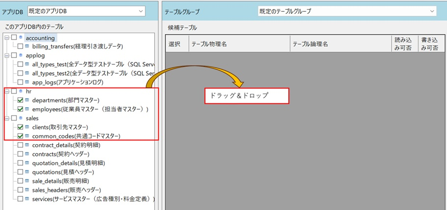

    - IO操作画面の詳しい説明は [IO操作画面](/ja/docs/features/io-operations/) で説明します。

2. 候補テーブルグリッドには選択されたテーブルが表示されます。左側のツリーでは選択されたテーブルはグレーアウトされ、使用できなくなります。

   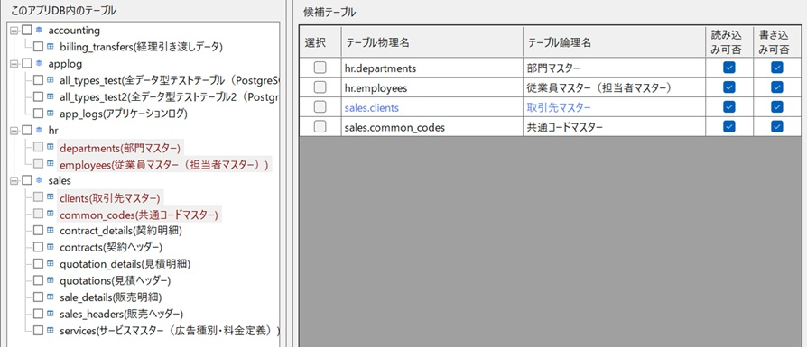

3. 候補テーブルグリッドは、入力シート操作を行う候補のテーブルです。実際に処理するテーブルは、チェックを付けて選択済みテーブルにドラッグ＆ドロップします。

   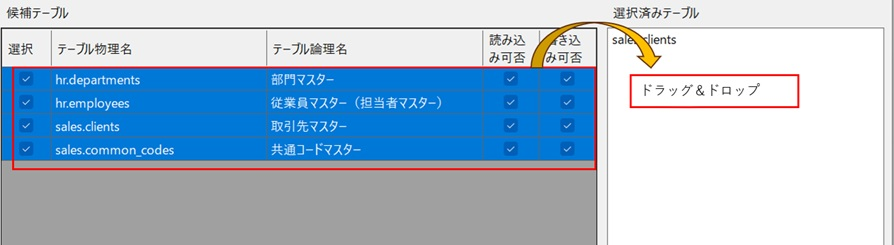

4. 選択済みテーブルに追加したテーブルは、1つのワークブックにまとめて入力シートが作成されます。**選択済みテーブルの並びはデータ挿入・削除時の処理順**になるため、リスト内でドラッグ＆ドロップして順番を変更できます。

   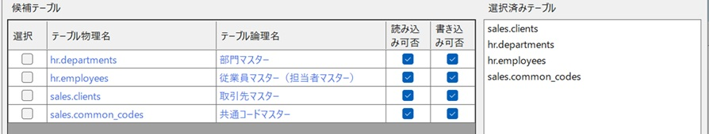

5. この状態でフッタ部の「データの出力」ボタンをクリックします。データ出力ダイアログで入力シートの出力先パスを指定し、「新規入力シートを作成してデータを出力」を選択してOKをクリックします。

   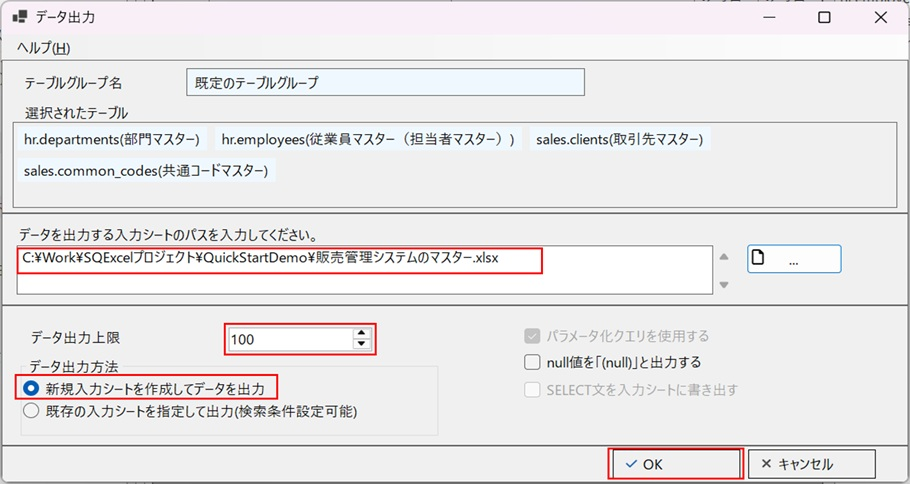

   - データ出力ダイアログの詳しい説明は [データ出力ダイアログ](/ja/docs/features/io-operations/data-export-dialog/) で説明します。

6. 指定したファイルにSQExcel入力シートが作成され、各テーブルから取得したデータが表示されます。選択済みテーブルの順番通りに入力シートが出力されていることを確認してください。

   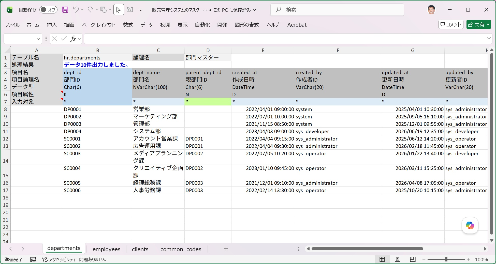

    - SQExcel入力シートの詳しい説明は [SQExcelの入力シート](/ja/docs/features/input-sheet/) で説明します。

7. **clients（取引先）テーブルに、既存データを参考にした2件のデータを追加**します。データが出力されている入力行の先頭に2行を挿入し、さらにその下へ空白行を1行挿入してください。**入力エリアの空白行は、データ取り込み処理をそこで止める目印**になります。

   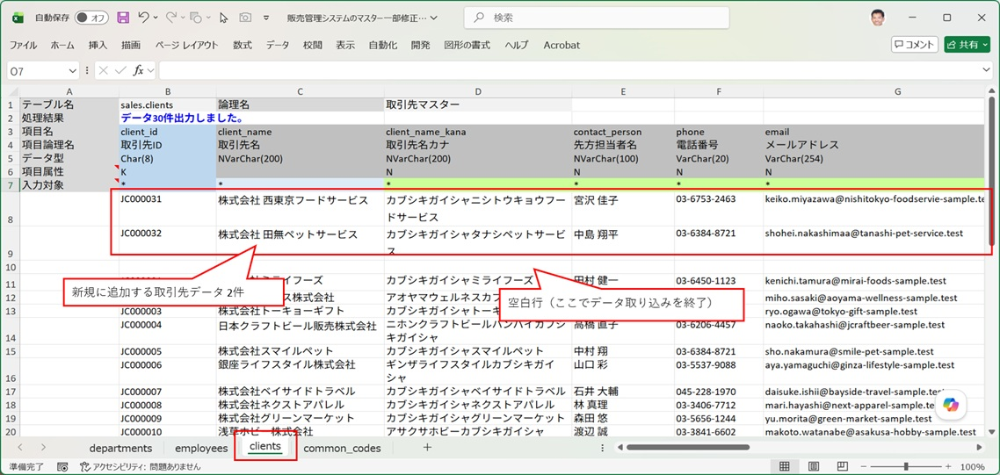

8. データ作成日時・更新日時のように自動設定される項目は、入力対象行の「*」を外します。これでその項目はデータ取り込みの対象から外れます。

   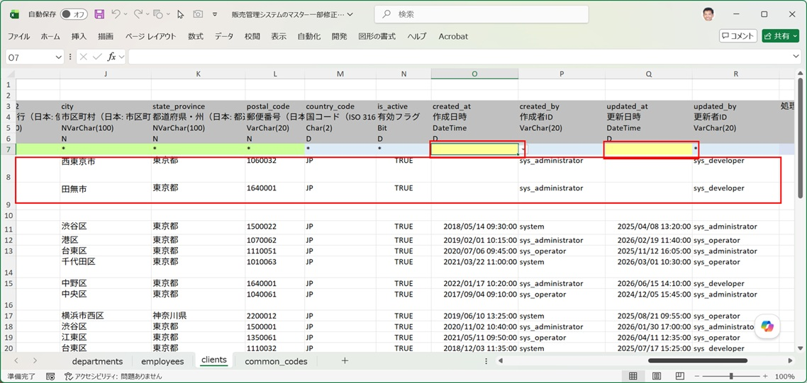

9. 選択済みテーブルリストでclientsテーブルのみを残し、他のテーブルはコンテキストメニューの「テーブルの削除」でリストから外します。この状態で「データ取り込み」をクリックします。

   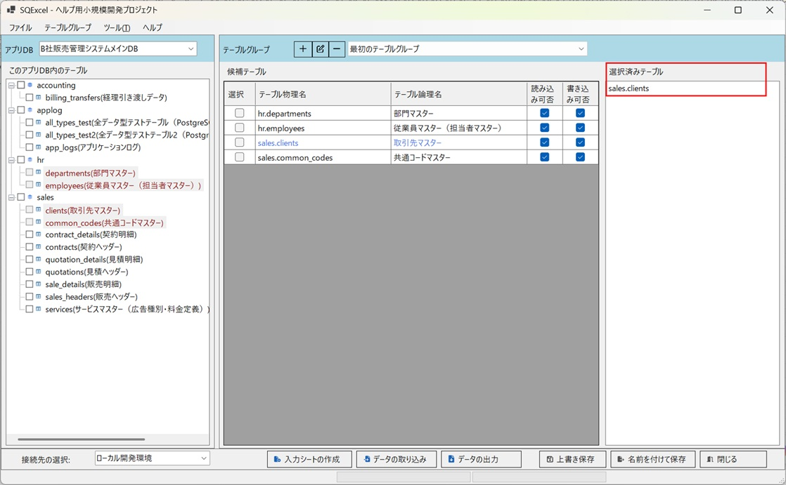

10. データ取り込みダイアログで入力シートのパスを設定し、実行するSQLの種類に「Insert」を選択します。「SQLの出力のみ（実行をスキップ）」のチェックを外すと、SQLファイルの出力パスが自動設定されます。この状態でOKをクリックします。

    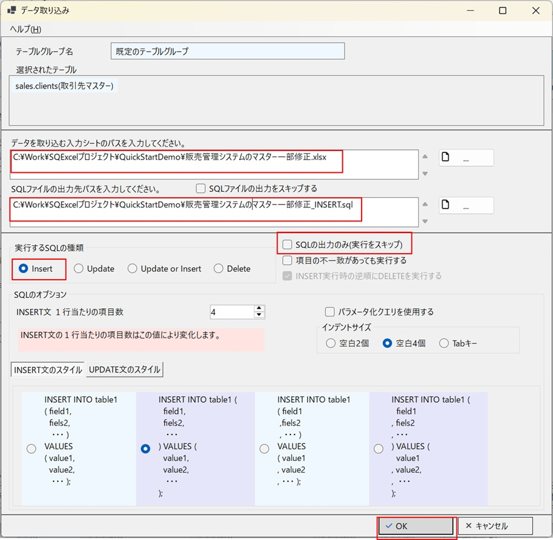

    - データ取り込みダイアログの詳しい説明は [データ取り込みダイアログ](/ja/docs/features/io-operations/data-import-dialog/) で説明します。

11. 処理が正常終了したことが表示されます。入力シートを開くと、処理結果にINSERT処理で2件成功したことが示されています。

    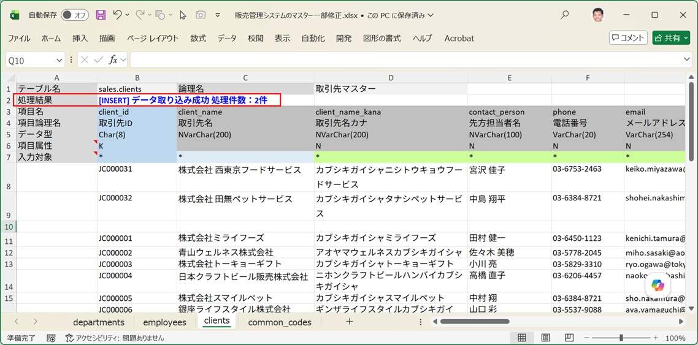

12. 実際にデータが登録されたかを確認してみましょう。データベースクライアントツール（SQL Server Management Studio）でclientsテーブルを検索すると、データが登録されていることが確認できます。

    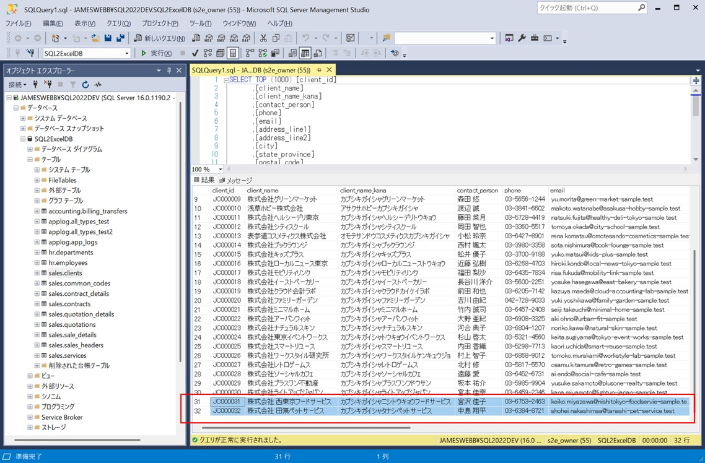

13. 最後に、生成されたSQLスクリプトを確認してみましょう。入力シートと同じフォルダに、同じ名前（拡張子は.sql）で保存されています。

    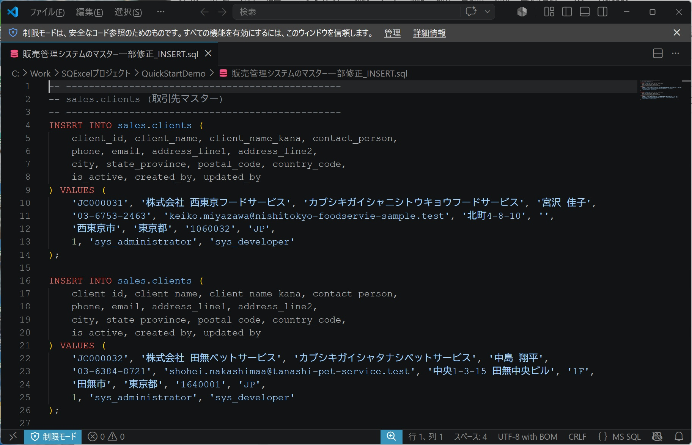

---

## クイックモードでできること・できないこと

| できること | できないこと |
|---|---|
| DB種類・接続情報・テーブルグループの内容を保存し、次回起動時に復元する | プロジェクト内で複数のアプリDBや接続、テーブルグループを持つことは出来ない。（アプリDB、接続、テーブルグループは1個に固定） |
| 通常モードと同じ入力シート作成・データ取り込み・データ出力操作 | テーブルグループを複数作成する（既定のテーブルグループ1個のみ） |
| 「上書き保存」で既定のテーブルグループの選択内容を保存する | プロジェクト名・アプリDB名を変更する |

もっと本格的に、複数のアプリDBや接続、テーブルグループを管理したくなったら、「名前を付けて保存」で任意の `.qtxl` ファイルとして保存してください。この時点でクイックモードの制約はすべて解除され、**通常のプロジェクトとして**扱われるようになります。

---

## 通常モードとの関係

クイックモードはあくまで「通常モードの操作に最短距離でたどり着くための入り口」であり、裏側で行われている処理（テーブルグループの作成、入力シート操作）は通常モードと全く同じです。

通常モードでの本格的な使い方（複数のアプリDB・接続・テーブルグループを管理する流れ）は [操作の流れとデータモデル階層](/ja/docs/operation-flow/) で説明します。
