## 想定する開発現場

| 項目 | 内容 |
|---|---|
| DB種類 | メイン系：SQL Server／サブ（人事・会計）：Oracle／その他（ログ）：MariaDB |
| アプリDB数 | 3 |
| 接続数 | 4（メイン系：結合テスト環境／システムテスト環境の2種類、サブ(人事・会計)：システムテスト環境、その他(ログ)：システムテスト環境） |
| テーブルグループ数 | 4（メイン系：2、サブ(人事・会計)：1、その他(ログ)：1） |
| テーブル数 | 100個以上（主なメンテナンス対象は10個程度） |
| 保守要員数 | 3〜5名 |

テーブル定義は固定された状態で運用されており、環境ごとの差異はありません。本番環境のメンテナンス対象テーブル（例：販売管理システムの見積トランザクション等）には、数万件規模のデータが登録されている状況を想定します。

### プロジェクトのホーム画面

想定する開発現場での SQExcel プロジェクトのホーム画面です。

   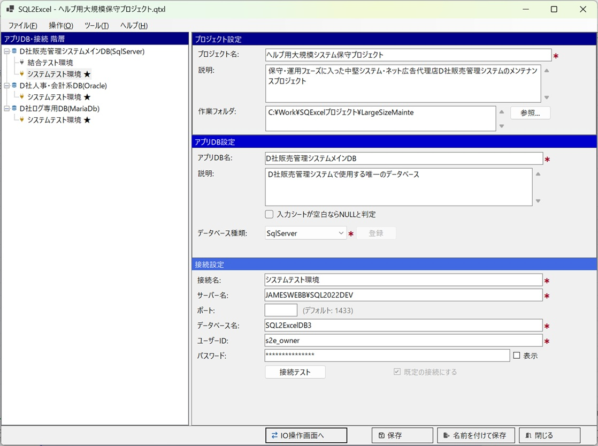

---

## このシナリオではサンプルデータ作成は行わない

大規模な既存システムの保守運用では、新規にサンプルデータを作るという場面はほとんどありません。既存システムに新しいサブシステムを追加するようなケース（新規開発を伴う場合）は、むしろ [小規模開発で使う](/ja/docs/real-world/small-scale/) のシナリオを参照してください。

このシナリオで扱うのは、**既存データに対して、マスタメンテナンス画面やアプリケーション機能を使わずに直接データを修正する**作業です。これは DevOps チームにおける Operation 部門スタッフの主要な業務の1つです。

## 使いどころ①：メンテナンス対象テーブルのテーブルグループ化

100テーブル以上あるスキーマ・テーブルツリーの中から、実際にメンテナンスが必要な10個程度のテーブルだけをテーブルグループにまとめておくことで、日々の保守作業で毎回テーブルを探し回る手間をなくします。

### 実例

1. 想定する規模のシステムでは、メインDB内に100個のテーブルが配置されています。保守担当者がデータメンテナンスを行う可能性のあるテーブルを、テーブルグループの候補テーブルにピックアップします。ある程度絞り込んだ後、実際にメンテナンスを行う際は、対象テーブルを選択済みテーブルリストにドラッグ＆ドロップします。

   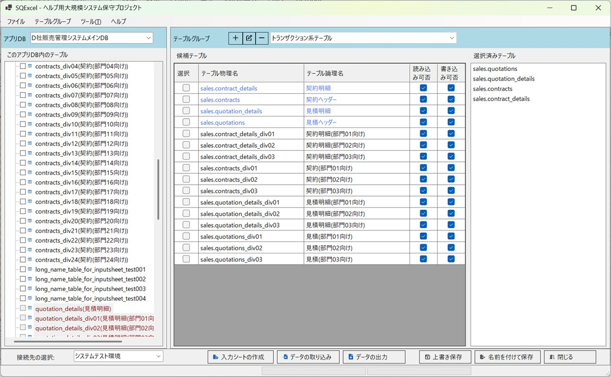

---

## 使いどころ②：大量データからメンテナンス対象データを抜き出して更新

[データ出力機能について](/ja/docs/features/input-sheet/data-export/) の検索条件を使い、数万件規模のテーブルから修正が必要な行だけを絞り込んで入力シートへ出力します。抜き出したデータを修正し、[データ取り込みダイアログ](/ja/docs/features/io-operations/data-import-dialog/) の UPDATE でそのまま反映します。

### 実例

1. ここでは、quotations（見積ヘッダー）と contracts（契約ヘッダー）の2つのテーブルから、quotation_id（見積ID）が 202607100020、202607100021、202607100022 であるデータを修正することにします。入力シートのデータエリア先頭のA列に `C` を記入すると、その行は検索条件行として扱われます。検索対象の項目列に検索条件を記入します。 
   入力シートへの検索条件記入方法の詳しい説明は [入力シートへの検索条件記入方法](/ja/docs/features/input-sheet/search-conditions/) をご参照ください。

   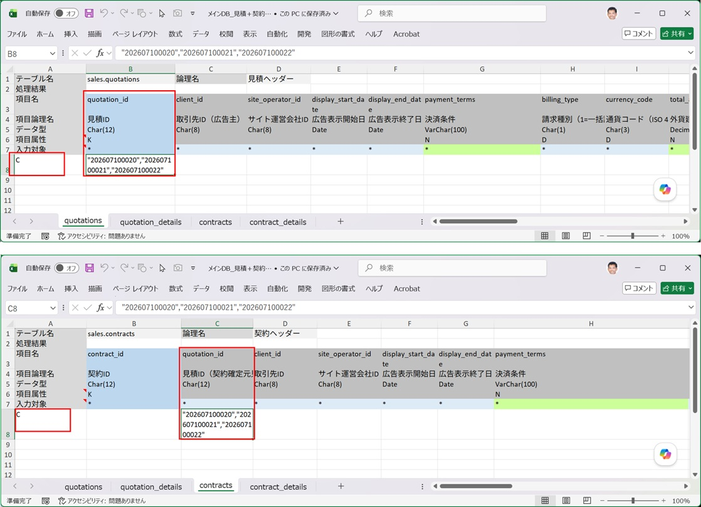

   - データテーブルを直接編集する理由は様々ですが、多くの場合は、本来システム上ではユーザー本人しか修正できない項目について、編集可能期限を過ぎてしまったがやむを得ない事情で変更が必要になったケースです（例えば、注文確定後に入力誤りに気付き、相談窓口に変更を依頼して受理された場合など）。
   - この例では、項目の修正に伴い連動して変更される他の項目・他のテーブルの項目は存在しないものとします。

2. この検索条件をセットした入力シートに、quotation_id（見積ID）で検索されたデータを書き込みます。データ出力をクリックし、表示されるダイアログで次のように設定します：データ出力方法＝既存の入力シートを指定して出力、パラメータ化クエリを使用＝OFF、null値を「(null)」と出力＝ON、SELECT文を入力シートに書き出す＝OFF。この状態で OK をクリックします。

   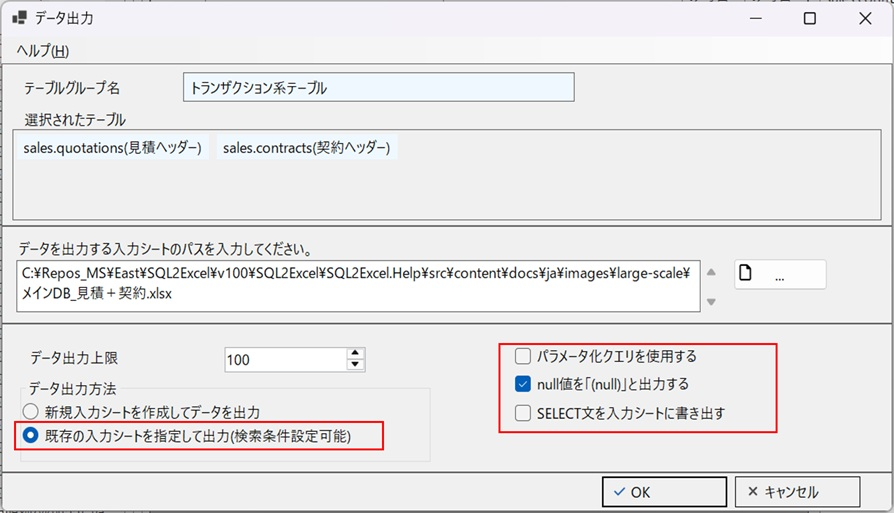

3. 指定した検索条件に適合するデータが、quotations（見積ヘッダー）と contracts（契約ヘッダー）の各シートに出力されました。ここに出力されたデータを使ってメンテナンスを行います。

   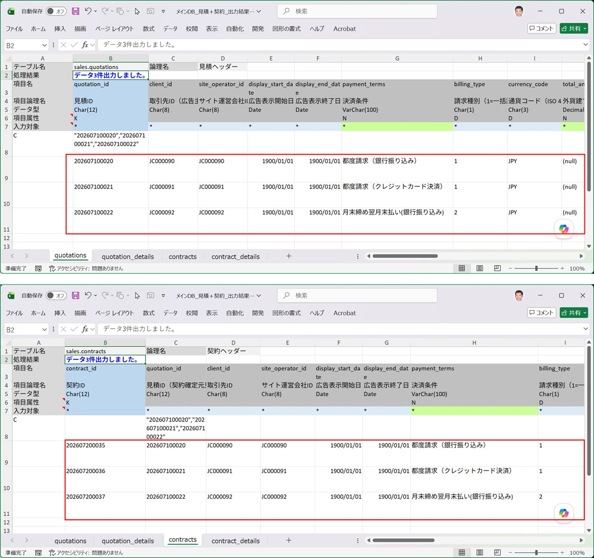

4. ここでは payment_terms（決済条件）、billing_type（請求種別）、updated_by（更新者ID）を変更します。更新内容は下図を参照してください。主キーと変更対象項目以外の入力対象行チェック（`*` マーク）は、DELETE キーでクリアします。変更した項目は、後から履歴が追えるよう赤いフォントにしていますが、これは必須ルールではありません（フォント色はそのままでも問題ありません）。

   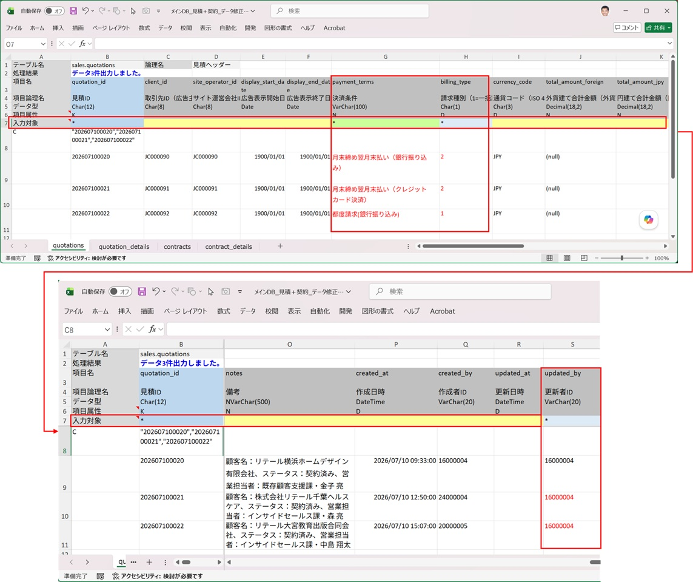

5. contracts（契約ヘッダー）にも、quotations（見積ヘッダー）と同じ項目の変更を行います。※contracts（契約ヘッダー）は quotations（見積ヘッダー）を外部キー参照しているため、引き継ぐ項目に齟齬が無いようにするためです。

   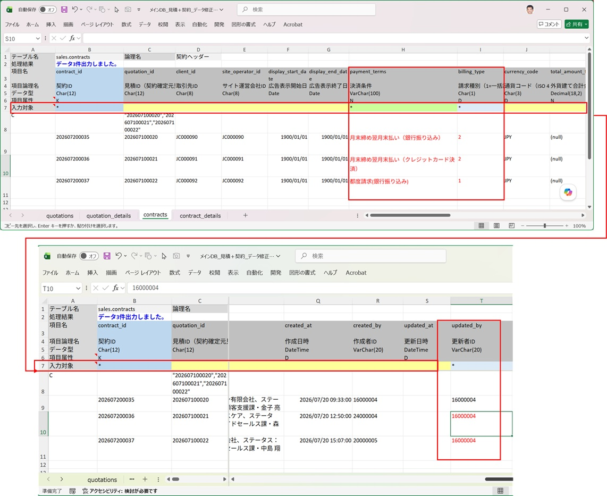

6. データ取り込みをクリックし、表示されたダイアログで変更した入力シートを指定して、「SQLファイルの出力をスキップする」チェックボックスを OFF にします。これにより、実行される SQL スクリプトが既定で入力シートと同じフォルダに保存されます（保存先は変更可能です）。実行する SQL の種類＝Update として OK をクリックします。

   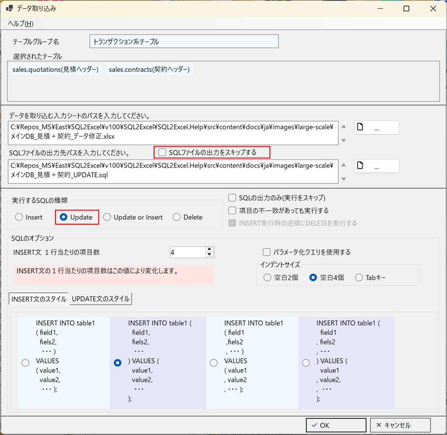

7. データ取り込みが成功します。入力シートを開くと、Update 処理が成功したことが確認できます。

   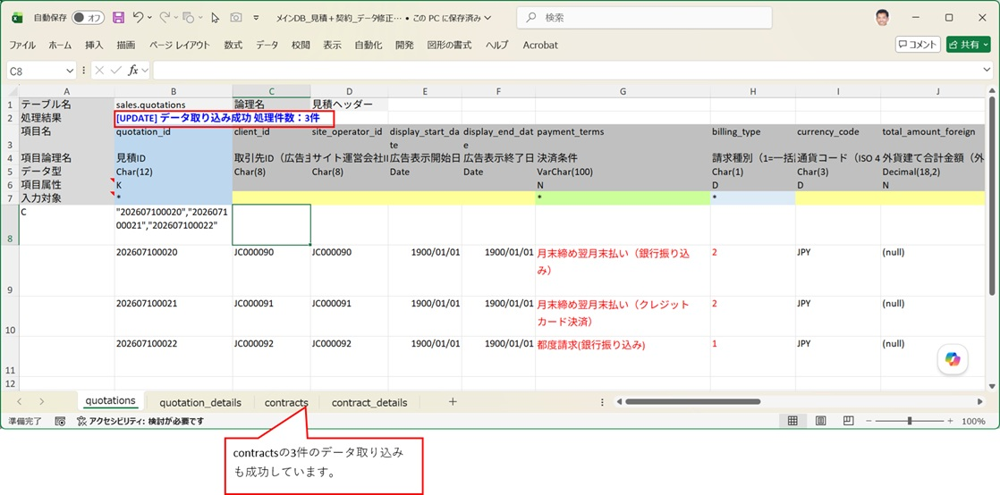

8. 出力された SQL ファイルを確認します。入力対象行で `*` マークが付いた項目だけが、更新項目になっていることが分かります。

   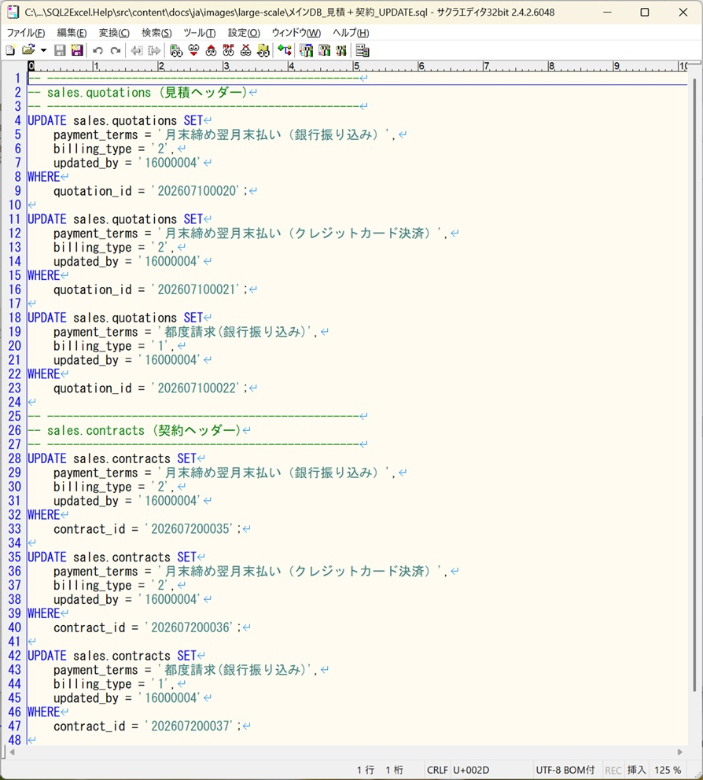

9. データが実際に変更されたかどうかを確認します。ここではアプリケーションからではなく、更新したデータベースを直接検索します。メインDBは SQL Server なので、SSMS（SQL Server Management Studio）で、更新対象の2テーブルに対して SELECT 文を発行し、結果を確認します。

   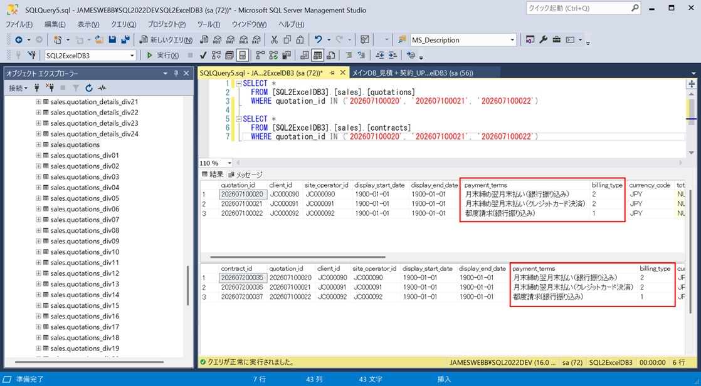

---

## 使いどころ③：出力SQLを準用した一括変換スクリプトの作成

SQExcel が生成する UPDATE 文は、入力シートの主キー列を検索条件として1行＝1件のデータを更新する形式です。そのため、**主キー以外の条件を指定した一括UPDATE（例：「特定の取引先の全レコードの単価を一律5%値上げ」）を SQExcel から直接発行することはできません**。

ただし、[データ取り込みダイアログ](/ja/docs/features/io-operations/data-import-dialog/) で出力された UPDATE 文のスタイル（項目の書き方・エスケープ処理など）を雛形として流用し、`WHERE` 句だけを手作業で一括条件に書き換えることで、そのような一括変換用の SQL スクリプトを作成できます。

※ このセクションでは実例の表示は省略します。

:::tip[SQExcelの役割の範囲]
一括変換SQLの実行そのものは SQExcel の機能ではなく、通常の DB 管理ツール（SSMS、SQL Developer 等）から実行することを想定しています。SQExcel はあくまで「正しい書式の SQL 雛形を素早く手に入れる」ためのショートカットとして活用してください。
:::
