## 想定する開発現場

| 項目 | 内容 |
|---|---|
| DB種類 | メイン系：SQL Server／サブ（人事・会計）：MySQL |
| アプリDB数 | 2 |
| 接続数 | 4（メイン系：ローカル開発環境／結合テスト環境／システムテスト環境の3種類、サブ(人事・会計)：システムテスト環境） |
| テーブルグループ数 | 3（メイン系：2、サブ(人事・会計)：1） |
| テーブル数 | 約50（主要機能で使用するものは10個程度） |
| 開発者数 | 3〜10名 |

### プロジェクトのホーム画面

想定する開発現場での SQExcel プロジェクトのホーム画面です。

   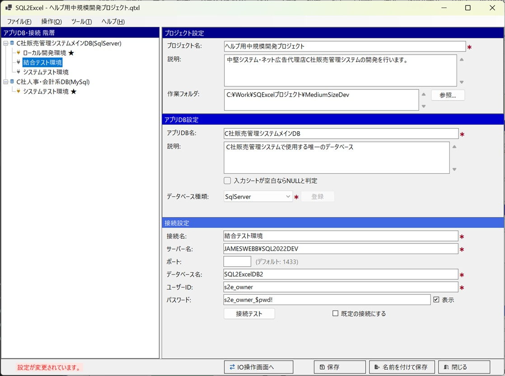

### ポイント

複数の開発者が並行して作業するため、テーブル定義は開発環境 → 結合テスト環境 → システムテスト環境の順に世代が進み、項目定義が変わることがあります。サンプルデータ作成の目的は [小規模開発で使う](/ja/docs/real-world/small-scale/) の場合と同じです（初期データ・テストデータ作成、機能デバッグ用）。本番環境への初期データ投入も、小規模開発と同様に SQL スクリプトの出力で対応します。

---

## 使いどころ①：テーブルグループによる整理

50個のテーブルをすべて一度に扱うのは非現実的です。用途や目的に応じてテーブルグループを分けることで、管理しやすくします。一般的な例は次のとおりです。

| テーブルグループ例 | 対象テーブル |
|---|---|
| マスタ系 | 部門・従業員・取引先・共通コード等 |
| 見積・契約系 | 見積ヘッダ／明細・契約ヘッダ／明細等 |
| 人事・会計系（サブDB＝MySQL） | 給与・勤怠・請求関連等 |

### 実例

1. 想定する規模のシステムでは、メインDB内に50個のテーブルが配置されています。この規模になると、入出力対象のテーブルを選ぶだけでも相応の手間がかかります。SQExcel のテーブルグループに、開発者が主に使用するテーブルをまとめて保存しておくと、作業効率が上がります。ここでは、開発に使用するマスターテーブルをテーブルグループに追加した状態を示します。

   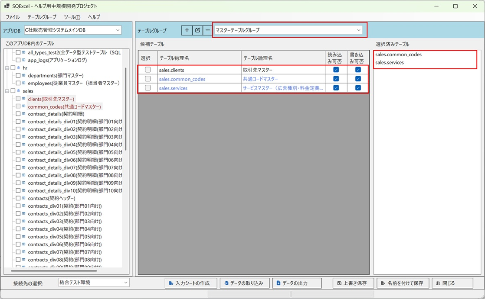

2. マスター類と同様に、テストで使用するトランザクションテーブルもデータ入出力用にテーブルグループを作成しておきます。

   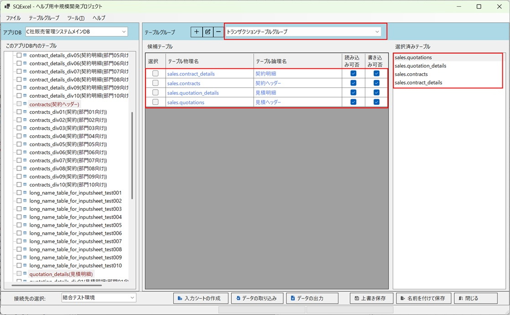

---

## 使いどころ②：環境間のテーブル定義差異への対応

開発環境で先行して行われたテーブル変更が、結合テスト環境・システムテスト環境にまだ反映されていない、という状況はよく起こります。SQExcel は接続を切り替えるたびにスキーマ・テーブル情報を再取得するため、環境ごとの最新のテーブル定義に基づいた入力シートをその都度作成できます。

代表的な差異のパターンと対応：

| 差異のパターン | 対応 |
|---|---|
| 項目名変更（命名規則違反の是正・スペルミス修正） | 変更後の環境で入力シートを作り直す（または[既存ワークブックへの追加/上書き](/ja/docs/features/io-operations/input-sheet-builder-dialog/)機能で該当テーブルのシートのみ更新） |
| 項目追加 | 入力シート再作成時に新項目が自動的に追加される |
| 型変更 | 入力シート再作成時に新しいデータ型に応じたセル書式が自動的に反映される |

### 実例

1. 開発環境とテスト環境でテーブル定義が異なる例を挙げます。多くの開発現場では、テーブル定義はローカル開発環境 → 各種テスト環境 → … → 本番環境の順に新しい定義へと変わっていきます。ここでは、結合テスト環境とシステムテスト環境のサービスマスターの項目定義が一世代古く、ローカル開発環境ではすでに更新されているケースを例にとります。まずは、テスト環境のサービスマスターの定義を確認します。

   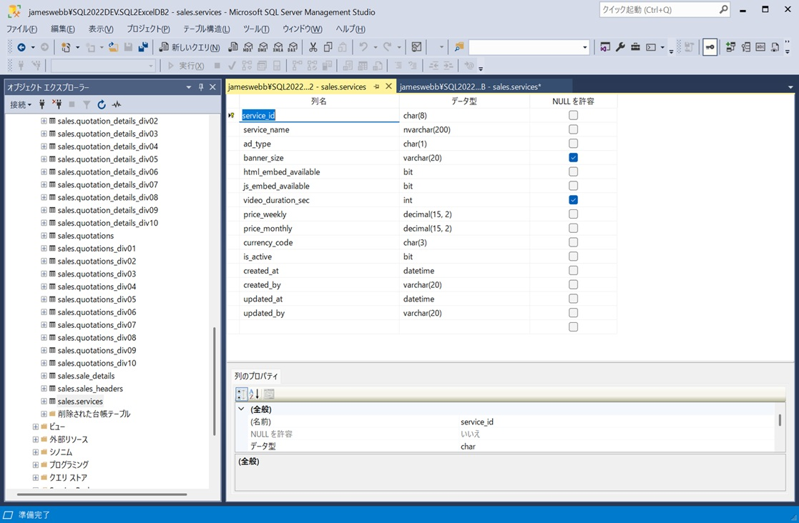

2. 一方、ローカル開発環境のサービスマスターには、start_date（適用開始日時）と end_date（適用終了日時）の2項目が追加されています。

   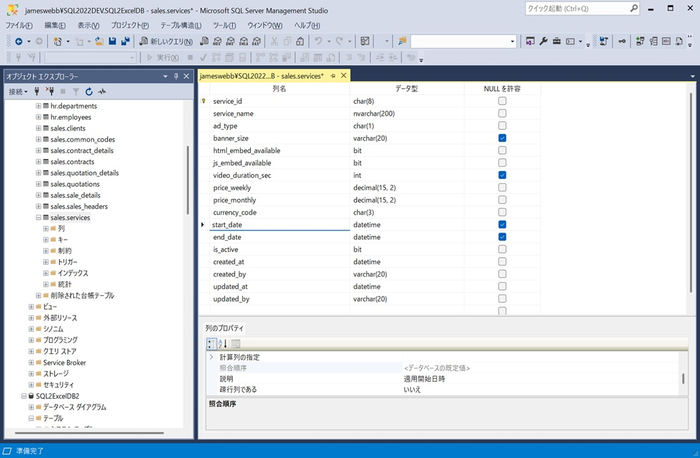

3. ローカル開発環境に接続して作成したサービスマスターの入力シートにも、start_date（適用開始日時）と end_date（適用終了日時）の2項目が追加されています。

   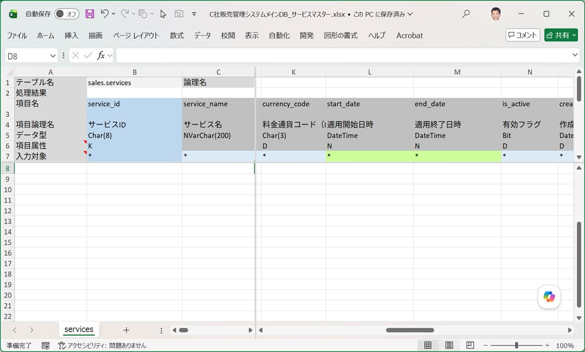

4. まず、共通コードマスターに2つの区分値データを追加します（このテーブルの項目は、ローカル開発環境と結合テスト環境で同一です）。

   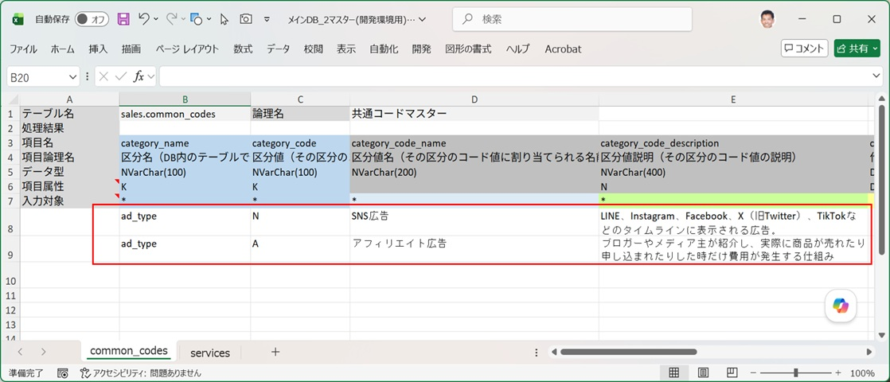

5. 続いて、共通コードマスターに追加した2つの区分値を使用したデータ7件を、サービスマスターに追加します。このテーブルの項目は、ローカル開発環境では start_date（適用開始日時）と end_date（適用終了日時）が追加済みですが、結合テスト環境にはまだ追加されていません。

   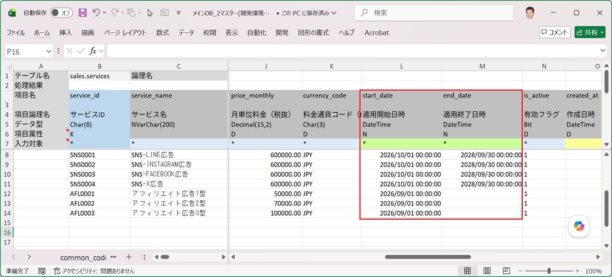

6. ローカル開発環境で、データ追加用の入力シートを指定し、SQL の種類を Insert にしてデータ取り込みを実行します。

   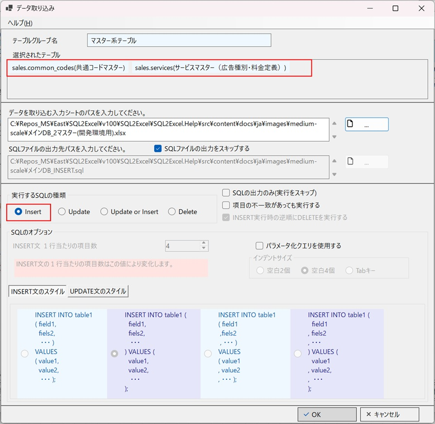

7. 開発環境用の入力シートは、サービスマスターの追加項目（適用開始日時・適用終了日時）に対応しているため、2テーブルともデータ取り込みが成功します。

   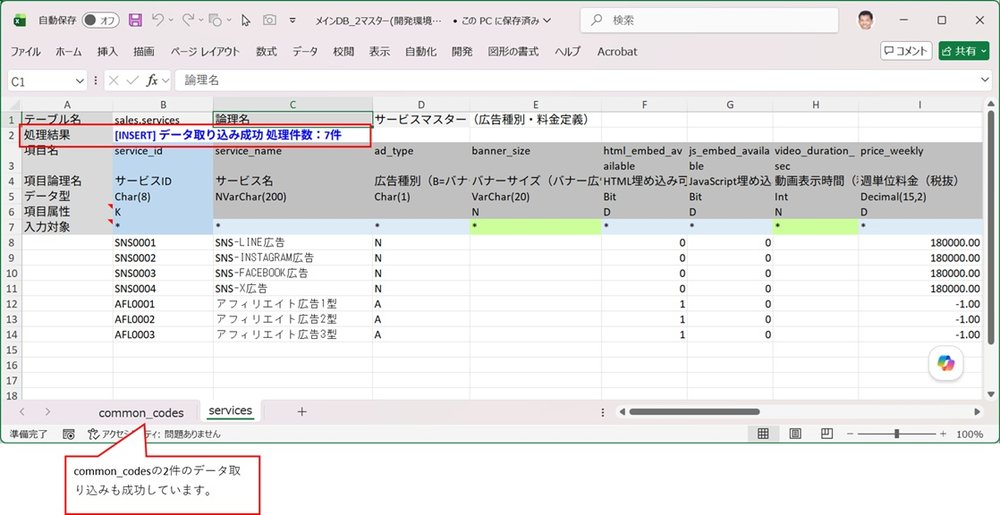

8. 次に、接続先を結合テスト環境に切り替え、同じ入力シートを使って INSERT によるデータ取り込みを実行します。※結合テスト環境のサービスマスターには項目追加がまだ反映されておらず、start_date（適用開始日時）と end_date（適用終了日時）は存在しません。

   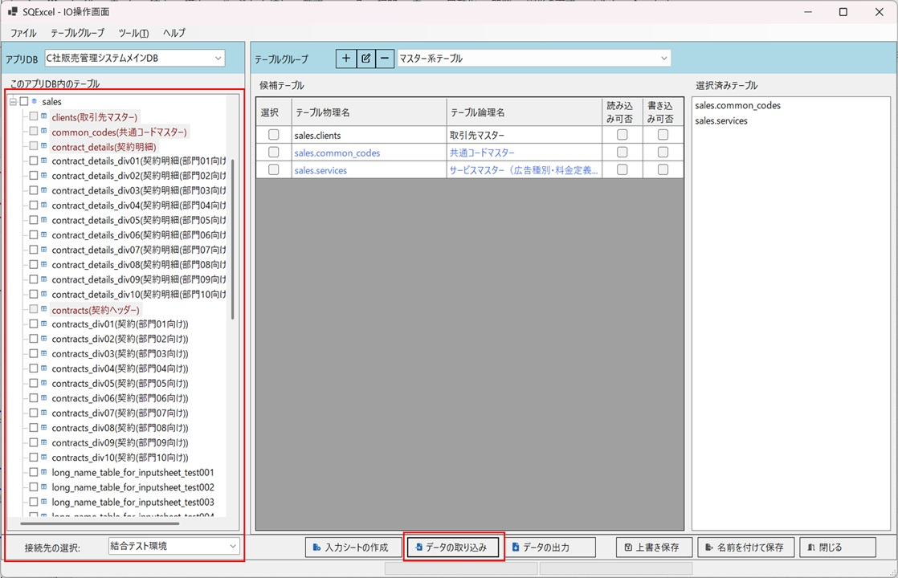

9. 取り込みを実行すると、処理終了時に項目不一致（存在しない項目が指定された）を知らせるダイアログメッセージが表示されます。ワークブックには2つの入力シートが含まれていますが、エラーが発生した入力シートのテーブル名が明示されます。

   

   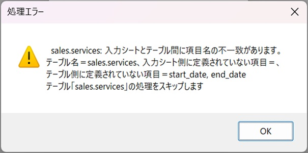

   

10. エラーの詳細は入力シート側にも記録されます。該当する入力シートを開くと、エラー内容がシート上に直接書き込まれています。

    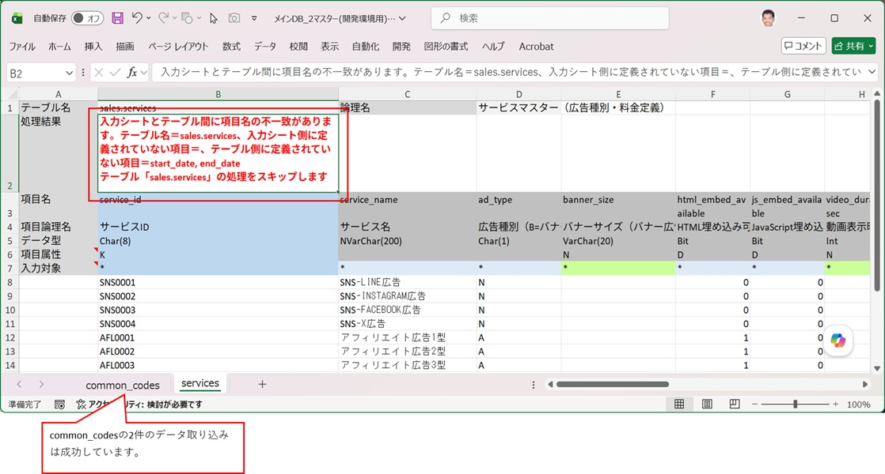

11. このような場合、対応策は開発現場の方針や進捗状況によって異なります。追加した項目はサービスの適用期間を示すものなので、結合テスト環境側ではまだ、サービスマスター参照時に適用期間をチェックする機能が実装されていないと考えられます。その機能が実装されるまでデータ追加を保留するのも一つの方法ですが、ここでは、この項目追加にプログラム側が対応できているかを先にテストするため、結合テスト環境にもデータを投入することにします。そのために、入力シートから start_date（適用開始日時）と end_date（適用終了日時）の2項目を外します。

    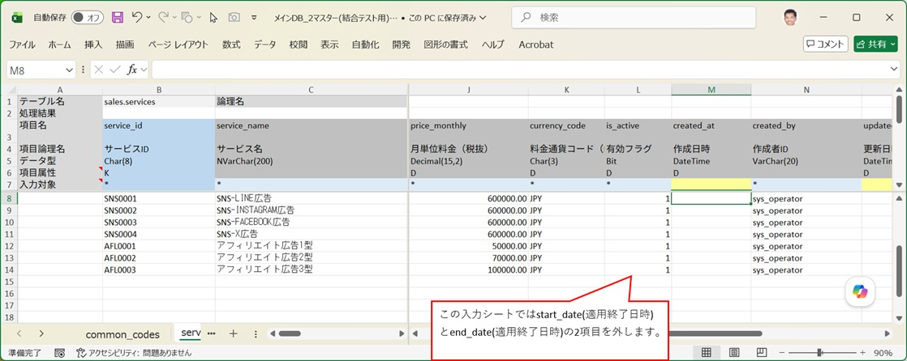

12. 入力シートの services（サービスマスター）のテーブル項目が結合テスト環境の項目と一致したため、データ取り込みは成功します。SSMS（SQL Server Management Studio）で結合テスト環境のデータベースに接続し、結果を確認します。投入した7件のデータが services（サービスマスター）に反映されていることが確認できます。

    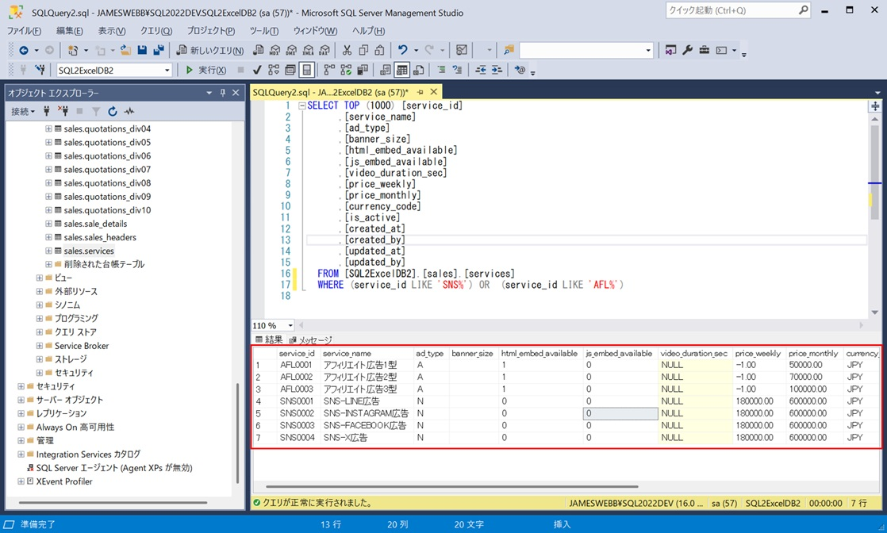

---

## 使いどころ③：マスターテーブルへのデータ追加

中規模以上の環境では、共通コードマスターに新しい区分値を追加し、それを参照する商品マスターやサービスマスターにもデータを追加する、という作業がよく発生します。SQExcel の入力シートでこれらのデータを管理すると、作業がスムーズに進みます。

※作業例は「使いどころ②：環境間のテーブル定義差異への対応」を参照してください。

## 使いどころ④：本番環境への初期データ投入

こちらも小規模開発と同様、マスターテーブルへのデータ投入 SQL をスクリプトとして出力し、本番リリース手順に組み込みます。

※作業例は [小規模開発で使う](/ja/docs/real-world/small-scale/) の「使いどころ②：本番環境への初期データ投入」を参照してください。
