## 想定する開発現場

| 項目 | 内容 |
|---|---|
| DB種類 | PostgreSQL |
| アプリDB数 | 1 |
| 接続数 | 2（ローカル開発環境／結合テスト環境） |
| テーブルグループ数 | 1 |
| テーブル数 | 約15 |
| 開発者数 | 1〜2名 |

開発者が少人数のため、ローカル開発環境と結合テスト環境のテーブル定義に差異はありません。本番環境へのデータ投入は、SQExcel が出力した SQL スクリプトを本番環境で実行して対応します（SQExcel から本番 DB へ直接接続することは想定していません）。

### プロジェクトのホーム画面

想定する開発現場での SQExcel プロジェクトのホーム画面です。

   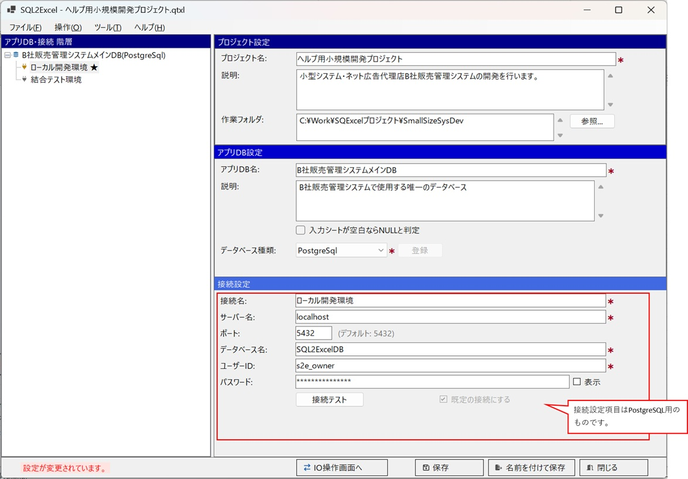

---

## サンプルデータ作成の目的

| データ種別 | 目的 |
|---|---|
| 共通コードマスタ・システム制御変数マスタ | 本番環境でも使用する初期データの作成 |
| マスターデータ | テスト用初期データの作成、またはマスタメンテナンス機能のデバッグ用 |
| トランザクションデータ | テスト用初期データの作成、及びアプリケーション機能のデバッグ用 |

## 使いどころ①：初期データを10〜20件投入する

新規テーブルに対し、[入力シートへのデータ投入方法](/ja/docs/data-entry/) のいずれか（特に [Copilot](/ja/docs/data-entry/copilot/) がお勧めです）でマスタデータを10〜20件作成し、開発環境・テスト環境それぞれの接続を切り替えながらデータ取り込みを実行します。

### 実例

1. ローカル開発環境の接続を選択して IO 操作画面を開きます。このプロジェクトでは1つのテーブルグループを持ち、ここにアプリケーションで使用するテーブルを候補テーブルグリッドに配置します。ここでは、開発初期に共通コードマスターと、販売管理システムのサービスマスターを登録する例を紹介します。

   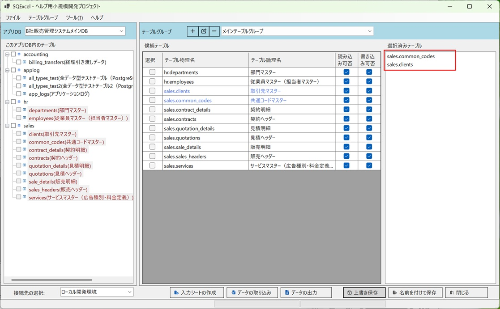

2. 選択した2テーブル（共通コードマスターとサービスマスター）用の入力シートを作成します。入力シート作成ダイアログで2つのマスターが選択されていることを確認し、ファイル名を指定して OK をクリックします。

   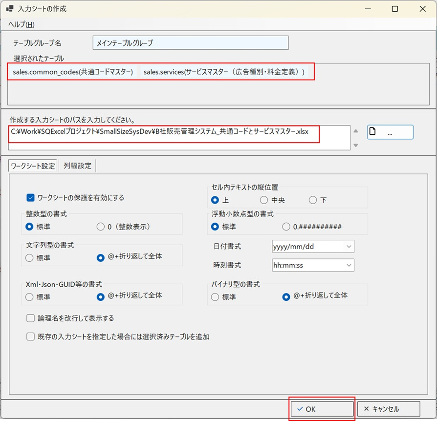

3. 選択した2つのマスターテーブルの入力シートが作成されます。ここに、開発で使用する共通コードマスターと、共通コードを参照するサービスマスターのデータを作成していきます。

   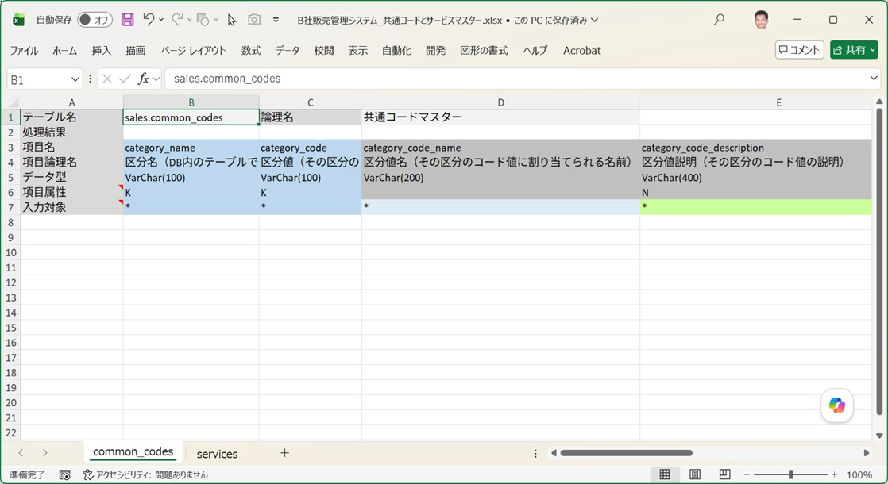

4. 共通コードマスター（区分マスター）の入力シートにデータを設定します。このテーブルは、区分名と区分値の組み合わせを管理します。マスターメンテナンス画面がまだ完成していない開発初期段階でも、この入力シートでデータ登録しておくと、その後の管理も含めて作業がスムーズに進みます。共通コードマスターの初期データは、通常この入力シートに手作業で設定します。

   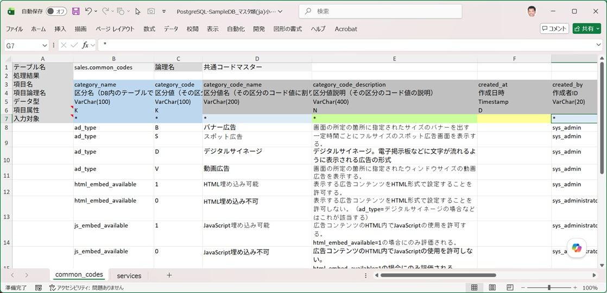

5. サービスマスターの初期データを設定します。このテーブルの一部の項目は共通コードマスタを参照するため、区分名とコードが合致しているか確認しながら入力します。テスト用データであれば、この作業は Excel Copilot に依頼した方が効率的です。 
   ※例：「serviceのテストデータをcommon_codesを参照しながら10件作成して。参照する項目はad_typeだよ。」

   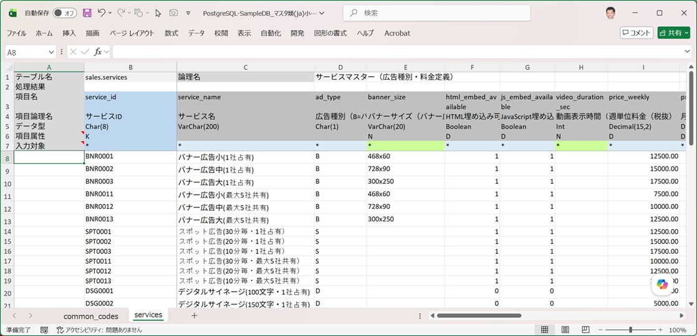

6. 開発が進み、本番環境への初期データ投入時期が近づいてきました。ここでは、確定した共通コードマスタとサービスマスターのデータを投入します。SQExcel はセキュリティ上、本番環境に直接接続しない前提とします。この場合、データ投入用の SQL スクリプトを作成し、タスクスケジューラなどで実行するのが一般的な方法です。ここでは、データベースへ直接投入せず、SQL スクリプトのみを出力する方法を紹介します。 
   データ取り込みダイアログで入力シートのパスを設定すると、SQL の出力先パスが自動設定されます。実行する SQL の種類は **Insert**、**[SQLの出力のみ(実行をスキップ)]** チェックボックスを ON にし、他のオプションはそのままで OK をクリックします。

   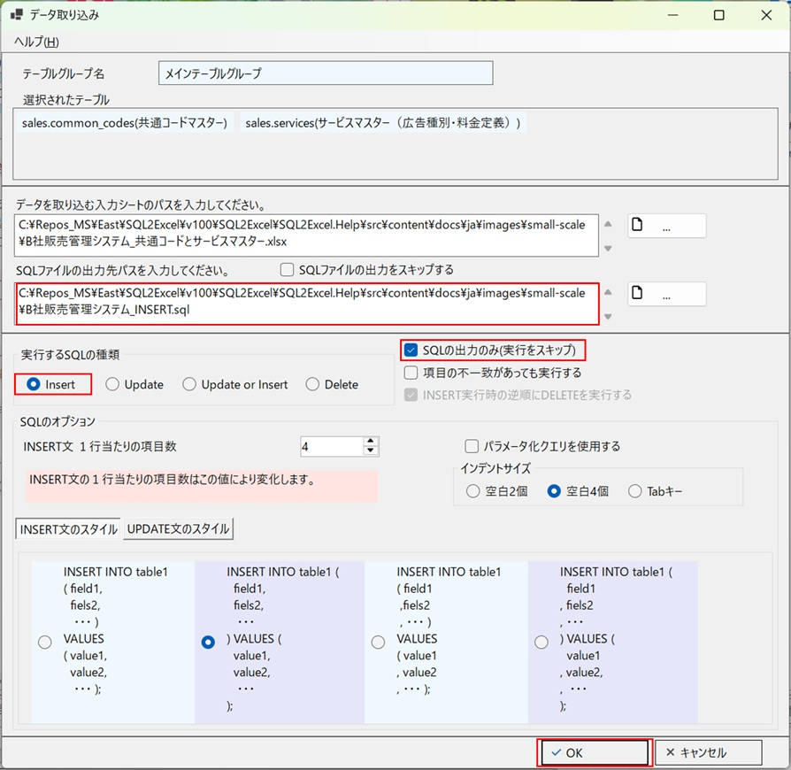

7. 初期データを設定した入力シートを指定し、SQL の種類を Insert にしてデータ取り込みを実行します。処理が終わったら、結果が記入された入力シートを開いて、全データが投入されたか確認します。

   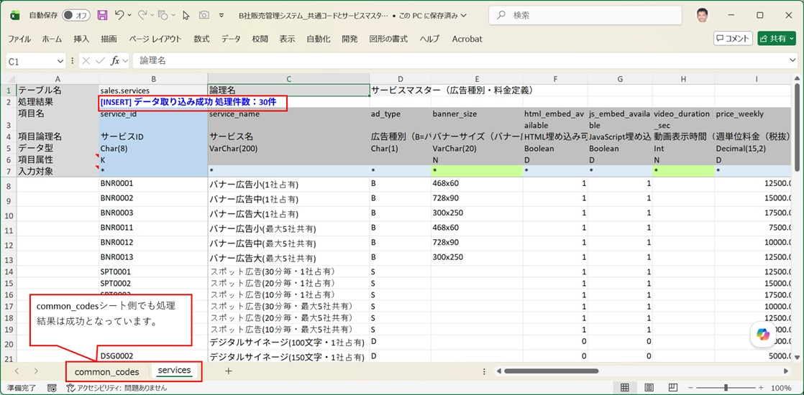

※アプリケーション側でこのデータを表示する画面までは、本ページの対象範囲ではありません。SQExcel の役割は「投入するデータそのものを効率よく作る」ところまでです。

---

## 使いどころ②：本番環境への初期データ投入

共通コードマスタなど、本番環境でも必ず必要になる初期データについては、[データ取り込みダイアログ](/ja/docs/features/io-operations/data-import-dialog/) の「SQL出力のみ」オプションを使い、実行はせず SQL スクリプトのみを出力します。

### 実例

1. 確定した共通コードマスタとサービスマスターのデータを、SQL スクリプトとして出力します。データ取り込みダイアログで入力シートのパスを設定すると、SQL の出力先パスが自動設定されます。実行する SQL の種類は **Insert**、**[SQLの出力のみ(実行をスキップ)]** チェックボックスを ON にし、他のオプションはそのままで OK をクリックします。

   

2. 出力された SQL スクリプトをエディタで確認します。共通コードマスターとサービスマスター、それぞれのテーブルへの INSERT 文が、入力シートの全データ分作成されています。

   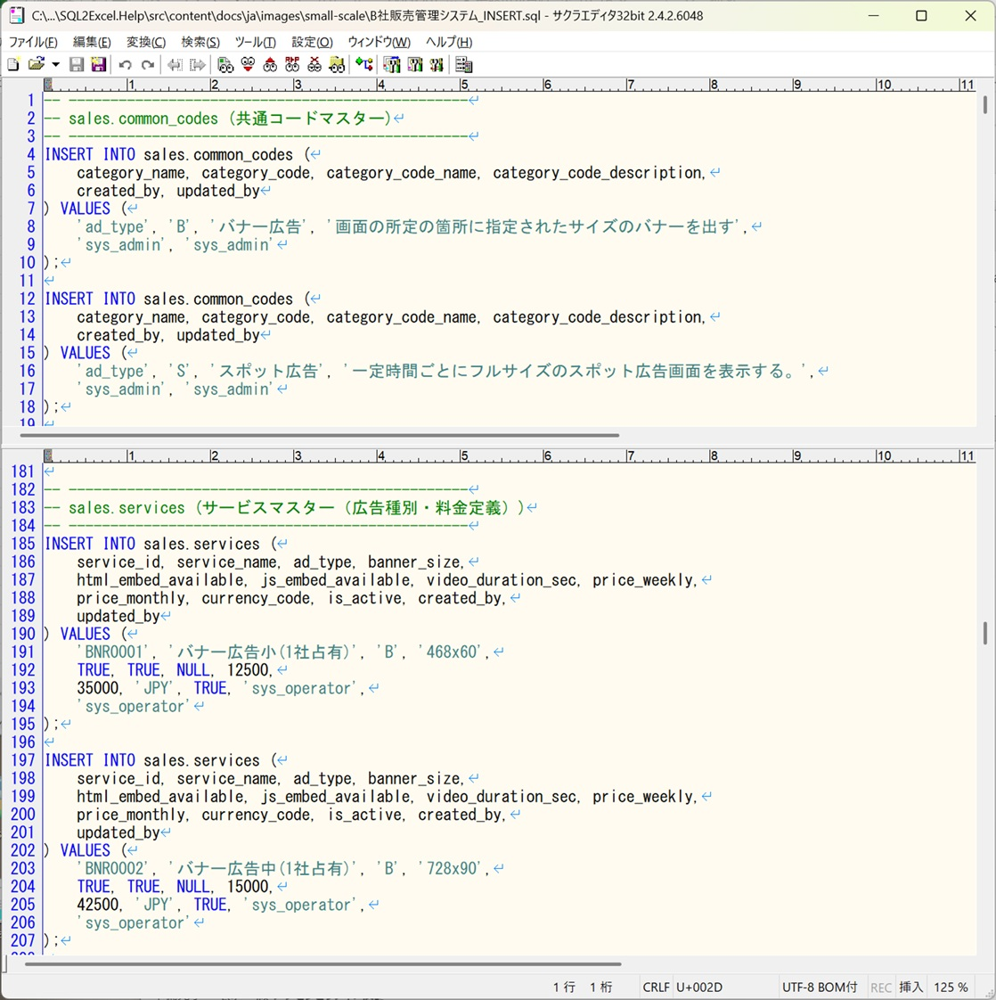

3. 出力した SQL スクリプトを、PostgreSQL のクライアントツール pgAdmin4 で実行し、動作を確認します。確認前に、対象マスターのデータを削除しておく必要があります。 
   ※pgAdmin4 の使い方は PostgreSQL の公式サイトなどをご参照ください。

   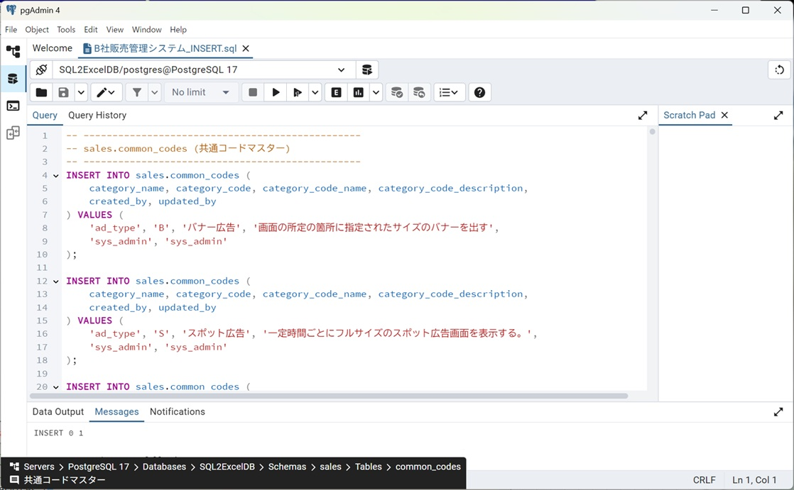

4. pgAdmin4 で SQL の実行結果を確認します。データが正しく作成されていることが確認できます。

   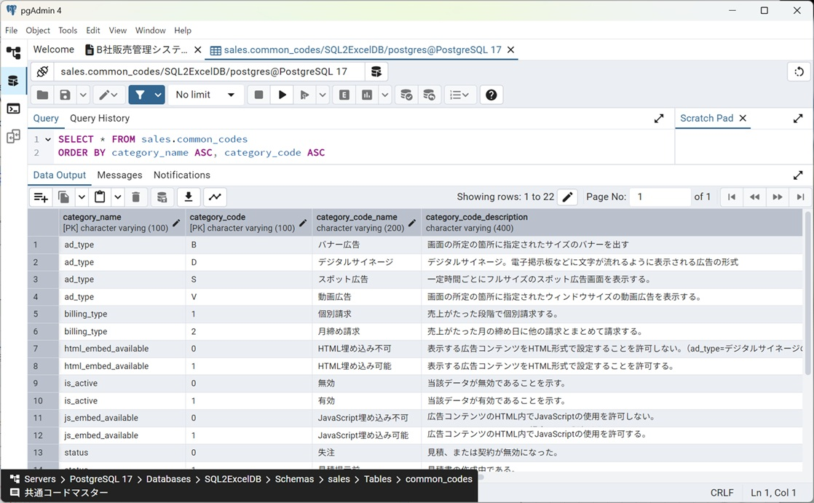

---

出力した SQL スクリプトは、本番環境のリリース手順（DBA によるレビュー・実行など）に従って適用します。タスクスケジューラへの登録など、SQL 実行そのものに関する話題は SQExcel の対象範囲外のため、本ページでは扱いません。
